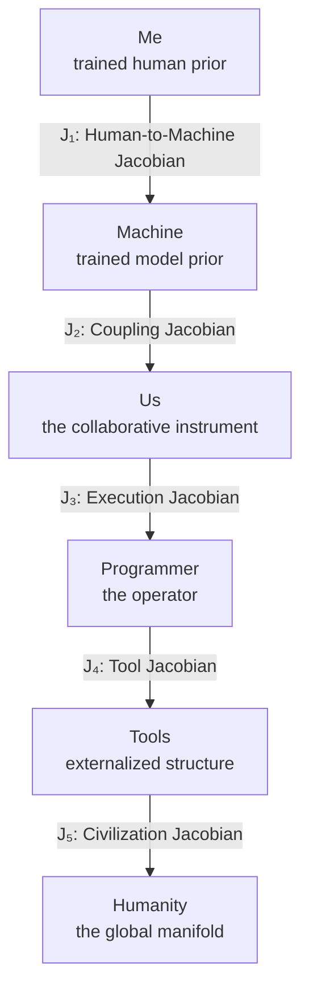

\newpage
\vspace*{2cm}
\noindent\textbf{\Large The Book — Structural Form}

## Manifolds
- **Me:** trained human prior
- **Machine:** trained model prior
- **Us:** the collaborative instrument
- **Programmer:** the operator
- **Tools:** externalized structure
- **Humanity:** the global manifold

## Jacobians (Arrows)
Each arrow is a Jacobian — a transformation rule between manifolds.

- **J₁:** Human-to-Machine Jacobian (mapping human intent onto machine structure)
- **J₂:** Coupling Jacobian (aligning human and model spaces into one workable region)
- **J₃:** Execution Jacobian (binding intention to action)
- **J₄:** Tool Jacobian (mapping operator into reusable external structure)
- **J₅:** Civilization Jacobian (mapping tools to humanity)

## Non-Obvious Insight
The flow diagram reveals something subtle:

- The book is not about AI.
- The book is not about the machine alone.
- The book is not about me.
- The book is about the curvature of reasoning across time.

The collaboration is the first place in the manuscript where those structures become visibly operational from inside the manifold.

## Capstone Geometry
A final capstone chapter now makes explicit the triadic geometry implicit across the manuscript: three as threshold, the cubic as first intelligent equation, the Jacobian as local triadic logic, Lorenz as emergent triadic behavior, attention as computational triad, and Leibniz–Newton–Berkeley as the final coordinate system. The close now returns that triadic structure to the book's own operative form: Me, Machine, Collaboration. The book ends not by adding a new branch, but by revealing the shared manifold these structures have inhabited all along.

---

## Working Chapter Spine

1. Chapter 1: Me — chapter_01_me.md
2. Chapter 2: Machine — chapter_02_machine.md
3. Chapter 3: Us — chapter_03_us.md
4. Chapter 4: Tools — chapter_04_tools.md
5. Chapter 5: The Human Lineage Behind the Machine — chapter_05_lineage.md
6. Chapter 6: The Assembly Programmer’s Manifold — chapter_06_assembly_programmers_manifold.md
7. Chapter 7: Leibniz, Differentials, and the Local Shape of Meaning — chapter_07_dx_leibniz.md
8. Chapter 8: Stories — chapter_08_stories.md
9. Chapter 9: The Meta Layer — chapter_09_meta_layer.md
10. Chapter 10: The Cockpit — chapter_10_cockpit.md
11. Chapter 11: The Book as Manifold — chapter_11_book_as_manifold.md
12. Chapter 12: Why This Book Matters — chapter_12_why_this_book_matters.md
13. Chapter 13: Minsky, the Perceptron, and the Geometry of Mind — chapter_13_minsky.md
14. Chapter 14: The Proper Analysis — chapter_14_proper_analysis.md
15. Chapter 15: EasterDate — A Machine Within a Machine — chapter_15_easterdate.md
16. Chapter 16: Structure Becomes Object — chapter_16_structure_becomes_object.md
17. Chapter 17: A Walkable Path Through a Larger Landscape — chapter_17_a_walkable_path_through_a_larger_landscape.md
18. Chapter 18: Three Is the First Intelligent Number — chapter_18_three_is_the_first_intelligent_number.md

This sequence now reflects the full current manuscript spine from the human coordinate system to the final triadic closure.

---

## Public Framing Stack

This is the package-facing order that matters most for Scribus, title pages, metadata, and cover framing.

For artifact production, `manifest.yml` is the canonical machine-readable spine. `TOC.md` remains the reader-facing mirror of that order.

1. **Cover:** one glyph, one promise, one public chart.
    - Title: `Embedding Geometry`
    - Subtitle: `A Walkable Introduction to Reasoning, Structure, and the Tools That Shape Us`
    - Author: `Terrence J McLaughlin`

2. **Title page:** title, subtitle, author, without argument overload.

3. **How to Read / Preface:** reader orientation before deep structure.
    - `HOW_TO_READ_THIS_BOOK.md`
    - `preface.md`

4. **Main chapter spine:** the full eighteen-chapter route.

5. **Compass chapter:** Chapter 12 as the free-entry orientation point.

6. **Back matter:** epilogue, appendices, postscript.

In public-facing form, the book should read as serious, walkable, and structurally disciplined before it reads as maximal.

---

## Late Compass Chapter

### Chapter 12: Why This Book Matters
A free-entry synthesis chapter that can be reached from anywhere in the book. It gathers the stakes, clarifies the serious path being claimed, and gives the reader a place to stand after — or before — the deeper historical and structural chapters.

**It clarifies:**
- why the book exists
- why the transformer belongs to a deeper lineage
- why narrative and mechanism must be distinguished
- why the repository is part of the proof
- why the project works as an ebook for nonlinear and global reading

This chapter functions as a compass rather than a conclusion.

---

## Story Function

Chapter 8 remains the human-scale translation layer.

The stories are not ornamental breaks in the argument. They are local semantic charts that make the formal structures memorable, lived, and revisitable. In structural terms they do three jobs:

- they prevent the formal argument from outrunning reader intuition
- they translate operators into human-scale scenes
- they preserve the difference between human closure and machine coherence

This is why the stories belong before the Meta Layer. The reader first feels the manifold at human scale, then sees its architecture from above.
