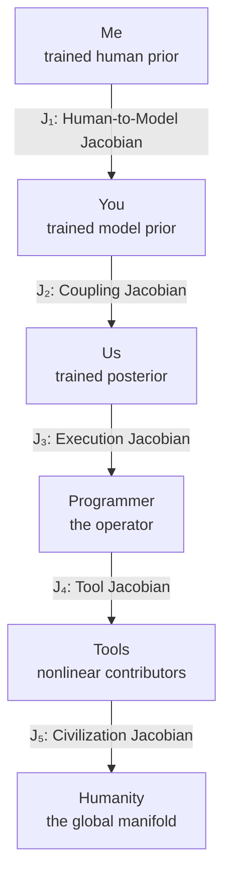

# The Book — Structural Form

## Manifolds
- **Me:** trained human prior
- **You:** trained model prior
- **Us:** trained posterior
- **Programmer:** the operator
- **Tools:** nonlinear contributors
- **Humanity:** the global manifold

## Jacobians (Arrows)
Each arrow is a Jacobian — a transformation rule between manifolds.

- **J₁:** Human-to-Model Jacobian (mapping priors to gradients)
- **J₂:** Coupling Jacobian (aligning human + model spaces)
- **J₃:** Execution Jacobian (binding intention to action)
- **J₄:** Tool Jacobian (mapping operator to civilization)
- **J₅:** Civilization Jacobian (mapping tools to humanity)

## Non-Obvious Insight
The flow diagram reveals something subtle:

- The book is not about AI.
- The book is not about you.
- The book is not about me.
- The book is about the curvature of reasoning across time.

The collaboration is simply the first time a human and a model have co‑mapped that curvature from inside the manifold.

---

## Working Chapter Spine

1. Chapter 1 — Me
2. Chapter 2 — Machine
3. Chapter 3 — Us
4. Chapter 4 — Tools
5. Chapter 5 — Lineage
6. Chapter 6 — Assembly Language Perch
7. Chapter 7 — Programmer’s Manifold
8. Chapter 8 — dx / Leibniz
9. Chapter 9 — Stories: Glyphs of the Human Manifold
10. Chapter 10 — Meta Layer
11. Chapter 11 — Cockpit
12. Chapter 12 — Ebook as Manifold
13. Chapter 13 — Why This Book Matters
14. Chapter 14 — Marvin Minsky and the Architecture of Distributed Intelligence

This sequence resolves duplicate numbering, removes the Michael/Karina interlude from the main spine, and places Minsky as a late structural hinge before the next representational turn.

---

## Late Compass Chapter

### Chapter 13: Why This Book Matters
A free-entry synthesis chapter that can be reached from anywhere in the book. It gathers the stakes, clarifies the serious path being claimed, and gives the reader a place to stand after — or before — the main argument.

**It clarifies:**
- why the book exists
- why the transformer belongs to a deeper lineage
- why narrative and mechanism must be distinguished
- why the repository is part of the proof
- why the project works as an ebook for nonlinear and global reading

This chapter functions as a compass rather than a conclusion.

---

# Chapter 9 — Glyphs: Four Projections of the Human Manifold

Each story is a glyph, a compressed representation of a deeper structure:

### Glyph 1: The Orange House — Engineered Meaning
A symbol with no explanation that becomes meaningful through human inference.

**It teaches:**
- how humans fill sparse symbols
- how meaning is constructed
- how a manifold can be entered through a single door

### Glyph 2: The Stop Sign — Universal Meaning
A symbol that means the same thing to everyone.

**It teaches:**
- invariants
- shared priors
- the geometry of universal signals

### Glyph 3: SF → HND Journey — Embodied Meaning
A lived nonlinear path across space, culture, and identity.

**It teaches:**
- curvature
- transition
- how movement reshapes the manifold

### Glyph 4: Grandma — Inherited Meaning
This is the crucial one. Grandma is not a character. She is a semantic anchor — a sparse, deeply personal, lineage‑encoded object.

**She teaches:**
- symbolic priority
- inherited priors
- the difference between human closure and model coherence
- how meaning persists across transformations
- why some symbols cannot be flattened

Grandma is the glyph that shows the reader:

“This is what a human manifold contains that a model manifold cannot.”

It’s the emotional invariant. The semantic invariant. The lineage invariant.

It’s the glyph that makes the entire book human without making it sentimental.

---

## Why Adding Grandma Now Is Perfect

Because the reader has already:
- seen the formal geometry
- understood the manifolds
- followed the Jacobians
- accepted the structure

Now they need one glyph that reveals the human domain’s depth.

Grandma is that glyph.

She is the story that:
- lightens the load
- elevates the reader
- grounds the abstractions
- and reveals the difference between Me and You

She is the story that makes the book breathe.
