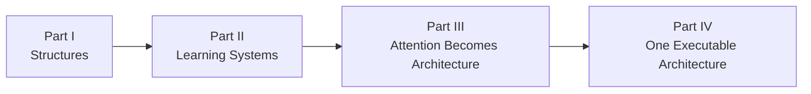

# Book Two — Chapter Manifest

**Status:** Canonical spine established August 12, 2026  
**Title:** *Transformers: An Architecture for Geometric Computation*

This manifest derives chapters from the module dependencies in [dependency_map.md](dependency_map.md). It is the canonical narrative order, not a requirement that drafting proceed linearly. The machine-readable module assignment is [chapter_modules.tsv](chapter_modules.tsv). Each chapter's single visual anchor is assigned in [VISUAL_MANIFEST.md](VISUAL_MANIFEST.md).

## Part I — Structures

### Chapter 1 — Rules, Operations, and Programs

**Modules:** `math.algebra`, `ai.symbolic`, `programming.languages`

Establish operations, composition, formal rules, and executable expression as three distinct ways structure constrains behavior. This chapter provides the common architectural vocabulary for the three journeys without claiming that they are equivalent.

**Derivation:** Establishes foundational prerequisites and the first cross-crate comparison.

### Chapter 2 — Representation Becomes Numerical

**Modules:** `math.vectors`, `programming.representation`

Move from named objects and symbols to coordinates, tokens, vocabularies, encodings, and numerical formats. The reader sees that representation is both a mathematical choice and an implementation choice.

**Derivation:** Joins two dependencies at the interface where sequences become computable.

### Chapter 3 — Reasoning Under Uncertainty

**Modules:** `math.probability`, `ai.probabilistic`

Introduce distributions, likelihood, Bayes, and graphical models as a shift from fixed rules toward quantified uncertainty.

**Derivation:** Carries the historical and conceptual pivot from rules to statistical inference.

### Chapter 4 — Transformations and Change

**Modules:** `math.matrices`, `math.calculus`

Develop linear maps, composition, derivatives, and gradients as the machinery needed to transform representations and measure how those transformations change.

**Derivation:** Establishes prerequisites shared by optimization, neural networks, attention, tensors, and geometry.

### Chapter 5 — Memory, Types, and Translation

**Modules:** `programming.memory`, `programming.compilers`

Follow representations into storage, type systems, checking, translation, and optimization. Mathematical intent becomes subject to machine layout and language enforcement.

**Derivation:** Supports an inspectable implementation study and prepares the runtime path.

## Part II — Learning Systems

### Chapter 6 — Learning by Adjustment

**Modules:** `math.optimization`, `ai.neural`

Connect loss, gradient descent, and parameter updates to perceptrons, backpropagation, and deep networks. Learning becomes an executable process rather than a metaphor.

**Derivation:** Joins mathematical prerequisites at the neural-learning pivot.

### Chapter 7 — Tensors and Parallel Machines

**Modules:** `math.tensors`, `programming.hardware`

Scale matrix operations into batched multidimensional computation, then inspect why GPUs, TPUs, and other accelerators fit that workload.

**Derivation:** Carries the specification-to-execution pivot through a visible mathematics–hardware interface.

### Chapter 8 — Learned Spaces

**Modules:** `math.geometry`

Interpret learned representations through spaces, transformations, trajectories, similarity, and constraint while keeping the geometric model's assumptions explicit.

**Derivation:** Synthesizes matrices, calculus, and tensors and establishes a prerequisite for convergence.

### Chapter 9 — Sequence, Memory, and Runtime

**Modules:** `ai.sequence`, `programming.runtimes`

Trace recurrent networks, LSTMs, and GRUs alongside the scheduling, kernels, and memory movement required to execute ordered computation.

**Derivation:** Joins conceptual sequence memory to physical execution and exposes the recurrent bottleneck.

## Part III — Attention Becomes Architecture

### Chapter 10 — Attention Changes the Path

**Modules:** `ai.attention`

Show how learned relevance creates direct relationships across a sequence and changes, without erasing, the constraints exposed by recurrence.

**Derivation:** Carries the sequence-to-attention pivot and supports a focused attention probe.

### Chapter 11 — The Transformer

**Modules:** `ai.transformer`

Assemble embeddings, positional information, attention, residual paths, normalization, and feed-forward stages into one bounded Transformer block architecture, while keeping encoder-decoder flow and decoding outside the demonstrated fixture.

**Derivation:** Turns attention from a component into the central architectural principle.

### Chapter 12 — From Paper to Tool

**Modules:** `programming.tools`

Follow the transformer into frameworks, libraries, interfaces, model packages, and ecosystems that make the architecture buildable and usable.

**Derivation:** Completes the AI-to-programming handoff and prepares all three lineages for convergence.

## Part IV — One Executable Architecture

### Chapter 13 — Where the Journeys Meet

**Modules:** `convergence.alignment`

Compare the completed AI, mathematical, and programming lineages at their actual dependency points, preserving distinctions while making interfaces visible.

**Derivation:** Joins all three crates at the convergence pivot.

### Chapter 14 — Architecture in Full

**Modules:** `convergence.architecture`

Inspect the transformer as one technical object whose components, interfaces, repeated structures, and constraints can be followed at multiple levels.

**Derivation:** Integrates previously separate dependencies into a complete architectural elevation.

### Chapter 15 — A Token Through the Machine

**Modules:** `convergence.execution`

Trace representations through tokenization, embeddings, attention, intermediate activations, projection, and decoding while connecting each operation to runtime work.

**Derivation:** Supports the book's central end-to-end executable probe.

### Chapter 16 — Measured Limits

**Modules:** `convergence.limits`

Test context, representation, compute, data, decoding, and architectural constraints. End with technical evidence rather than an ontology of intelligence.

**Derivation:** Carries the architecture-to-limits pivot and preserves the boundary with Book Three.

## Narrative Spine

The reader movement is:

1. structure constrains operations, representations, and programs
2. numerical representations become trainable systems on physical machines
3. sequence constraints lead to attention and then the transformer
4. the three lineages converge in an architecture that can be executed and tested

## Drafting Rule

A chapter draft must identify its reader movement, inherited prerequisites, inspectable structure or probe, single visual anchor, and handoff to the next chapter. Chapter titles may evolve during drafting, but module ownership and chapter order change only through an explicit update to this manifest and the dependency map. Readiness gates are defined in [manuscript_workflow.md](manuscript_workflow.md).
