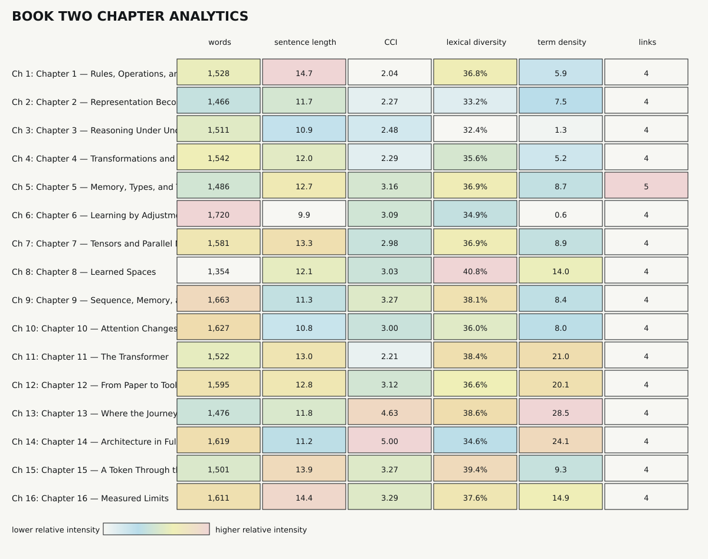

# Book Two Analytics

> Generated by `python3 analytics/analyze.py`. Do not edit manually.

## Runtime

- Mode: **chapter**
- Measured units: 16
- Words: 24,802
- Canonical modules: 25
- Dependency edges: 39
- Dependency layers: 13
- Broken local links: 0

## Unit Metrics

| Unit | Words | Share | Avg words/sentence | Long sentences | CCI | Lexical diversity | Reading ease* | Term density | Links |
|---|---:|---:|---:|---:|---:|---:|---:|---:|---:|
| Chapter 1 — Rules, Operations, and Programs | 1,528 | 6.2% | 14.7 | 6.7% | 2.04 | 36.8% | 38.9 | 5.9 | 4 (0 broken) |
| Chapter 2 — Representation Becomes Numerical | 1,466 | 5.9% | 11.7 | 1.6% | 2.27 | 33.2% | 39.8 | 7.5 | 4 (0 broken) |
| Chapter 3 — Reasoning Under Uncertainty | 1,511 | 6.1% | 10.9 | 2.2% | 2.48 | 32.4% | 44.6 | 1.3 | 4 (0 broken) |
| Chapter 4 — Transformations and Change | 1,542 | 6.2% | 12.0 | 0.0% | 2.29 | 35.6% | 47.2 | 5.2 | 4 (0 broken) |
| Chapter 5 — Memory, Types, and Translation | 1,486 | 6.0% | 12.7 | 0.9% | 3.16 | 36.9% | 41.4 | 8.7 | 5 (0 broken) |
| Chapter 6 — Learning by Adjustment | 1,720 | 6.9% | 9.9 | 0.6% | 3.09 | 34.9% | 51.6 | 0.6 | 4 (0 broken) |
| Chapter 7 — Tensors and Parallel Machines | 1,581 | 6.4% | 13.3 | 0.8% | 2.98 | 36.9% | 39.5 | 8.9 | 4 (0 broken) |
| Chapter 8 — Learned Spaces | 1,354 | 5.5% | 12.1 | 0.0% | 3.03 | 40.8% | 28.0 | 14.0 | 4 (0 broken) |
| Chapter 9 — Sequence, Memory, and Runtime | 1,663 | 6.7% | 11.3 | 2.0% | 3.27 | 38.1% | 43.8 | 8.4 | 4 (0 broken) |
| Chapter 10 — Attention Changes the Path | 1,627 | 6.6% | 10.8 | 1.3% | 3.00 | 36.0% | 45.8 | 8.0 | 4 (0 broken) |
| Chapter 11 — The Transformer | 1,522 | 6.1% | 13.0 | 6.0% | 2.21 | 38.4% | 31.8 | 21.0 | 4 (0 broken) |
| Chapter 12 — From Paper to Tool | 1,595 | 6.4% | 12.8 | 2.4% | 3.12 | 36.6% | 28.0 | 20.1 | 4 (0 broken) |
| Chapter 13 — Where the Journeys Meet | 1,476 | 6.0% | 11.8 | 1.6% | 4.63 | 38.6% | 17.7 | 28.5 | 4 (0 broken) |
| Chapter 14 — Architecture in Full | 1,619 | 6.5% | 11.2 | 1.4% | 5.00 | 34.6% | 41.1 | 24.1 | 4 (0 broken) |
| Chapter 15 — A Token Through the Machine | 1,501 | 6.1% | 13.9 | 3.7% | 3.27 | 39.4% | 36.3 | 9.3 | 4 (0 broken) |
| Chapter 16 — Measured Limits | 1,611 | 6.5% | 14.4 | 3.6% | 3.29 | 37.6% | 31.1 | 14.9 | 4 (0 broken) |

*Reading ease is heuristic and comparative; technical vocabulary can lower it without indicating weak prose.*

## Structural Vocabulary

| Term | Exact count |
|---|---:|
| architecture | 76 |
| constraint | 14 |
| execution | 28 |
| geometry | 21 |
| interface | 41 |
| representation | 51 |
| structure | 22 |
| transformer | 34 |

## Chapter analytics

Each column is normalized independently. Color shows relative intensity, not quality.
