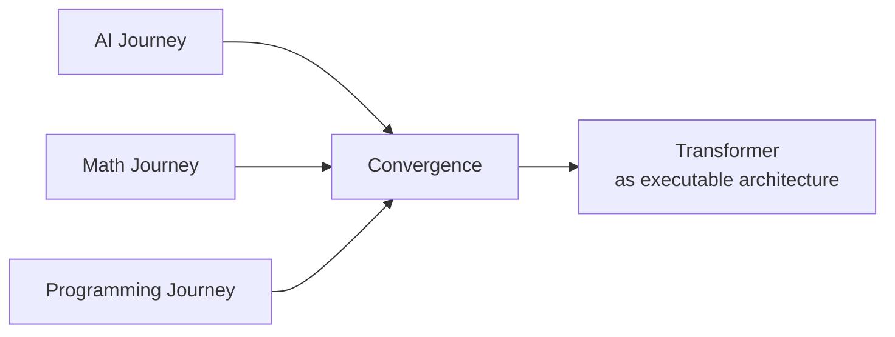

# Book Two — Structural Form

Book Two is organized as four conceptual crates. The first three reconstruct independent lineages; the fourth shows where they meet in a working transformer. Crates define responsibilities, modules define questions, and chapters will be derived only after dependencies and pivots are visible.

## `ai_journey/`

**Purpose:** Explain how the transformer became possible in AI terms.

Modules:

1. `symbolic` — logic, rules, search, and GOFAI
2. `probabilistic` — uncertainty, Bayes, and graphical models
3. `neural` — perceptrons, backpropagation, and deep networks
4. `sequence` — recurrent networks, LSTMs, and GRUs
5. `attention` — learned relevance across a sequence
6. `transformer` — attention-centered architectural convergence

**Pivot:** The transformer inherits a field shaped by symbolic representation, probabilistic modeling, and neural learning. It does not literally contain or unify every earlier AI paradigm.

## `math_journey/`

**Purpose:** Explain how the transformer became possible in mathematical terms.

Modules:

1. `algebra` — operations, closure, composition, and non-commutativity
2. `vectors` — numerical representation
3. `matrices` — linear maps and composition
4. `probability` — distributions, uncertainty, and likelihood
5. `calculus` — derivatives, gradients, and change across many variables
6. `optimization` — loss, gradient descent, and parameter updates
7. `tensors` — batched multidimensional computation
8. `geometry` — learned spaces, transformations, trajectories, and constraints

**Pivot:** A transformer maps algebraically structured token sequences through learned vector transformations. Calling this “geometric computation of algebraic intent” is a useful model whose assumptions must remain visible.

## `programming_journey/`

**Purpose:** Explain how the transformer became possible as an executable system.

Modules:

1. `representation` — tokens, vocabularies, encodings, and numerical formats
2. `languages` — abstraction, expression, enforcement, and structure
3. `memory` — layout, movement, persistence, and capacity
4. `compilers` — types, checking, translation, and optimization
5. `runtimes` — execution, scheduling, kernels, and constraints
6. `hardware` — GPUs, TPUs, accelerators, and parallelism
7. `tools` — frameworks, libraries, interfaces, and ecosystems

**Pivot:** Transformers become usable artifacts only through programming constraints, implementations, runtimes, and physical machines.

## `convergence/`

**Purpose:** Join the three lineages without drifting into Book Three’s philosophical work.

Modules:

1. `alignment` — dependency points among AI, mathematics, and programming
2. `architecture` — the transformer as one integrated technical object
3. `execution` — how inference moves representations through that object
4. `limits` — context, representation, compute, data, decoding, and architectural constraints

**Pivot:** The transformer is an artifact in which AI lineage, mathematical machinery, and programmed execution become operational together.

## Book Boundary

Book Two may identify and test architectural limits. It does not turn those limits into an ontology of intelligence. Closure as philosophy, geometry as ontology, and claims about ultimate possibility belong to Book Three.

## Derivation Rule

A module becomes a chapter only when it carries a distinct reader movement, experiment, or convergence pivot. Neighboring modules may share a chapter when separating them would produce taxonomy without narrative movement.

No crate is automatically assigned an equal number of chapters. The chapter spine must follow explanatory dependency rather than directory symmetry.

The current prerequisite graph is maintained in [dependency_map.md](dependency_map.md). The chapter spine derived from that graph is maintained in [CHAPTER_MANIFEST.md](CHAPTER_MANIFEST.md).