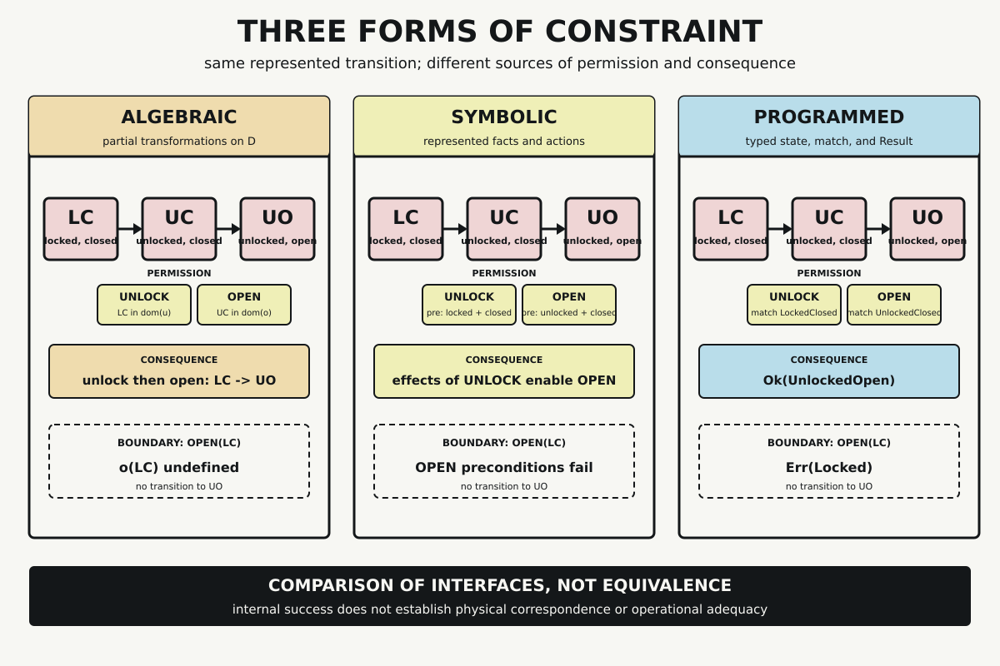

# Chapter 1 — Rules, Operations, and Programs

“Follow the rules” sounds precise until we ask what is doing the following.

A mathematical operation can be defined without anyone carrying it out. A symbolic rule can be applicable without being selected. A program can compile without corresponding to anything outside the machine. All three can produce an orderly sequence of represented states, yet the source of that order differs in each case.

That distinction matters because a transformer eventually involves all three kinds of structure. Its numerical operations have mathematical definitions. Its design belongs to a history of artificial intelligence that includes explicit symbols, rules, and search. Its behavior exists only because programs express those operations in forms that languages, compilers, runtimes, and hardware can execute. If we call every constraint a rule, those layers blur just when we need to follow them carefully.

This chapter starts smaller than a transformer. We will use one modeled door with three states and two possible transitions. The example is deliberately narrow enough that every permitted step, rejected step, and limitation remains visible.

## One Door, Three States

Represent the bolt as either locked, $L$, or unlocked, $U$. Represent the door position as either closed, $C$, or open, $O$. The raw combinations form the product

$$
X=\{L,U\}\times\{C,O\}.
$$

Our toy mechanism admits only three of those combinations:

$$
D=\{(L,C),(U,C),(U,O)\}.
$$

We abbreviate them as

$$
LC=(L,C),\qquad UC=(U,C),\qquad UO=(U,O).
$$

The missing combination, locked and open, is not a universal impossibility. It is excluded by the mechanism assumption declared for this model. That sentence is important. A formal domain tells us which objects the model admits; it does not tell us that the world must conform to the model.

Now consider two transformations:

- `unlock` takes the modeled door from $LC$ to $UC$
- `open` takes it from $UC$ to $UO$

The resulting trace is simple:

$$
LC\xrightarrow{unlock}UC\xrightarrow{open}UO.
$$

We will hold that trace constant while changing the mechanism that permits each arrow.

## The Algebraic Gate

In the algebraic view, define two partial transformations on $D$:

$$
u,o:D\rightharpoonup D.
$$

The hooked arrow indicates that these transformations need not accept every element of $D$. Define them only where the modeled operation is permitted:

$$
u(LC)=UC
$$

and

$$
o(UC)=UO.
$$

The permission test is membership in an operation’s domain. Because $LC$ lies in the domain of $u$, unlocking is defined there. Because $UC$ lies in the domain of $o$, opening is defined there. In each successful case, the consequence is another element of $D$.

Composition makes order visible. Reading composition from right to left gives

$$
(o\circ u)(LC)=UO.
$$

First apply $u$, producing $UC$; then apply $o$, producing $UO$. Reversing the order does not merely produce a less desirable answer:

$$
(u\circ o)(LC)
$$

is undefined because the first requested step, $o(LC)$, is undefined.

This is a structural result inside the declared domain. It tells us what follows from the definitions. It does not tell us whether a sensor correctly reported $LC$, whether a motor turned a bolt, or whether opening the door was a good idea.

## The Symbolic Gate

A symbolic system represents the same situation differently. Instead of beginning with an element of $D$, begin with represented facts:

```text
locked
closed
```

Then describe actions by represented preconditions and effects:

```text
ACTION UNLOCK
PRECONDITIONS: locked, closed
EFFECTS: unlocked, closed, not locked

ACTION OPEN
PRECONDITIONS: unlocked, closed
EFFECTS: unlocked, open, not closed
```

Here the gate is not membership in the domain of a partial function. The gate is satisfaction of represented preconditions. `UNLOCK` is applicable because the initial fact set contains `locked` and `closed`. Applying its represented effects changes the fact set to include `unlocked` and `closed`. Those facts then satisfy the preconditions of `OPEN`.

This style belongs to a long history of symbolic artificial intelligence. John McCarthy’s proposed Advice Taker separated declarative premises, immediate deduction, heuristic selection of premises, and resulting imperatives. Later operator-based planning systems such as STRIPS made represented conditions and state-changing effects central to problem solving. These systems differed in formalism and purpose, but both make a distinction our small example needs: storing a condition, deriving a consequence, selecting a path, and carrying out an action are not one event.

The distinction prevents several easy overclaims. If the fact set contains `unlocked`, that does not prove the physical bolt is retracted. If the preconditions of `OPEN` are represented as satisfied, that does not guarantee that an actuator can move the door. If more than one action is applicable, applicability alone does not choose among them. Search or another control procedure still has work to do.

The symbolic panel therefore supplies its own internal permission and consequence:

- **permission:** represented facts satisfy an action’s preconditions
- **consequence:** represented effects update the fact set

That mechanism produces a trace aligned with the algebraic one, but it is not the same mechanism in different typography.

## The Programmed Gate

The programmed view must express the states and transitions in a language that can execute. In Rust, the admitted represented states can be declared as an enumeration:

```rust
enum DoorState {
    LockedClosed,
    UnlockedClosed,
    UnlockedOpen,
}
```

Errors are represented separately:

```rust
enum DoorError {
    AlreadyUnlocked,
    DoorOpen,
    Locked,
    AlreadyOpen,
}
```

The `open` function branches on the typed input state:

```rust
fn open(state: DoorState) -> Result<DoorState, DoorError> {
    match state {
        DoorState::LockedClosed => Err(DoorError::Locked),
        DoorState::UnlockedClosed => Ok(DoorState::UnlockedOpen),
        DoorState::UnlockedOpen => Err(DoorError::AlreadyOpen),
    }
}
```

Rust’s `match` expression compares a typed value with arm patterns and selects the first matching arm. The return type makes the two classes of outcome explicit: `Ok(next_state)` represents program-defined success, while `Err(reason)` represents program-defined failure.

Composition is expressed as another function:

```rust
fn unlock_then_open(state: DoorState) -> Result<DoorState, DoorError> {
    let state = unlock(state)?;
    open(state)
}
```

The `?` operator extracts the value from `Ok`. If `unlock` returns `Err`, the enclosing function returns that error immediately and does not call `open`. The program therefore expresses both the intended order and the boundary that stops the sequence.

The complete executable artifact was compiled with Rust 1.97.1 under the Rust 2024 edition with warnings denied. Its tests cover every input branch of `unlock` and `open`, plus the effect of operation order. The observed outputs were:

```text
unlock_then_open(LockedClosed) = Ok(UnlockedOpen)
open(LockedClosed) = Err(Locked)
```

Three tests passed and none failed. That evidence supports a precise claim: under this implementation and test environment, the represented transitions and rejections behave as recorded. It does not establish that a physical door moved.

## Three Forms of Constraint



The figure holds the visible transition fixed:

$$
LC\longrightarrow UC\longrightarrow UO.
$$

What changes is the source of permission and consequence.

| View | Objects | Permission | Consequence | Rejected `open(LC)` |
|---|---|---|---|---|
| Algebraic | elements of $D$ | input lies in a partial operation’s domain | operation returns another element of $D$ | undefined |
| Symbolic | represented facts and actions | represented preconditions hold | represented effects update facts | inapplicable |
| Programmed | typed values and functions | a state reaches a matching branch under language rules | execution returns `Ok` or `Err` | `Err(Locked)` |

This is a comparison of interfaces, not an equivalence. The algebraic view specifies a relation among declared objects. The symbolic view manipulates represented facts under action descriptions. The program executes language expressions over typed values. Their traces can align because we designed them to represent corresponding distinctions. Alignment does not erase the different machinery that produced each trace.

## Where Internal Success Ends

All three views operate on representations. To claim that the model corresponds to a physical door, we would need evidence connecting the world to the represented state. Let $W_t$ denote a physical condition, $S_t$ a sensor reading, and $D_t$ the encoded door state. Correspondence requires a tested chain such as

$$
W_t\longrightarrow S_t\xrightarrow{encode}D_t.
$$

Operational adequacy requires more. A command must pass through a controller and actuator, produce a new observable condition, and satisfy a task criterion:

$$
D_t\longrightarrow command\longrightarrow controller\longrightarrow actuator
\longrightarrow S_{t+1}\xrightarrow{encode}D_{t+1}.
$$

No equation, symbolic rule, or successful function call establishes that chain by itself. `Ok(UnlockedOpen)` means that the program returned the success variant containing that represented state. It does not mean that a sensor was calibrated, an actuator moved, an obstruction was absent, or the action served a user’s goal.

This boundary is not a defect in formalization. It tells us what kind of evidence is still missing. Internal checks answer internal questions. Empirical and operational claims require tests that cross the relevant interfaces.

## From Rules to Representation

We can now use the word *constraint* more carefully. An operation is constrained by its declared domain. A symbolic action is constrained by represented preconditions and the procedure that selects it. A program is constrained by syntax, types, control flow, translation, and runtime behavior. Each system can establish a form of validity within its own boundaries.

The next question begins inside those boundaries. Every operation, fact, pattern, and state must be represented in a form its system can distinguish. The word `open`, the enum variant `UnlockedOpen`, an integer identifier, a one-hot coordinate, and a dense vector are not interchangeable versions of an intrinsic meaning. They are objects connected by chosen mappings.

Chapter 2 follows those mappings. It asks how selected symbols become numerical objects and which distinctions survive the journey from text to coordinates.

## Sources and Evidence

The chapter’s bounded historical and language claims are documented in the [Chapter 1 source ledger](../evidence/chapter_01_sources.md). The complete formal comparison and evidence boundary are recorded in the [door-transition artifact](../evidence/chapter_01_door_model.md), and the tested implementation is available as [Rust source](../evidence/chapter_01_door_model.rs). Visual provenance and accessibility details are recorded with [Three Forms of Constraint](../visuals/chapter_01_three_forms_of_constraint.md).