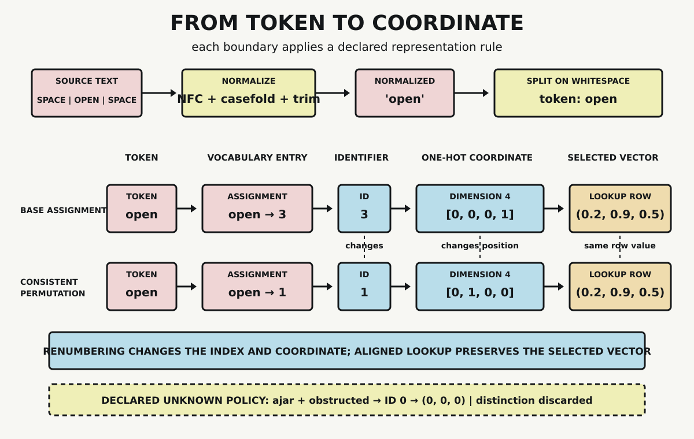

# Chapter 2 — Representation Becomes Numerical

At the end of Chapter 1, the door model contained a state called `UnlockedOpen`. The Rust program contained a variant with the same name. The symbolic system contained the facts `unlocked` and `open`. Those labels helped us align three views, but the labels were not the door, and they were not interchangeable objects inside the three systems.

Before a machine can transform text numerically, it needs a chain of representations. Source characters must be selected and normalized. A tokenizer must assign boundaries. A vocabulary must map an admitted token to an identifier. An encoding must make that identifier available to numerical operations. A lookup table may then select a vector.

It is tempting to compress the entire chain into one sentence: “The word becomes a vector.” That sentence hides every policy decision that determines what the system can still distinguish.

This chapter follows one small input through the chain. We will then renumber the vocabulary without changing the selected vector, and finally show two distinct inputs collapsing to one representation. Together, those tests reveal both the flexibility and the cost of numerical representation.

## Start with Source Text

Our source is the character sequence

```text
 OPEN 
```

It includes leading and trailing spaces and uses uppercase letters. The probe applies three declared transformations:

1. Unicode NFC normalization
2. Unicode case folding
3. removal of leading and trailing whitespace

The result is

```text
open
```

These transformations are not discoveries about what the source intrinsically means. They are policies. NFC applies a particular Unicode normalization form. Case folding supports caseless comparison. Trimming removes distinctions at the beginning and end of this input. Different applications and languages can require different choices.

The probe then splits on whitespace. Because the normalized text contains one non-whitespace sequence, the resulting token sequence is

```text
["open"]
```

This is a deliberately simple tokenizer. Production systems may split punctuation, use learned subword units, operate on bytes, or combine configurable normalization and pre-tokenization stages. There is no claim here that whitespace reveals a unique natural boundary. We need only one completely declared policy whose effects we can inspect.

## A Token Is Not Its Identifier

The base vocabulary contains four entries:

| Token | Identifier |
|---|---:|
| `<unk>` | 0 |
| `locked` | 1 |
| `unlocked` | 2 |
| `open` | 3 |

Under this assignment,

$$
\operatorname{id}_{base}(open)=3.
$$

The integer 3 is useful because an implementation can store, compare, and use it as an index. It does not say that `open` is greater than `locked`, three times anything, or located at an intrinsically meaningful numerical position. It is an assigned identifier in this vocabulary.

That distinction becomes visible when we construct a second vocabulary containing the same four tokens:

| Token | Identifier |
|---|---:|
| `unlocked` | 0 |
| `open` | 1 |
| `<unk>` | 2 |
| `locked` | 3 |

Now

$$
\operatorname{id}_{permuted}(open)=1.
$$

Nothing about the character sequence `open` forced either assignment. The vocabulary supplied the mapping.

## From Identifier to Coordinate

An identifier can select a coordinate in a vector space. For a vocabulary of size four, represent identifier $i$ by a one-hot vector in $\mathbb{R}^4$: one coordinate is 1 and the other three are 0.

In the base assignment, identifier 3 gives

$$
open\longmapsto [0,0,0,1].
$$

In the permuted assignment, identifier 1 gives

$$
open\longmapsto [0,1,0,0].
$$

The coordinates differ:

$$
[0,0,0,1]\ne[0,1,0,0].
$$

This change does not indicate that the token itself changed. A coordinate is meaningful only relative to the basis and assignment that define it. Renumber the vocabulary, and the active one-hot coordinate moves with the identifier.

One-hot vectors make the assignment explicit, but their dimension grows with the vocabulary. They also do not, by themselves, encode a useful notion of similarity. For any two different basis vectors $e_i$ and $e_j$,

$$
\lVert e_i-e_j\rVert_2=\sqrt{2}.
$$

Every pair is therefore equally separated under Euclidean distance. Later chapters will examine learned dense representations and their geometry. Here we need only the simpler role of a one-hot coordinate: it selects one declared entry.

## Lookup Is Another Mapping

Attach a fixed three-dimensional row to each token in the base vocabulary:

| Token | Identifier | Illustrative vector |
|---|---:|---|
| `<unk>` | 0 | $(0.0,0.0,0.0)$ |
| `locked` | 1 | $(0.8,0.1,-0.2)$ |
| `unlocked` | 2 | $(0.6,0.4,0.3)$ |
| `open` | 3 | $(0.2,0.9,0.5)$ |

The table has four rows and each row has dimension three. Looking up identifier 3 selects

$$
E_{base}[3]=(0.2,0.9,0.5).
$$

The vector is a fixed probe value. It was not learned, and the probe assigns it no semantic or geometric interpretation. Its purpose is to make row selection inspectable.

When the vocabulary is permuted, move every vector row with its token. `open` moves from row 3 to row 1, so the permuted table gives

$$
E_{permuted}[1]=(0.2,0.9,0.5).
$$

Therefore

$$
E_{base}[3]=E_{permuted}[1].
$$

The identifier changed. The one-hot coordinate changed. The selected vector did not change because the vocabulary and table were permuted consistently.

This is not evidence that the vector is the token’s true meaning. It is evidence that an index-based interface can preserve a selected row under coordinated relabeling.

## From Token to Coordinate



The visual keeps the stages separate:

```text
source text
    -> normalized text
    -> token
    -> vocabulary identifier
    -> one-hot coordinate
    -> selected vector
```

The base and permuted lanes align on the token and selected vector while differing at the identifier and coordinate. This is the structural point: numerical representation is a system of mappings, not a revelation of a number already hidden inside a word.

Each boundary has its own question:

| Boundary | Question |
|---|---|
| source to normalized text | Which character distinctions does the normalization policy preserve? |
| normalized text to token | Which boundary rule selects the token sequence? |
| token to identifier | Is the token admitted by this vocabulary, and which index is assigned? |
| identifier to coordinate | Which basis and dimension define the numerical position? |
| coordinate to vector | Which table row is selected, and how was that table obtained? |

Answers at one boundary do not answer the others. Unicode normalization does not define vocabulary membership. A token identifier does not specify vector dimension. A lookup operation does not establish that its rows were learned or that their distances support a task.

## Representation Can Discard Distinctions

The vocabulary also declares an unknown-token fallback. If a token is absent, the base system returns the identifier assigned to `<unk>`:

$$
\operatorname{id}_{base}(<unk>)=0.
$$

Now submit two distinct inputs:

```text
ajar
obstructed
```

Neither appears in the base vocabulary. Under the declared fallback,

$$
\operatorname{id}_{base}(ajar)
=\operatorname{id}_{base}(obstructed)
=0.
$$

Both identifiers select the same vector:

$$
(0.0,0.0,0.0).
$$

After this mapping, downstream operations receiving only that identifier or vector cannot recover which of the two absent tokens was supplied. The policy has discarded that distinction.

This result is specific to the toy policy. Some production tokenizers split unfamiliar strings into known subword units. Byte-level approaches can represent inputs without a single unknown-token fallback. Those designs apply different declared policies and preserve different distinctions for downstream computation.

## What the Probe Establishes

The standard-library Python probe checks five conditions:

- normalization produces the single token `open`
- the two vocabularies assign different identifiers to `open`
- the corresponding one-hot coordinates differ
- consistently permuted tables select the same vector for `open`
- `ajar` and `obstructed` share one identifier and vector under the declared fallback

Every assertion passes. The result supports two bounded claims. First, a vocabulary identifier is an assigned index rather than an intrinsic meaning. Second, a representation policy can discard distinctions among inputs.

The probe does not show how a production tokenizer should segment text. It does not train an embedding table, interpret vector directions, specify storage layout, or establish task adequacy. Those questions require different evidence and belong to later chapters.

## Numerical Objects Ready for Transformation

Chapter 1 showed that operations act on admitted objects under declared constraints. This chapter has constructed numerical objects that later operations can accept. The construction involved choices at every stage: normalization, boundaries, vocabulary coverage, index assignment, coordinate basis, and table lookup.

That chain gives computation something precise to manipulate. It also determines which distinctions remain available. Renumbering can preserve a lookup result when all dependent structures move together. Unknown-token mapping can merge inputs that were distinct in the source.

The lookup demonstrated here — an identifier selects one table row — is the same mechanism a trained embedding layer performs inside a Transformer, at far greater width. There the table holds learned rather than fixed rows, and hardware executes the selection as a memory-bound gather from contiguous storage rather than an arithmetic-heavy computation. Training changes which vectors occupy the rows; it does not change the indexing operation demonstrated here.

The next mathematical step is transformation: vectors become inputs to linear maps, and derivatives describe how outputs change with inputs and parameters. Before that, Chapter 3 takes a parallel route through numerical representation. Instead of assigning one state, it represents uncertainty across several hypotheses and asks how evidence changes their relative weight.

## Sources and Evidence

The chapter’s bounded claims about normalization, tokenizer components, subword policies, and indexed lookup are documented in the [Chapter 2 source ledger](../evidence/chapter_02_sources.md). Exact inputs, tables, assertions, and outputs are recorded in the [representation probe](../evidence/chapter_02_representation_probe.md), with its [Python implementation](../evidence/chapter_02_representation_probe.py). Visual provenance and accessibility details are recorded with [From Token to Coordinate](../visuals/chapter_02_from_token_to_coordinate.md).