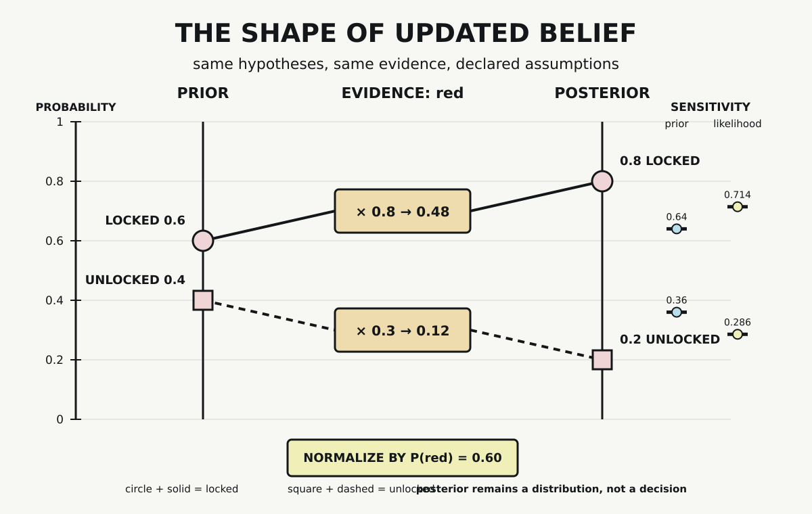

# Chapter 3 — Reasoning Under Uncertainty

Chapter 2 ended with numerical objects ready for transformation. A token could be assigned an identifier, represented by a coordinate, and used to select a vector. Each step depended on a declared policy, and each policy preserved some distinctions while discarding others.

Numerical representation does not require a system to commit to one state. It can also assign weight across several hypotheses. When evidence arrives, those weights can change without collapsing to a single certain answer.

That distinction is the subject of this chapter. We will return to the door, but we will no longer assert one modeled state. Instead, we will represent uncertainty over two hypotheses, admit one observation, and inspect how a Bayesian update redistributes probability. The example is small enough that every assumption and arithmetic step remains visible.

## Possibilities Before Predictions

Let the door-state hypothesis be

$$
H\in\{locked,unlocked\}.
$$

A hypothesis is not the same object as an outcome or an event. An outcome is one possible result of an experiment. An event is a set of outcomes to which probability can be assigned. A hypothesis is a represented claim whose probability may be considered before and after evidence. In this model, `locked` and `unlocked` are the two admitted hypotheses.

We begin with a prior distribution:

$$
P(locked)=0.6,\qquad P(unlocked)=0.4.
$$

The prior distributes total probability mass across the declared hypothesis space:

$$
0.6+0.4=1.
$$

It does not report an observed frequency, a measured sensor accuracy, or a ground-truth door state. These values are fixed assumptions of the toy model. The model also treats its two hypotheses as exhaustive. A physical door might be missing, broken, partly engaged, or incorrectly represented. Those possibilities are outside the declared space, not disproved by it.

The distribution therefore says something narrower than “the door is locked.” Before admitting the observation, the model assigns more probability to `locked` than to `unlocked`.

## Evidence Needs a Likelihood Model

Now admit the observation

$$
E=red.
$$

The word `red` does not update the prior by itself. The model needs a likelihood for observing red under each hypothesis:

$$
P(red\mid locked)=0.8,
$$

$$
P(red\mid unlocked)=0.3.
$$

These conditional probabilities answer a forward question within the model: if a hypothesis were admitted, how much probability would the model assign to this observation? They do not answer the reverse question we care about:

$$
P(red\mid locked)\ne P(locked\mid red).
$$

The distinction matters because an observation can be common under one hypothesis without making that hypothesis certain after the observation. The posterior must also account for how probability was distributed before the evidence arrived and how well the evidence fits the alternatives.

The illustrative likelihoods are not measurements of a real indicator. No physical sensor was calibrated for this chapter. The values let us inspect the update arithmetic and nothing more.

## Weight, Then Normalize

For each hypothesis $h$, multiply its prior probability by the likelihood of the admitted evidence:

$$
w(h)=P(red\mid h)P(h).
$$

For `locked`, the unnormalized joint weight is

$$
w(locked)=0.8\times 0.6=0.48.
$$

For `unlocked`, it is

$$
w(unlocked)=0.3\times 0.4=0.12.
$$

The sum of these weights gives the probability assigned to the evidence under the complete toy model:

$$
P(red)=0.48+0.12=0.60.
$$

Normalize each weight by that total:

$$
P(locked\mid red)=\frac{0.48}{0.60}=0.8,
$$

$$
P(unlocked\mid red)=\frac{0.12}{0.60}=0.2.
$$

The posterior is again a distribution:

$$
0.8+0.2=1.
$$

The observation has shifted probability from the prior $(0.6,0.4)$ to the posterior $(0.8,0.2)$. It has not selected a certain state. Both posterior values remain strictly between zero and one.

*Under the declared prior and likelihood model, observing `red` shifts probability from $(0.6,0.4)$ to $(0.8,0.2)$. The posterior remains a distribution conditioned on the model and evidence; sensitivity marks show how alternate prior or likelihood assumptions change that distribution.*

## The Same Evidence, Different Assumptions

The update depends on more than the word `red`. We can hold the observation fixed and change one assumption at a time.

First change only the prior:

$$
P(locked)=0.4,\qquad P(unlocked)=0.6.
$$

Retain the original likelihoods. The resulting posterior becomes

$$
P(locked\mid red)=0.64,\qquad
P(unlocked\mid red)=0.36.
$$

The evidence still shifts probability toward `locked`, but the result differs because the starting distribution differs.

Now restore the original prior and change only one likelihood:

$$
P(red\mid locked)=0.5.
$$

Keep $P(red\mid unlocked)=0.3$. The posterior becomes

$$
P(locked\mid red)=\frac{5}{7},\qquad
P(unlocked\mid red)=\frac{2}{7}.
$$

Again, the observation has not changed. The model used to interpret it has. These sensitivity cases do not tell us which assumptions correspond to a physical door. They establish that the posterior is conditional on the prior and likelihood model as well as the admitted evidence.

## A Graph Declares Dependence

The toy model can be drawn as one directed edge:

$$
H\longrightarrow E.
$$

The edge says that the probability assigned to the observation is conditioned on the door-state hypothesis. It makes the factorization used in the update explicit. It does not, by itself, prove that a physical door causes a physical indicator to display red.

This distinction becomes increasingly important in larger probabilistic graphical models. A graph can organize represented variables and conditional relationships so that inference can be computed. The meaning of an edge still depends on the model's definition. Direction alone is not a license to infer physical causation.

Probabilistic belief networks became an explicit research subject in artificial intelligence by the 1980s. Their historical presence matters here because AI did not develop only through deterministic rules. Systems also represented and propagated uncertainty. That history does not imply that probabilistic methods replaced symbolic AI or that every AI system performs Bayesian inference.

## Inference Is Not a Decision

The posterior answers a question inside the model: after admitting `red`, how is probability distributed across `locked` and `unlocked`?

It does not answer what anyone should do next.

A decision would require additional machinery. A system might introduce a threshold, assign different costs to errors, compare expected losses, request another observation, or decline to act. None of those choices follows from the posterior alone. Acting whenever one hypothesis exceeds $0.5$ is a decision rule, not Bayes' theorem.

The separation prevents four different objects from collapsing into one:

1. the evidence is the admitted observation `red`
2. the likelihood model states how probable that evidence is under each hypothesis
3. the posterior redistributes probability after conditioning
4. a decision rule, if one were supplied, would consume that distribution and select an action

This chapter stops at the third object. It contains no threshold, utility, loss function, predicted action, or asserted ground-truth state.

## What the Probe Establishes

The standard-library Python probe records the hypotheses, prior, likelihoods, joint weights, evidence probability, and posterior. It verifies that every prior and posterior sums to one. It verifies that the base posterior remains non-collapsed, that `red` increases the probability of `locked` without making it certain, and that changing either the prior or one likelihood changes the result.

The probe also rejects malformed inputs: an empty hypothesis space, mismatched keys, negative or non-finite probabilities, a prior that does not sum to one, and evidence with zero total probability. Those checks enforce the declared computational contract.

They do not establish physical correspondence. The probe cannot show that the hypotheses exhaust a real door's states, that `red` came from a real indicator, that the likelihoods measure sensor performance, or that an action based on the posterior would be adequate. Internal arithmetic can be valid while the model remains incomplete or poorly matched to a task.

## A Distribution Ready for Later Machinery

Chapter 1 established domains, operations, and constraints. Chapter 2 followed selected distinctions into numerical representation. This chapter has added another numerical object: a probability distribution over declared possibilities. Evidence changes that object through likelihood weighting and normalization, but the result remains conditional and uncertain.

Later chapters will use probability in two distinct directions. Chapter 6 will combine expected quantities with objectives and gradients when it introduces learning by adjustment. Chapter 10 will examine normalized weighting in attention while keeping attention weights distinct from Bayesian posterior probabilities.

Before either step, Chapter 4 turns to transformations more generally. Vectors and distributions can change; matrices, maps, and derivatives provide language for describing how outputs depend on inputs and parameters. The posterior showed one carefully bounded change. The next chapter develops machinery for change itself.

## Sources and Evidence

The chapter's bounded claims about conditional probability, Bayesian updating, historical origin, and probabilistic graphical models are documented in the [Chapter 3 source ledger](../evidence/chapter_03_sources.md). Exact assumptions, validation gates, sensitivity cases, and observed outputs are recorded in the [Bayesian update probe](../evidence/chapter_03_bayesian_update_probe.md), with its [Python implementation](../evidence/chapter_03_bayesian_update_probe.py). Visual provenance and accessibility details are recorded with [The Shape of Updated Belief](../visuals/chapter_03_shape_of_updated_belief.md).