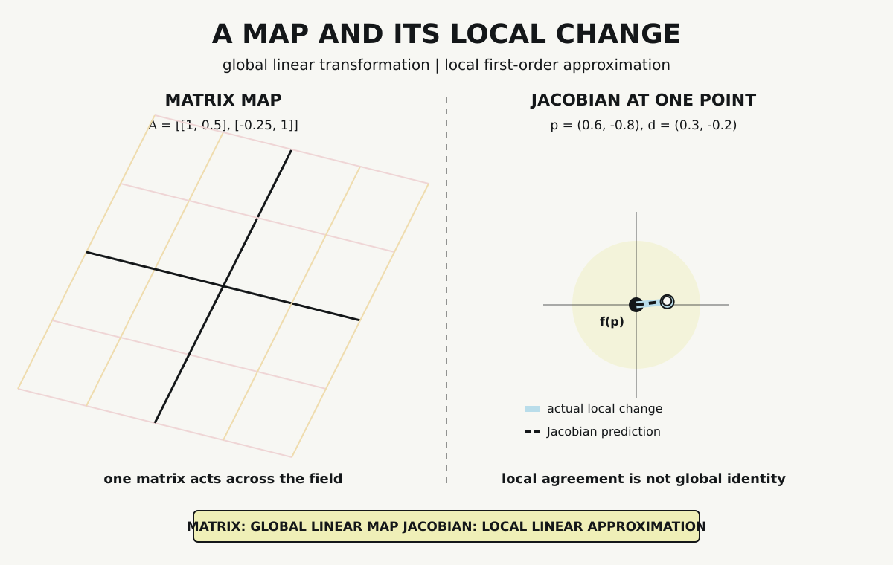

# Chapter 4 — Transformations and Change

Chapter 2 constructed vectors that numerical operations could accept. Chapter 3 showed a probability distribution changing when evidence entered a declared model. We now need language for transformation itself: what a map does to an input, which transformations are linear, and how a nonlinear map changes near one point.

These questions lead to matrices and derivatives. They are related, but they are not interchangeable. A matrix can represent a linear map across its complete domain once coordinates have been selected. A derivative describes local change. For a differentiable map with several inputs and outputs, that derivative can itself be represented by a matrix called the Jacobian.

The word *local* carries much of this chapter's weight. A Jacobian can expose how a map behaves near a declared point without describing the map globally. We will make that boundary visible with one fixed matrix, one nonlinear map, and one executable finite-difference check.

## A Matrix Acts on Coordinates

Consider the matrix

$$
A=
\begin{bmatrix}
1 & 0.5\\
-0.25 & 1
\end{bmatrix}.
$$

Applied to a coordinate vector $(x,y)$, it produces

$$
A
\begin{bmatrix}
x\\y
\end{bmatrix}
=
\begin{bmatrix}
x+0.5y\\
-0.25x+y
\end{bmatrix}.
$$

The output is another coordinate vector. The first output coordinate combines all of $x$ with half of $y$. The second combines all of $y$ with negative one quarter of $x$. Applying the matrix across a coordinate grid shears and rotates its visible directions while preserving the origin and straight combinations.

Strictly, the matrix is not the underlying linear map without qualification. A linear map acts between vector spaces. Once bases are selected, a matrix records how that map acts on coordinates in those bases. Changing the bases can change the matrix without changing the underlying map. Our probe fixes ordinary coordinates in $\mathbb{R}^2$, so the distinction remains visible even though no basis change is performed.

## What Makes the Map Linear

Linearity is not a synonym for numerical transformation. A map $T$ is linear when it preserves vector addition and scalar multiplication:

$$
T(u+v)=T(u)+T(v)
$$

and

$$
T(cu)=cT(u).
$$

The probe checks both relations for declared inputs

$$
u=(1,2),\qquad v=(-1,1),\qquad c=3.
$$

First,

$$
u+v=(0,3),
$$

so

$$
A(u+v)=(1.5,3).
$$

Computing the two transformed vectors separately and then adding gives the same result:

$$
Au+Av=(1.5,3).
$$

For scalar multiplication, both routes produce

$$
A(3u)=3Au=(6,5.25).
$$

These equalities test the implementation against the defining relations. Two numerical examples do not prove linearity by sampling. The algebraic form of matrix multiplication establishes that every matrix map preserves these operations; the probe verifies that our implementation and reported values agree with that structure.

Composition remains available. If $A$ and $B$ represent compatible linear maps, the product $BA$ represents applying $A$ first and $B$ second. Matrix multiplication therefore records a composed transformation, not merely a table of unrelated numbers. Later chapters will rely on repeated compositions of this kind.

## A Transformation That Is Not Linear

Now declare a different map:

$$
f(x,y)=\left(x+\frac14y^2,\sin x+y\right).
$$

This map is nonlinear. The squared term means that doubling an input does not generally double the first output. The sine term also changes its rate of response as $x$ changes. No single fixed matrix reproduces $f$ over its complete domain.

That does not prevent linear machinery from being useful. Near a specified point, a differentiable map can be approximated to first order by a linear map. For a scalar-valued function, its derivative in several coordinates is often organized as a gradient. For a vector-valued function such as $f:\mathbb{R}^2\to\mathbb{R}^2$, the derivative is represented by the Jacobian matrix.

Differentiate each output with respect to each input:

$$
J_f(x,y)=
\begin{bmatrix}
1 & 0.5y\\
\cos x & 1
\end{bmatrix}.
$$

The rows correspond to output components; the columns correspond to input coordinates. This matrix is not context-free. It belongs to the declared map $f$ and still depends on the evaluation point $(x,y)$.

## Change Near One Point

Choose

$$
p=(0.6,-0.8).
$$

At this point,

$$
J_f(p)=
\begin{bmatrix}
1 & -0.4\\
0.8253356149 & 1
\end{bmatrix}.
$$

Now choose the input direction

$$
d=(0.3,-0.2).
$$

Multiplying the Jacobian by this direction predicts the first-order output change per unit step along $d$:

$$
J_f(p)d=(0.38,0.0476006845).
$$

For a small scalar $h$, this gives the approximation

$$
f(p+hd)\approx f(p)+hJ_f(p)d.
$$

The approximation is local in two senses. It is evaluated at $p$, and its error is expected to become small as the step $h$ becomes small. Moving far from $p$ allows the nonlinear terms to accumulate. Evaluating the Jacobian at another point can produce another matrix.

*The fixed matrix transforms the complete coordinate field on the left. On the right, the nonlinear map's actual displacement near $p=(0.6,-0.8)$ nearly coincides with the directional change predicted by $J_f(p)$; the agreement is local, not a claim that the nonlinear map equals its Jacobian globally.*

The visual places the two roles side by side. The left field is transformed everywhere by one matrix. On the right, the solid and dashed displacements nearly coincide only within the highlighted neighborhood. The Jacobian exposes local structure; it does not turn the nonlinear map into a globally linear one.

## Checking the Derivative Numerically

An analytic derivative can be written incorrectly, and derivative code can disagree with the function it is intended to describe. A finite difference supplies an independent computational check.

The probe uses the central directional difference

$$
\frac{f(p+hd)-f(p-hd)}{2h}.
$$

It compares that vector with $J_f(p)d$ for four decreasing step sizes:

| $h$ | Error from $J_f(p)d$ |
|---:|---:|
| $10^{-1}$ | $3.7138\times10^{-5}$ |
| $10^{-2}$ | $3.7140\times10^{-7}$ |
| $10^{-3}$ | $3.7140\times10^{-9}$ |
| $10^{-4}$ | $3.7137\times10^{-11}$ |

The Euclidean error decreases at every recorded step. Reducing $h$ by a factor of ten reduces the observed error by approximately a factor of one hundred in this range. That pattern is consistent with the central difference approaching the analytic directional derivative for this smooth map.

The check remains bounded. It compares one implemented function and derivative at one point, in one direction, over four step sizes. It does not prove that arbitrary functions are differentiable or that the derivative is globally accurate. Nor should $h$ be reduced without limit: finite-precision subtraction can eventually make smaller steps less reliable.

## Jacobian, Gradient, and Learning

Several later mechanisms use derivative language, so their roles must remain distinct.

A Jacobian records the derivative of a vector-valued map. A gradient is associated with a scalar-valued function and points in the direction of steepest local increase under the usual Euclidean structure. An optimization method uses derivative information, an objective, and an update rule to choose a parameter change. A learning system adds parameters, data, loss construction, repeated execution, and stopping or evaluation conditions.

This chapter supplies only transformation and local change. The calculation

$$
J_f(p)d

does not minimize anything, update a parameter, or learn from data. Chapter 6 will add objectives and adjustment. Keeping that machinery separate prevents every derivative from being described as learning.

The same boundary applies beyond machines. A Jacobian is defined relative to a function, coordinates, and an evaluation point. A person does not simply “have a Jacobian” as a context-free trait, and matrix density or rank does not measure intelligence or worth.

## What the Probe Establishes

The dependency-free Python probe verifies the sampled additivity and homogeneity equalities for $A$. It evaluates the analytic Jacobian, applies it to $d$, computes the four central differences, and confirms decreasing error down to approximately $3.7\times10^{-11}$.

The result supports two bounded claims. The fixed matrix implementation behaves according to the tested linearity relations, and the analytic Jacobian agrees with local numerical change for the recorded case. It does not establish global linearity for $f$, numerical stability at every scale, or any optimization, neural-network, or attention result.

## Machinery Ready for Composition

Part I has assembled four kinds of structure. Operations act within declared domains. Representation policies produce numerical objects. Probability distributes weight across admitted possibilities. Matrices transform coordinates, while derivatives expose local change.

These structures now have outgoing work. Matrices will contribute to neural computation, tensors, geometry, and attention. Derivatives will contribute to optimization and geometric analysis. None of those later uses changes what has been established here: global linear maps and local linear approximations are related machinery with different scopes.

Chapter 5 follows numerical intent into programming systems. Values must occupy memory, types must constrain operations, and compilers must translate source expressions before hardware can execute them. Only after that implementation path is visible will Chapter 6 combine derivatives with objectives and repeated parameter adjustment.

## Sources and Evidence

The chapter's bounded claims about linear maps, matrix representation, multivariable derivatives, Jacobians, and finite-difference checks are documented in the [Chapter 4 source ledger](../evidence/chapter_04_sources.md). Exact inputs, formulas, assertions, and outputs are recorded in the [map-and-local-change probe](../evidence/chapter_04_map_and_local_change_probe.md), with its [Python implementation](../evidence/chapter_04_map_and_local_change_probe.py). Visual provenance and accessibility details are recorded with [A Map and Its Local Change](../visuals/chapter_04_map_and_local_change.md).