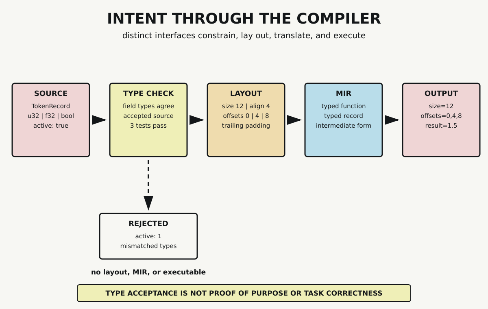

# Chapter 5 — Memory, Types, and Translation

Chapter 4 ended with mathematical machinery ready for composition. A matrix could transform coordinates, and a Jacobian could describe local change near a declared point. Those definitions do not place values in memory or produce instructions a processor can execute.

Between a mathematical expression and a running program lie several interfaces. A language admits some source constructions and rejects others. A representation policy constrains how fields are laid out. A compiler translates source through intermediate forms. An executable can then produce observable behavior in a particular environment.

It is tempting to call these artifacts different views of one unchanged intention. That description is too smooth. Each interface adds constraints, discards source form, or introduces target-dependent decisions. This chapter follows one small Rust record through the chain so that acceptance, layout, translation, and output remain distinguishable.

## A Typed Source Declaration

The source begins with three fields:

```rust
#[repr(C)]
struct TokenRecord {
    identifier: u32,
    weight: f32,
    active: bool,
}
```

The names orient a human reader. The field types constrain the values admitted by this program. `identifier` holds a 32-bit unsigned integer, `weight` holds a 32-bit floating-point value, and `active` holds a Boolean.

The accepted record is

```rust
let record = TokenRecord {
    identifier: 3,
    weight: 0.5,
    active: true,
};
```

These declarations do not tell us whether identifier 3 names the right token, whether weight 0.5 was learned correctly, or whether the record should be active. They establish a narrower source contract: each field must receive a value compatible with its declared type.

The probe tests the boundary by creating a temporary source variant:

```rust
active: 1
```

Rust does not treat integer 1 as Boolean `true`. The compiler exits unsuccessfully and reports mismatched types. No executable is produced from that invalid source.

This rejection is useful precisely because it is bounded. The compiler has established that one expression does not have the expected type. It has not established what the program is for, whether its model corresponds to the world, or whether an accepted computation is adequate for a task.

## A Type Is Not Yet a Layout

The types tell us which kinds of values the fields admit. Layout adds size, alignment, and relative field offsets.

The attribute `#[repr(C)]` selects declared layout rules for this record. For a struct with this representation, fields are considered in declaration order. Before placing each field, the layout algorithm adds any padding required to satisfy that field's alignment. The complete struct size is then rounded up to a multiple of the struct alignment.

In the recorded environment, the first field begins at offset 0:

```text
identifier: u32    offset 0    size 4
```

The next field also requires four bytes and begins at offset 4:

```text
weight: f32        offset 4    size 4
```

The Boolean occupies one byte beginning at offset 8:

```text
active: bool       offset 8    size 1
```

At this point, the fields account for nine bytes. The record alignment is four bytes, so its total size must be rounded to the next multiple of four. Three trailing padding bytes bring the size to 12:

```text
byte offset    0       4       8 9 10 11
content        u32     f32     bool | padding
```

The probe does not read the padding as data. Padding participates in layout and array stride, but it is not another source-level field.

Compile-time assertions require the complete contract:

```rust
assert!(size_of::<TokenRecord>() == 12);
assert!(align_of::<TokenRecord>() == 4);
assert!(offset_of!(TokenRecord, identifier) == 0);
assert!(offset_of!(TokenRecord, weight) == 4);
assert!(offset_of!(TokenRecord, active) == 8);
```

If the recorded values fail, compilation stops. The same properties are checked again by a runtime test.

## Representation Is a Policy

The layout result must retain its context. Rust's default representation does not generally promise that struct fields retain declaration order. Its guarantees are those needed for soundness, including adequate alignment and non-overlapping fields. We therefore cannot remove `repr(C)` and continue asserting the same offsets merely because one compilation happens to produce them.

Nor does `repr(C)` create one universal layout independent of field types and target. Primitive alignment can be platform-specific, and layout alone does not settle how every value is passed across function boundaries. The probe records one type, representation, toolchain, and environment.

This is the same discipline applied to numerical representations in Chapter 2. A representation policy preserves selected structure for a purpose. Its resulting numbers become meaningful inside that declared system, not as intrinsic labels attached to the source object.

## A Typed Operation

The program applies one function to the record:

```rust
fn weighted_identifier(record: TokenRecord) -> f32 {
    if record.active {
        record.identifier as f32 * record.weight
    } else {
        0.0
    }
}
```

The signature says that the function accepts a `TokenRecord` and returns an `f32`. Inside the active branch, the unsigned identifier is explicitly converted to `f32` before multiplication. For the accepted input,

$$
3\times0.5=1.5.
$$

Three tests pass: the declared layout matches, the active record produces 1.5, and an otherwise identical inactive record produces zero.

These tests inspect separate claims. The layout test does not verify the multiplication. The active test does not prove the field offsets. Keeping the assertions separate makes a failure easier to locate.

## Source Becomes an Intermediate Form

Accepted source is not passed directly to a processor as Rust syntax. rustc translates it through internal representations. The probe asks stable rustc to emit its Mid-level Intermediate Representation, or MIR.

MIR is organized as a control-flow graph. Nested source expressions are lowered into explicit operations, places, temporaries, basic blocks, and terminators. Types remain explicit. In the emitted artifact, the probe finds the typed function boundary

```text
fn weighted_identifier(_1: TokenRecord) -> f32
```

and a typed `TokenRecord` construction.

This is evidence of translation, not one-to-one preservation. A source variable can become an indexed MIR local. One source expression can become several intermediate operations. Optimization can remove, combine, or rearrange work before code generation. The human-readable MIR format is itself subject to change and is not a stable interchange contract.

The probe therefore checks two bounded markers rather than storing and comparing the complete MIR text. It verifies that the declared typed function and record construction remain inspectable in the recorded compiler output.



*The accepted `TokenRecord` crosses source declaration, type checking, declared layout, typed MIR, and observable output. A temporary integer supplied to the Boolean field is rejected at type checking and produces no downstream artifact. Acceptance establishes conformity to these interfaces, not proof of program purpose or task correctness.*

The downward branch in the visual is as important as the accepted path. `active: 1` does not acquire a layout as a `TokenRecord`, appear in accepted MIR, or produce an executable. The type boundary prevents those downstream artifacts from existing for that source.

## Observable Output

The accepted program prints:

```text
size=12
alignment=4
offsets=identifier:0,weight:4,active:8
weighted_identifier=1.5
```

The wrapper probe reproduces this output exactly. It also verifies three passing Rust tests, the two MIR markers, unsuccessful compilation of the invalid field value, and the expected type-mismatch diagnostic. All six wrapper assertions pass under rustc 1.97.1 using the Rust 2024 edition with warnings denied.

This output closes the chapter's concrete path. A source declaration has crossed type checking, a layout contract, compiler translation, and executable behavior. The output does not reveal every compiler stage or final instruction, and it does not demonstrate performance.

## Compilation Stops Before Runtime Analysis

Producing and launching the small executable is enough to reproduce its reported result. It is not enough to explain a runtime system.

This chapter does not measure allocation, cache behavior, scheduling, kernel dispatch, memory transfer, or hardware cost. It does not inspect LLVM internals, linker behavior, or a particular assembly sequence. Those mechanisms require different artifacts and, where appropriate, target-specific tools.

Chapter 9 resumes this programming path. It will combine translated artifacts with ordered computation, runtime work, and memory movement. The current chapter hands forward two bounded objects: values with an inspectable layout and source operations that have passed compiler translation.

The layout contract demonstrated here — declared size, alignment, and field offset — is the same kind of contract a tensor library enforces for every weight matrix and activation buffer inside a running Transformer, across memory hierarchies this chapter does not model. A multi-gigabyte tensor does not escape type checking or layout discipline; it is this same contract applied at far greater scale.

## What the Probe Establishes

The Rust artifact and Python wrapper jointly verify four claims in the declared environment. Field types reject the tested inadmissible value. The `repr(C)` record has size 12, alignment 4, and offsets 0, 4, and 8. Emitted MIR contains the typed function and record construction. The accepted executable produces the recorded output.

The probe does not establish that type checking proves correctness, that source intent survives unchanged, that MIR is stable, or that one source construct maps to one instruction. It does not generalize the layout to default Rust representation or every target ABI.

## Part I: Structures Ready to Work

Part I began with operations and rules, then constructed numerical representations, distributions, transformations, and local change. This chapter has followed a represented value into a typed and laid-out program artifact.

The result is not one unified structure. It is an interface chain. Mathematics specifies operations over declared objects. Representation makes objects numerically available. Probability expresses uncertainty. Matrices and derivatives describe transformation and change. Languages and compilers constrain how selected operations become executable artifacts.

Part II now asks how such machinery can adjust parameters. Chapter 6 combines probability and calculus with an objective, gradients, neural computation, and repeated updates. The compiler has not learned anything here. It has enforced and translated a declared program. Learning begins only when the next chapter adds the missing loop.

## Sources and Evidence

The chapter's bounded claims about Rust types, `repr(C)` layout, and MIR are documented in the [Chapter 5 source ledger](../evidence/chapter_05_sources.md). Exact source, commands, assertions, rejection behavior, and output are recorded in the [compiler probe](../evidence/chapter_05_intent_through_compiler_probe.md), with its [Rust artifact](../evidence/chapter_05_intent_through_compiler.rs) and [Python wrapper](../evidence/chapter_05_intent_through_compiler_probe.py). Visual provenance and accessibility details are recorded with [Intent Through the Compiler](../visuals/chapter_05_intent_through_compiler.md).