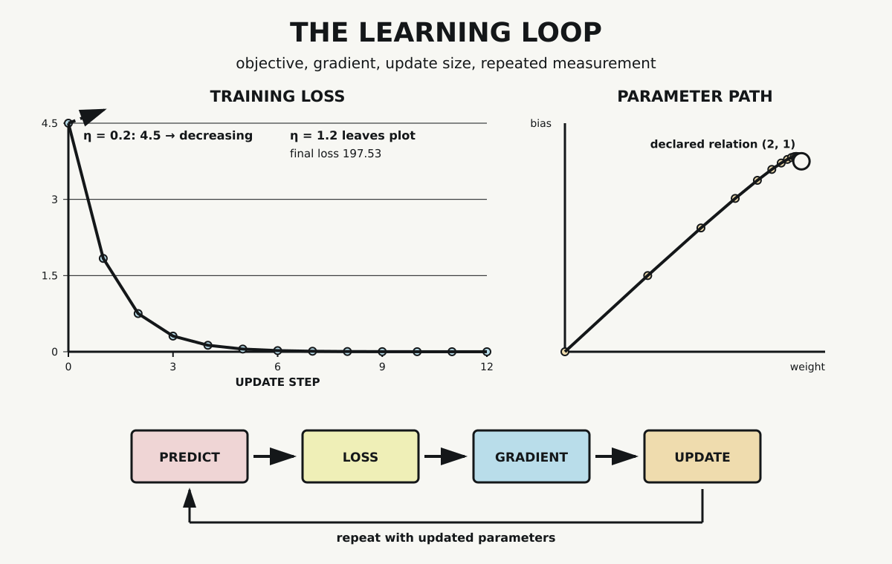

# Chapter 6 — Learning by Adjustment

Chapter 5 followed a typed program from source declaration to observable output. The compiler rejected an invalid field, preserved a declared layout, translated accepted source, and produced an executable. None of those operations changed the program's parameters in response to examples. The compiler enforced and translated instructions; it did not learn.

Chapter 4 stopped at a related boundary. A derivative described how a function changed near one point, but no objective selected a preferred direction and no update changed a parameter. A gradient alone is information about local change. Turning that information into training requires additional machinery.

This chapter adds the smallest complete loop. We will declare a parameterized model, a finite distribution of examples, a scalar loss, a gradient, an update rule, a learning rate, and repeated evaluation. One learning rate will lower the selected objective. A second, larger rate will fail while every other declared component remains fixed.

## A Model with Adjustable Parameters

Consider the affine unit

$$
\hat y=wx+b.
$$

The input $x$ is multiplied by a weight $w$, then shifted by a bias $b$. The output $\hat y$ is a prediction. At any moment, the ordered pair $(w,b)$ determines the function the unit computes.

We begin with

$$
w=0,\qquad b=0.
$$

At this initialization, every input produces the prediction zero. The model has parameters, but nothing has yet selected better values for them.

The term *unit* is deliberate. This affine computation is one component used in neural systems, but it is not a biological neuron. It has no membrane, metabolism, synapses, or cellular dynamics. Calling it artificial does not erase the distinction.

## Examples and Their Weights

The training data contain four examples:

| $x$ | target $y$ | probability |
|---:|---:|---:|
| $-1$ | $-1$ | $0.25$ |
| $0$ | $1$ | $0.25$ |
| $1$ | $3$ | $0.25$ |
| $2$ | $5$ | $0.25$ |

The targets follow the declared relation

$$
y=2x+1.
$$

The four probabilities sum to one. They make the training objective an expected quantity over this finite distribution, carrying forward Chapter 3's distinction between admitted alternatives and the weights assigned to them. Equal weighting is a choice in the worked problem, not a property of training data in general.

Each example produces an error

$$
e_i=wx_i+b-y_i.
$$

An error belongs to one prediction-target comparison. Training requires a scalar objective that combines the errors across the declared distribution. Here that objective is half the expected squared error:

$$
L(w,b)=\frac12\sum_i P_i(wx_i+b-y_i)^2.
$$

Squaring prevents positive and negative errors from canceling. The factor of one half simplifies the derivative. Neither choice makes this loss universal. It is the objective selected for this model and these examples.

At $(w,b)=(0,0)$, the four errors are $1$, $-1$, $-3$, and $-5$. Substitution gives

$$
L(0,0)=4.5.
$$

This number evaluates the current parameters against the declared training objective. It does not measure intelligence, understanding, or performance on examples that are not present.

## From Loss to Gradient

The loss is a scalar-valued function of two parameters. Its gradient collects the two partial derivatives:

$$
\nabla L(w,b)=
\begin{bmatrix}
\dfrac{\partial L}{\partial w}\\[6pt]
\dfrac{\partial L}{\partial b}
\end{bmatrix}.
$$

Differentiating the declared loss gives

$$
\frac{\partial L}{\partial w}
=\sum_i P_i(wx_i+b-y_i)x_i
$$

and

$$
\frac{\partial L}{\partial b}
=\sum_i P_i(wx_i+b-y_i).
$$

At the initial parameters, these expressions produce

$$
\nabla L(0,0)=(-3.5,-2.0).
$$

Under the usual Euclidean geometry, the gradient points in the direction of steepest local increase. Its negative points toward local decrease. The word *local* remains essential: the derivative describes change near the current parameters, not the behavior of every possible finite step.

The probe checks the analytic gradient with central finite differences. For the weight component, it evaluates

$$
\frac{L(w+h,b)-L(w-h,b)}{2h},
$$

with a corresponding expression for the bias and $h=10^{-6}$. The numerical result is approximately

$$
(-3.50000000049,-2.00000000028).
$$

Both absolute differences from the analytic components are below $5\times10^{-10}$. This agreement checks the implemented formulas at the initial point. It does not prove that every derivative implementation is correct.

## An Update Is a Decision

The gradient does not alter the parameters. An update rule must use it. Gradient descent applies

$$
(w,b)\leftarrow(w,b)-\eta\nabla L(w,b),
$$

where $\eta$ is the learning rate.

The learning rate scales the update. It is not part of the gradient and does not change the direction reported by the derivative. With $\eta=0.2$, the first step is

$$
(0,0)-0.2(-3.5,-2.0)=(0.7,0.4).
$$

Evaluating the loss again gives

$$
L(0.7,0.4)=1.8375.
$$

For this step, the chosen update lowers the loss from $4.5$ to $1.8375$. That observation supports a claim about one update under one declared rate. Training becomes a loop only when the system evaluates the updated parameters and repeats the process.

## The Repeated Loop

The probe performs 12 updates. At each recorded position it predicts, measures loss, computes the gradient, and updates the parameters. Selected points from the trace are:

| step | weight | bias | loss |
|---:|---:|---:|---:|
| 0 | 0.000000 | 0.000000 | 4.500000 |
| 1 | 0.700000 | 0.400000 | 1.837500 |
| 3 | 1.440000 | 0.805000 | 0.308812 |
| 6 | 1.828750 | 0.990875 | 0.022818 |
| 9 | 1.939045 | 1.024231 | 0.002342 |
| 12 | 1.973632 | 1.023326 | 0.000486 |

Loss decreases at every recorded update in this trace. The parameters move from $(0,0)$ toward the declared relation $(2,1)$, though after 12 steps they have not arrived exactly there.

*With learning rate $0.2$, the declared training loss falls across 12 updates and the parameters move toward $(2,1)$. Holding the model, data, objective, initialization, and step count fixed but increasing the rate to $1.2$ sends the control trajectory outside the plotted loss region and ends near $197.53$.*

The lower band of the visual exposes the repeated mechanism: predict, compute loss, compute gradient, update, then return with changed parameters. No individual box is learning by itself. The observed adjustment belongs to their ordered repetition within the declared training problem.

## Direction Does Not Guarantee a Good Step

The base trace might tempt us to say that following a negative gradient always improves the objective. The control case prevents that inference.

The probe holds the model, examples, probabilities, loss, analytic gradient, initialization, and 12-step duration fixed. It changes only the learning rate from $0.2$ to $1.2$. The control begins at the same loss $4.5$ but ends at approximately

$$
197.5298.
$$

The local descent direction has been multiplied into steps large enough to overshoot the useful region in this case. Repeated updates amplify the failure instead of correcting it.

This result does not establish a universal threshold between good and bad rates. It establishes something narrower and more important: derivative information and update size play distinct roles, and the presence of a gradient does not guarantee improvement for every finite step.

## Training Loss Is Not Generalization

Every quantity measured here belongs to the same four training examples used to construct the objective. The falling curve therefore reports reduced training loss. No examples were held out, and no unseen-data performance was measured.

Generalization asks how a trained model behaves beyond the observations used to adjust it. Answering that question requires another evaluation design. Train/test separation, regularization, early stopping, and deployment conditions are outside this probe. A low training loss can be useful evidence without being sufficient evidence for a useful deployed model.

The same boundary applies to stronger language. Parameter adjustment does not establish understanding or intention. The word *learning* names the declared machine-learning procedure here: parameters change in response to an objective computed from data. It should not silently import every meaning the word carries in biology, psychology, or ordinary life.

## From One Unit to Layered Systems

This affine unit uses a derivative of one scalar objective with respect to two parameters. Layered neural networks contain many parameters connected through composed operations. Training them requires assigning how changes in the final objective depend on intermediate computations and parameters.

Backpropagation is historically important machinery for computing those derivatives through layered networks using the chain rule. The 1986 work of Rumelhart, Hinton, and Williams helped establish error backpropagation as a practical method for adjusting weights in such systems. This chapter does not implement that machinery. There is no hidden layer, activation function, automatic differentiation system, or backward traversal of a computational graph in the probe.

The single-unit case supplies the prerequisite distinction. A model produces predictions. A loss evaluates them. Derivatives describe local sensitivity. An update rule changes parameters. Repetition creates a training trajectory. Later systems can scale and compose these roles without making them identical.

## What the Probe Establishes

The dependency-free Python probe verifies five claims for the declared case. The example probabilities sum to one. The analytic initial gradient matches finite differences. With learning rate $0.2$, loss decreases at every recorded update and the parameters move closer to $(2,1)$. With learning rate $1.2$, final loss exceeds initial loss.

The probe does not establish convergence for arbitrary objectives, models, initializations, or learning rates. It does not test stochastic gradients, minibatches, hidden layers, biological learning, unseen-data performance, or intelligence. Its strength comes from the visible boundary around what was changed and what was measured.

## Adjustment Ready to Scale

Part II begins with a loop rather than a larger model. Probability supplies weights over examples. Calculus supplies local change information. Numerical representations carry inputs and parameters. Executable code repeats the selected operations. The result is a bounded mechanism for objective-directed adjustment.

Chapter 7 will widen the computational substrate. Matrix operations will become higher-dimensional tensor operations, and parallel hardware will make larger workloads practical. Chapter 9 will later add ordered state and recurrence. Those systems depend on parameterized neural computation, but scale does not remove the distinctions established here: prediction is not loss, gradient is not update, and reduced training loss is not a guarantee of generalization.

The four-step loop demonstrated here — predict, compute loss, compute gradient, update — does not change shape when the parameters are a transformer's attention projections, feed-forward weights, and embeddings instead of one weight and one bias. What changes is size and hardware cost: batched matrix multiplications, tensor contractions, and gradient-accumulation buffers replace two scalar partial derivatives. A larger model trained this way is not thereby a model that understands; it is the same bounded update rule executed at greater width and depth.

## Sources and Evidence

The chapter's bounded claims about training objectives, gradient descent, learning rate, and backpropagation lineage are documented in the [Chapter 6 source ledger](../evidence/chapter_06_sources.md). Exact data, formulas, assertions, and outputs are recorded in the [learning-loop probe](../evidence/chapter_06_learning_loop_probe.md), with its [Python implementation](../evidence/chapter_06_learning_loop_probe.py). Visual provenance and accessibility details are recorded with [The Learning Loop](../visuals/chapter_06_learning_loop.md).