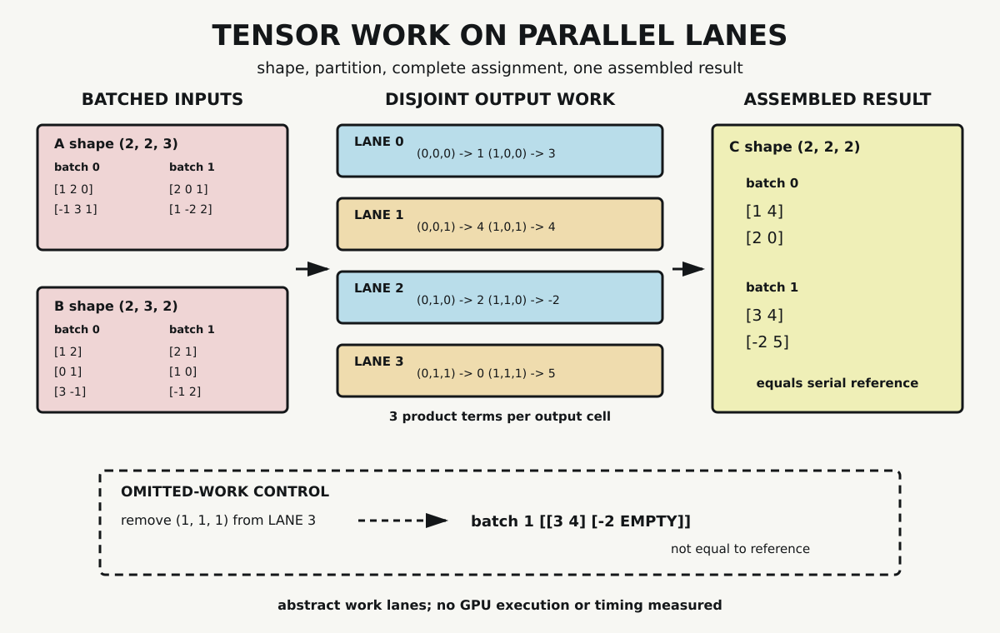

# Chapter 7 — Tensors and Parallel Machines

Chapter 6 trained one affine unit by repeating prediction, loss, gradient, and update operations. Its probe used four examples and two parameters. Larger neural systems repeat related numerical operations across many examples, positions, features, and parameters. Writing each value as a separately named scalar would conceal the structure that makes this work manageable.

Tensors provide a computational organization for those values. Their shapes expose which axes belong to examples, rows, columns, positions, or features. Some tensor operations also expose many output tasks that can be assigned across parallel execution machinery.

That second statement needs care. A calculation that can be partitioned is not thereby running concurrently. A GPU is not guaranteed to improve every workload, and an operation count is not an elapsed time. This chapter will first inspect one exact work decomposition, then place it beside the hardware structures designed to execute abundant numerical work.

## Shape Before Arithmetic

In this chapter, a tensor is a shaped multidimensional array of numerical values. This is the computational usage common in machine-learning systems. It does not exhaust the mathematical meaning of tensors in multilinear algebra or differential geometry.

A vector can be stored as a one-axis array. A matrix adds a second axis. Additional axes can identify a batch of matrices, a sequence of vectors, or another declared grouping. The number of axes is often called the array's rank, while its *shape* records the size along each axis.

The probe begins with a left tensor $A$ of shape

$$
(2,2,3).
$$

Read from left to right, it contains two batches, two rows per batch, and three values per row. The right tensor $B$ has shape

$$
(2,3,2),
$$

meaning two batches, three rows per batch, and two columns per row.

The axis names are not intrinsic to the stored numbers. They come from the declared operation. Here the first axis selects a batch, the second and third axes form one matrix, and equally indexed batches are multiplied together.

## Matrix Multiplication Across a Batch

Ordinary matrix multiplication combines one row of a left matrix with one column of a right matrix. The inner dimensions must agree. For shapes $(n,k)$ and $(k,m)$, the result has shape $(n,m)$.

The same operation can be applied across a stack of matrices. For batch $b$, output row $i$, and output column $j$, the probe computes

$$
C_{b,i,j}=\sum_{k=0}^{2}A_{b,i,k}B_{b,k,j}.
$$

The first dimensions of $A$ and $B$ both contain two batches. Their matrix dimensions are $(2,3)$ and $(3,2)$. The contracted inner dimension is three, so each batch produces a $(2,2)$ matrix. The complete output shape is therefore

$$
(2,2,2).
$$

Shape compatibility is a constraint on the operation, not a claim that every pair of multidimensional arrays can be multiplied this way. Libraries can add broadcasting and other conventions. The standard-library probe deliberately uses equal batch dimensions and no broadcasting so every index remains visible.

## One Output Cell

Consider the first output coordinate, $(0,0,0)$. It selects batch zero, row zero, and column zero. Its three product terms are

$$
(1)(1)+(2)(0)+(0)(3)=1.
$$

Coordinate $(1,1,1)$ belongs to the other batch and the lower-right output position:

$$
(1)(1)+(-2)(0)+(2)(2)=5.
$$

Each output cell performs the same structural operation over different coordinates. In this probe there are

$$
2\times2\times2=8
$$

output cells. Each contains three scalar product terms, yielding 24 terms in the declared batched multiplication.

These counts describe arithmetic structure. They do not include address calculation, data movement, synchronization, instruction overhead, or device launch cost. They are not a timing model.

## From Coordinates to Work Assignments

The serial reference visits all eight output coordinates in a fixed nested-loop order and produces

```text
[
  [[ 1, 4], [ 2, 0]],
  [[ 3, 4], [-2, 5]]
]
```

The partitioned version assigns coordinates round-robin across four abstract lanes:

| lane | assignments |
|---:|---|
| 0 | $(0,0,0)$ and $(1,0,0)$ |
| 1 | $(0,0,1)$ and $(1,0,1)$ |
| 2 | $(0,1,0)$ and $(1,1,0)$ |
| 3 | $(0,1,1)$ and $(1,1,1)$ |

The assignments are disjoint: no output coordinate appears in two lanes. They are also complete: together they cover all eight coordinates. Each lane computes its assigned cells, and the results are written into their declared positions. The assembled tensor exactly equals the serial reference.

This equality does not depend on the order in which distinct output cells are visited. Each cell reads input values and writes to a separate output coordinate. The reduction inside one cell still has an order, and different numerical formats or reduction strategies can affect rounding in larger implementations. The probe uses fixed Python floating-point operations and fixed traversal.



*Two batched tensors expose eight output coordinates containing three product terms each. Four abstract lanes assign every coordinate once and reproduce the serial reference. The lanes show partitionable work; they do not report GPU execution or speedup.*

The figure makes the invisible interface visible. Shapes define the valid operation. Coordinates identify output tasks. Lanes provide one possible assignment. Recombination places each result into the tensor specified before the work began.

## The Missing Cell

Exact agreement could be uninformative if the comparison failed to detect incomplete work. The control removes coordinate $(1,1,1)$ from lane 3 while leaving the other assignments unchanged.

The final batch then contains

```text
[[3, 4], [-2, null]]
```

Seven writes cannot produce the declared eight-cell output. The incomplete tensor differs from the serial reference, and the missing coordinate remains visible rather than being replaced with a plausible number.

This control does not prove that every parallel implementation is correct when all coordinates appear in a plan. Duplicate writes, incorrect arithmetic, synchronization errors, and memory faults require other tests. It establishes a narrower point: completeness is necessary for this partition, and the probe's equality gate detects the declared omission.

## Parallel Structure Is Not Parallel Execution

The Python probe executes its lane lists sequentially. The lanes are labels in a work plan, not threads observed on hardware. Actual concurrency requires a programming model, runtime, executable kernel, device, and schedule.

CUDA, for example, organizes GPU kernel work through threads, thread blocks, and grids. A program maps problem coordinates into that hierarchy. Hardware and runtime then determine how scheduled work occupies available resources. The mathematical decomposition supplies candidate tasks; it does not specify every scheduling, synchronization, or memory decision.

GPUs are not the only relevant machines. Domain-specific accelerators can dedicate substantial hardware to matrix operations. The first-generation Tensor Processing Unit evaluated by Jouppi and colleagues contained a 65,536-element 8-bit multiply-accumulate matrix unit for documented neural-network inference workloads. That architecture differs from CUDA's general thread hierarchy. Grouping both under the word *accelerator* should not erase their mechanisms.

The historical TPU measurements also remain attached to their context: a specified device, contemporaneous CPU and GPU systems, production inference workloads, precision, memory organization, and datacenter requirements. They are not a standing benchmark for current hardware or arbitrary tensor programs.

## Where Performance Actually Enters

Abundant independent arithmetic can suit parallel hardware, but suitability is only the beginning of a performance argument. Inputs must reach the device. Work must be launched and scheduled. Intermediate values must occupy a memory hierarchy. Threads or specialized units must receive enough useful work to offset overhead. Precision choices can change both arithmetic and data volume.

A small tensor may complete before accelerator setup pays for itself. An operation with poor data reuse may wait on memory rather than arithmetic. A theoretically high peak throughput can remain underused. Conversely, a well-implemented operation over suitable shapes can exploit hardware resources effectively.

None of those cases is measured here. The chapter therefore does not say that the four abstract lanes are four GPU threads, that four lanes create a fourfold speedup, or that the 24 product terms predict runtime. Performance requires a benchmark whose workload, implementation, environment, comparison, and measurement method are declared.

## What the Probe Establishes

The dependency-free probe verifies five claims for its fixed inputs. Batch and inner dimensions are compatible. Every output coordinate in the complete plan is assigned once. Lane writes are disjoint. The partitioned result exactly matches the serial reference. Removing one coordinate makes equivalence fail with one visible `null` cell.

The probe does not execute concurrently, benchmark hardware, model memory traffic, compare precision, or establish optimal scheduling. It does not show that every tensor operation decomposes into independent output cells. Its result belongs to one batched matrix multiplication and one deterministic partition.

## Shaped Work Ready for Later Systems

Chapter 6 exposed parameter adjustment. This chapter has exposed a computational substrate on which larger parameterized systems operate: shaped arrays, contractions, indexed output work, and machines built to schedule or specialize numerical operations.

The outgoing paths now separate. Chapter 8 will treat learned representations as points and neighborhoods under declared geometric assumptions. Chapter 9 will add runtime scheduling, kernels, memory movement, and ordered sequence work. Chapter 11 will later assemble batched tensor operations into transformer components.

Scale does not dissolve the chapter's distinctions. A tensor shape is not a schedule. A work partition is not concurrent execution. Arithmetic count is not elapsed time. Hardware suitability is not measured performance.

## Sources and Evidence

The chapter's bounded claims about stacked matrix multiplication, CUDA execution structure, and specialized tensor hardware are documented in the [Chapter 7 source ledger](../evidence/chapter_07_sources.md). Exact inputs, assignments, assertions, control behavior, and outputs are recorded in the [tensor-partition probe](../evidence/chapter_07_tensor_parallel_probe.md), with its [Python implementation](../evidence/chapter_07_tensor_parallel_probe.py). Visual provenance and accessibility details are recorded with [Tensor Work on Parallel Lanes](../visuals/chapter_07_tensor_parallel.md).