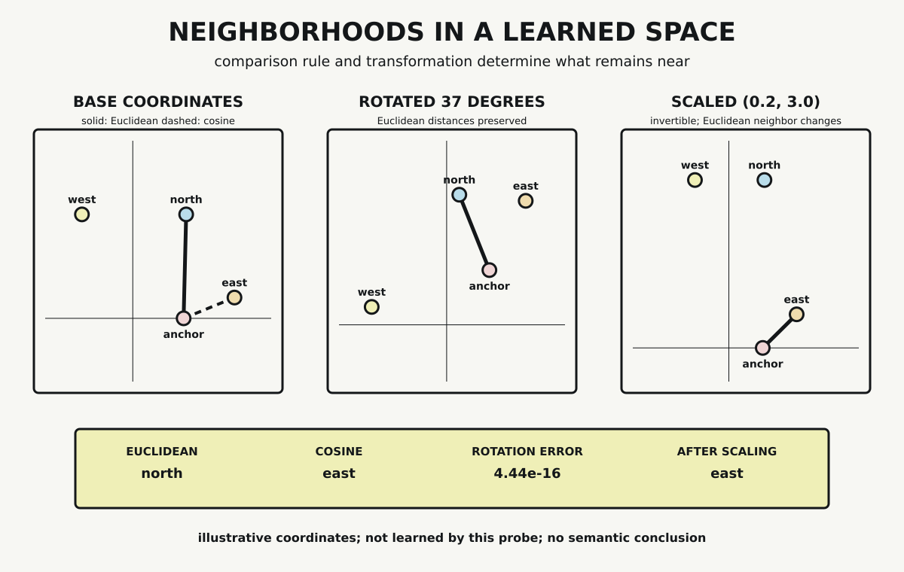

# Chapter 8 — Learned Spaces

Chapter 7 organized numerical work by shape. A tensor's axes identified batches, rows, inner dimensions, and output coordinates before hardware entered the discussion. Learned representations add another question: once a model assigns vectors to items, what relationships can be inspected in the resulting coordinate space?

Geometry gives us distances, directions, neighborhoods, transformations, and trajectories. Those words can make a learned representation feel immediately interpretable. Two points are close, so perhaps their items mean the same thing. A direction appears stable, so perhaps an axis has acquired a concept.

Neither conclusion follows from coordinates alone. A geometric claim requires a source for the representation, a comparison rule, and a record of any transformation applied before inspection. Interpretation requires still more.

## What Makes a Space Learned

An embedding is a vector representation produced under a model, data set, task, objective, and training procedure. Those conditions matter because another task or corpus can produce another arrangement for the same named items.

Static word-embedding systems provide an early clear example. The Skip-gram work of Mikolov and colleagues trained distributed word and phrase vectors and evaluated syntactic and semantic relationships in the resulting representations. The same paper stated limitations, including indifference to word order in individual word representations and difficulty composing some idiomatic phrases.

The lesson is not that proximity equals meaning. It is that a trained representation can exhibit regularities worth measuring under declared tasks and tests. Modern embedding systems differ in architecture and context, but the requirement survives: the numerical arrangement belongs to a training and evaluation history.

The probe in this chapter does not perform that training. It uses four declared two-dimensional points as an analysis fixture. Calling the chapter *Learned Spaces* names the destination of the method, not the provenance of those four coordinates.

## Coordinates Are Not Their Labels

The fixture contains:

| label | coordinate |
|---|---:|
| `anchor` | $(1,0)$ |
| `east` | $(2,0.2)$ |
| `north` | $(1.05,1)$ |
| `west` | $(-1,1)$ |

The labels make the points easy to discuss. They do not encode compass directions as intrinsic semantic properties. We could rename the points without changing any distance calculation.

Real learned representations are usually much higher-dimensional than this fixture. Their individual axes need not correspond to simple human-readable concepts. A two-dimensional drawing may be useful, but if it is produced by projecting a larger space, the projection method becomes another declared transformation with its own preserved and discarded structure.

## Two Ways to Be Near

Euclidean distance measures displacement between two coordinates:

$$
d(u,v)=\sqrt{(u_1-v_1)^2+(u_2-v_2)^2}.
$$

From `anchor`, the Euclidean distances are approximately:

| candidate | distance |
|---|---:|
| `north` | $1.0012492$ |
| `east` | $1.0198039$ |
| `west` | $2.2360680$ |

Under this rule, `north` is nearest.

Cosine similarity asks a different question. It compares direction from the coordinate origin through the normalized dot product:

$$
s(u,v)=\frac{u\cdot v}{\lVert u\rVert\lVert v\rVert}.
$$

The corresponding similarities are approximately:

| candidate | cosine similarity |
|---|---:|
| `east` | $0.9950372$ |
| `north` | $0.7241379$ |
| `west` | $-0.7071068$ |

Now `east` is the nearest in the sense of greatest cosine similarity. Nothing about the stored coordinates changed between the two rankings. The comparison rule changed.

The phrase “nearest neighbor” is therefore incomplete until the representation and measure are named. Euclidean distance is sensitive to magnitude and displacement. Cosine similarity compares orientation relative to the origin and is undefined for a zero vector under the formula used here. Neither rule is universally correct for every learned space.

## A Transformation That Preserves Distance

Chapter 4 distinguished a map from the objects it transforms. Apply that discipline here by rotating every point 37 degrees around the origin.

A rotation changes each displayed coordinate. The `anchor` point moves from $(1,0)$ to approximately

$$
(0.798636,0.601815).
$$

Yet rigid rotation preserves Euclidean distances. Across all six pairs in the fixture, the probe records a maximum absolute distance difference of approximately

$$
4.44\times10^{-16},
$$

which is within its $10^{-12}$ floating-point tolerance. `north` remains the Euclidean nearest neighbor of `anchor`.

This is a coordinate change that preserves the selected geometry. The plotted orientation changes, but the Euclidean neighborhood does not. A visual direction on the page is therefore not automatically an intrinsic direction in the represented domain.

## Invertible Does Not Mean Distance-Preserving

Now apply anisotropic scaling:

$$
(x,y)\mapsto(0.2x,3y).
$$

Both scale factors are nonzero. The transformation is invertible: dividing by the same factors recovers the original coordinates. But horizontal displacement is compressed while vertical displacement is expanded. Euclidean distance is not preserved.

After scaling, `east` becomes the Euclidean nearest neighbor of `anchor`. The original `north` point is pushed much farther away in the stretched vertical direction.

*The same illustrative coordinates produce different neighbors under Euclidean and cosine comparison. Rotation preserves the Euclidean neighborhood, while invertible anisotropic scaling changes it. The probe tests geometric assumptions, not learned semantics.*

The three panels separate properties that are easy to collapse. A metric selects a neighborhood. A rigid transformation preserves the Euclidean relation. An invertible transformation can preserve all coordinate information while changing that relation.

The point labels did not change during scaling. Nor did the probe establish that their meanings changed. It established only that a selected geometric neighborhood changed under a selected transformation.

## Geometry Across Training and Context

Learned spaces can also be inspected across training checkpoints, layers, or contexts. A vector's recorded positions can form a trajectory, and derivatives can describe local sensitivity for a specified mapping. Those analyses inherit Chapter 4's boundary: a trajectory requires a parameterization, and a derivative belongs to a declared function and evaluation point.

This chapter does not construct such a trajectory. It establishes the prior requirement that any claim about movement must identify which representations are being compared and whether their coordinate systems are aligned. Two independently trained spaces may encode useful relations while assigning different coordinates or orientations. Direct coordinate comparison can therefore require additional alignment assumptions.

## From Regularity to Interpretation

Geometric regularity is evidence about a representation. It can reveal that selected items occupy stable neighborhoods under a declared metric, that an operation preserves distances, or that a transformation separates groups. It can support retrieval, classification, visualization, and diagnostic work.

It does not validate its own interpretation. Proximity may reflect training context, task labels, frequency, artifacts, or other structure. A visually convincing cluster is not automatically a natural category. A direction that correlates with a human label is not necessarily a unique semantic axis.

This is the Book Two boundary in geometric form. The architecture produces and transforms numerical representations. We can measure those representations under explicit rules. Whether a measured relation warrants a claim about meaning belongs to criteria and evidence not supplied by geometry alone.

## What the Probe Establishes

The dependency-free probe verifies five claims for four fixed points. Euclidean and cosine comparison select different neighbors. Rotation preserves pairwise Euclidean distances within tolerance and leaves the Euclidean neighbor unchanged. Invertible anisotropic scaling changes that neighbor from `north` to `east`.

The probe does not train an embedding, project a high-dimensional space, run clustering, or establish semantic similarity. It does not show that either metric is suitable for a particular model. Its strength is the counterexample: even with fixed coordinates, “nearest” depends on the comparison rule, and invertibility does not guarantee geometric preservation.

## Geometry Ready for Convergence

Part II has now moved from adjustment to shaped work and then to geometric inspection. Chapter 6 changed parameters against an objective. Chapter 7 exposed indexed tensor computation. Chapter 8 has shown what must be declared before relationships among resulting vectors can be analyzed geometrically.

Chapter 9 returns to execution, adding ordered state, kernels, scheduling, and memory movement. Chapter 13 later brings geometry into the alignment of the AI, mathematical, and programming lineages. That handoff carries a constraint: geometry can make learned relations inspectable without making their interpretation intrinsic.

## Sources and Evidence

The chapter's bounded claims about learned vector representations, task-dependent embedding spaces, and cosine similarity are documented in the [Chapter 8 source ledger](../evidence/chapter_08_sources.md). Exact coordinates, formulas, transformations, assertions, and outputs are recorded in the [learned-space probe](../evidence/chapter_08_learned_space_probe.md), with its [Python implementation](../evidence/chapter_08_learned_space_probe.py). Visual provenance and accessibility details are recorded with [Neighborhoods in a Learned Space](../visuals/chapter_08_learned_space.md).