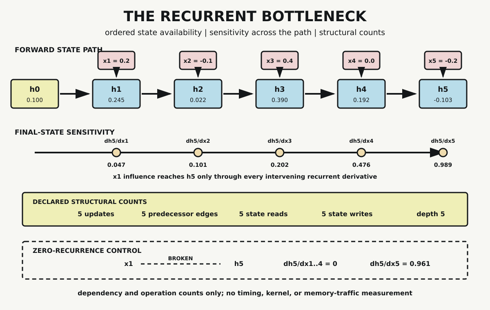

# Chapter 9 — Sequence, Memory, and Runtime

Chapter 8 treated learned representations as points whose neighborhoods depend on coordinates, comparison rules, and transformations. Those points did not yet arrive in an order. A sequence adds a constraint geometry alone does not supply: position one precedes position two, and some computations make the result at the second position depend on what happened at the first.

Recurrent neural networks make that dependence explicit. They reuse a parameterized update while carrying a hidden state from one position to the next. The state gives later computation access to a transformed trace of earlier inputs. It also creates a path that must be traversed in order.

That path is often called a recurrent bottleneck. The phrase can hide several different claims. A mathematical dependency is not a runtime measurement. A state value is not the complete history it summarizes. A long derivative path is not proof that every recurrent network must fail. This chapter separates those claims with one scalar recurrence whose states, sensitivities, and limits remain inspectable.

## Order Before Recurrence

Begin with the fixed input sequence

$$
x=(0.2,-0.1,0.4,0.0,-0.2).
$$

The parentheses alone do not determine how a program processes the values. A vectorized operation might transform all five independently. A reduction might combine them under an operation with another dependency structure. Our recurrence declares an ordered update:

$$
a_t=wh_{t-1}+x_t,
$$

$$
h_t=\tanh(a_t).
$$

Use initial state $h_0=0.1$ and recurrent weight $w=0.5$. To compute $h_1$, the system needs $h_0$ and $x_1$. To compute $h_2$, it needs the newly produced $h_1$ and $x_2$. This continues through $h_5$.

The same recurrent weight appears at every step. Parameter sharing does not make the state values identical. The parameter $w$ defines one repeated operation; each $h_t$ is the result of applying that operation at a particular position with a particular input and predecessor state.

The verified trace is:

| Position | Input | Pre-activation | Hidden state |
|---:|---:|---:|---:|
| 0 | — | — | 0.100000 |
| 1 | 0.2 | 0.250000 | 0.244919 |
| 2 | -0.1 | 0.022459 | 0.022456 |
| 3 | 0.4 | 0.411228 | 0.389515 |
| 4 | 0.0 | 0.194757 | 0.192332 |
| 5 | -0.2 | -0.103834 | -0.103463 |

Each state is a scalar. It cannot preserve five arbitrary scalar inputs without loss. Calling it memory names its recurrent role: later states depend on it. The word does not establish complete recall, persistence, addressability, or any equivalence with human memory.

## The Path Through Time

The recurrence can be unrolled into a feed-forward graph with repeated parameters:

$$
h_0\rightarrow h_1\rightarrow h_2\rightarrow h_3\rightarrow h_4\rightarrow h_5.
$$

Unrolling does not create five different recurrent weights. It makes five uses of the shared weight visible. It also exposes readiness. The computation of $h_4$ cannot begin until $h_3$ is available under this recurrence, because $h_3$ is one of its inputs.

Work inside a step can still contain parallel numerical operations. In a practical recurrent layer, matrix products may process a batch and many hidden coordinates through optimized kernels. Different sequences in a batch may also expose independent work. None of that removes the predecessor edge between successive states of one sequence.

The distinction is the same one Chapter 7 established for tensors. Mathematical structure exposes dependencies and possible work partitions. A programming model, runtime, implementation, and machine determine how that work executes.

## Sensitivity Across the Path

Forward state dependence exists whether or not anyone computes a gradient. We now perform a separate analysis: how sensitive is the final state $h_5$ to each input?

For the input entering at position $j$,

$$
\frac{\partial h_j}{\partial x_j}=1-h_j^2.
$$

At each later recurrent step,

$$
\frac{\partial h_t}{\partial h_{t-1}}=w(1-h_t^2).
$$

The chain rule therefore gives

$$
\frac{\partial h_5}{\partial x_j}
=(1-h_j^2)\prod_{t=j+1}^{5}w(1-h_t^2).
$$

An early input crosses more factors than a late input. In this particular recurrence, every recurrent factor has magnitude below $0.5$. The resulting analytic sensitivities are:

| Input | $\partial h_5/\partial x_j$ |
|---:|---:|
| $x_1$ | 0.047456 |
| $x_2$ | 0.100968 |
| $x_3$ | 0.202039 |
| $x_4$ | 0.476350 |
| $x_5$ | 0.989295 |

The first input still affects the final state, but its local influence is much smaller than the final input's influence under the declared values. The probe checks every analytic result with central finite differences at step size $10^{-6}$. The largest absolute disagreement is approximately

$$
1.54\times10^{-11}.
$$

This is one observed attenuation pattern. Repeated derivative products can also amplify, oscillate, or behave differently under other weights, activations, gates, states, losses, and numerical conditions. The result does not show that all recurrent networks forget at one rate. It makes one path and its factors inspectable.

*Five ordered inputs update five hidden states through one shared recurrence. Final-state sensitivity to an early input crosses every intervening state. The structural-count band reports declared work and dependencies, not measured runtime or memory traffic.*

## Breaking the Recurrent Link

A useful probe needs a control that can make its claimed mechanism disappear. Set the recurrent weight to zero while holding the inputs, activation, initial state, and finite-difference procedure fixed:

$$
h_t=\tanh(x_t).
$$

The update still transforms each input. It no longer carries the preceding state into the next position. The final state depends only on $x_5$.

Analytically and numerically,

$$
\frac{\partial h_5}{\partial x_1}
=\frac{\partial h_5}{\partial x_2}
=\frac{\partial h_5}{\partial x_3}
=\frac{\partial h_5}{\partial x_4}=0.
$$

Final-input sensitivity remains approximately

$$
\frac{\partial h_5}{\partial x_5}=0.961043.
$$

This control isolates the recurrence. It does not implement attention, compare model quality, or demonstrate parallel hardware execution. It establishes that the cross-position sensitivity in the base case travels through the nonzero recurrent path.

## What the Counts Do Not Measure

For five inputs, the probe records five recurrent updates, five predecessor-state edges including $h_0\rightarrow h_1$, five state reads, five state writes, and forward dependency depth five.

Those values are reproducible properties of the declared scalar computation. They are not five measured memory loads, five allocations, five kernel launches, or five equal units of clock time. A compiler may retain a value in a register. A library may fuse operations. A runtime may batch work, schedule kernels, reuse buffers, or move values through several levels of memory. Hardware may overlap some activity while waiting on another dependency.

Making a runtime claim therefore requires a different experiment. It must identify at least the implementation, framework or library, shapes, batch size, precision, device, warm-up policy, synchronization boundary, measurement method, and statistic reported. Without those declarations, dependency depth is evidence about the computation graph, not latency.

CUDA provides a programming model in which kernels execute work organized through grids, thread blocks, and threads. That hierarchy helps an implementation map abundant numerical work to a GPU. It does not guarantee that a particular recurrent workload achieves a particular throughput. The ordered state path and the work inside each step remain separate objects of analysis.

## Why Gates Entered the Architecture

Simple recurrence made sequence state trainable and useful, but repeated paths also exposed difficulty in learning long-range dependencies. Bengio, Simard, and Frasconi analyzed why gradient-based learning across long temporal spans can become difficult. Hochreiter and Schmidhuber introduced Long Short-Term Memory as a gated recurrent architecture designed to control error flow and retained state differently from a simple recurrent unit.

LSTM cells add internal state and gates that regulate writing, retaining, and exposing information. The later gated unit introduced in Cho and colleagues' recurrent encoder-decoder uses update and reset gates in a different architecture commonly called the GRU. These mechanisms change the recurrence. They do not remove sequence order or make every long-range dependency easy.

This chapter does not implement either cell. Their role here is historical and architectural: recurrent systems did not stop at one fixed state update. Designers altered the path after operation exposed its limitations.

## The Bottleneck, Precisely

The recurrent bottleneck is not one claim that recurrence is obsolete. It is a bounded structural observation:

> For one sequence under a recurrent state update, position $t$ requires the state produced at position $t-1$.

That property can be useful. It naturally supports streaming inputs and bounded carried state. It can also limit how much sequence work becomes ready at once and lengthen the path through which early information and derivatives must travel.

Whether those costs dominate in an application is empirical. Sequence length, cell architecture, batch structure, kernel implementation, memory behavior, hardware, and task requirements all matter. The probe establishes the path. It does not benchmark the installed system.

## What the Probe Establishes

The dependency-free Python probe verifies the complete state trace, immediate predecessor relation, analytic sensitivities, central finite-difference agreement, and zero-recurrence control. All validation gates pass. Its maximum derivative-check error is below $1.6\times10^{-11}$.

The probe does not train an RNN, perform backpropagation through time, implement LSTM or GRU gates, launch a device kernel, inspect a scheduler, or measure memory traffic and elapsed time. It supports a narrower conclusion: recurrent state creates an ordered dependency path, and influence through that path is a product of declared local transformations.

## Part II: The Constraint Attention Inherits

Part II began by turning derivatives into repeated parameter adjustment. It then organized larger numerical work as tensors, inspected learned spaces under declared geometry, and finally added ordered state to execution.

The result is not a verdict against recurrence. It is a constraint ready for comparison. Chapter 10 introduces attention and asks how direct pairwise relationships change the path between positions. The comparison must preserve the discipline established here: a shorter graph path is not automatically a faster program, and a normalized attention weight is not by itself a causal account of information flow.

## Sources and Evidence

The chapter's bounded claims about recurrent networks, long-range gradient difficulty, LSTM, GRU, and CUDA runtime terminology are documented in the [Chapter 9 source ledger](../evidence/chapter_09_sources.md). Exact inputs, formulas, assertions, control behavior, and outputs are recorded in the [recurrent-runtime probe](../evidence/chapter_09_recurrent_runtime_probe.md), with its [Python implementation](../evidence/chapter_09_recurrent_runtime_probe.py). Visual provenance and accessibility details are recorded with [The Recurrent Bottleneck](../visuals/chapter_09_recurrent_bottleneck.md).