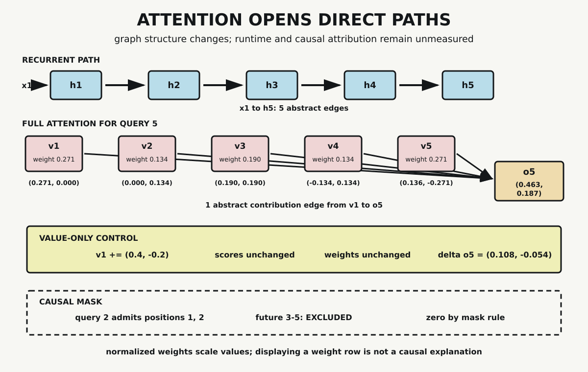

# Chapter 10 — Attention Changes the Path

Chapter 9 ended with a constraint. In a recurrent computation, the state at one position must be available before its successor can be evaluated. An early input reaches a late state through every intervening recurrent update.

Attention changes that path. It lets one position form a weighted combination of values from other admitted positions without carrying those values through a single predecessor-state chain. That architectural change is substantial, but it is easy to overstate. A direct graph edge is not measured speed. A large normalized weight is not automatically causal importance. A visible pattern is not a complete explanation.

This chapter builds one head of scaled dot-product attention from fixed vectors. Every score, weight, contribution, and output will remain visible. Then we will change a value while holding the entire weight matrix fixed. The control reveals what an attention map leaves out.

## Three Roles at Each Position

Attention assigns three numerical roles to represented positions: query, key, and value.

- a **query** specifies the vector used to compare the current output position with admitted key positions
- a **key** participates in that compatibility comparison
- a **value** supplies numerical content to the weighted output combination

These are roles in an operation, not intrinsic kinds of token. In a Transformer, learned projections produce query, key, and value vectors from incoming representations. The fixture here begins after that projection step. It declares five two-dimensional vectors of each kind and does not train them.

For query $q_i$ and key $k_j$, scaled dot-product attention computes

$$
s_{ij}=\frac{q_i\cdot k_j}{\sqrt{d_k}}.
$$

The dimension in the probe is $d_k=2$, so the denominator is $\sqrt{2}$. Scaling is part of the declared operation. It tempers dot-product magnitude as key dimension changes; it does not turn compatibility into probability or semantic truth.

For the fifth query,

$$
q_5=(0.5,-0.5).
$$

Its scaled scores against the five keys are approximately

$$
(0.353553,-0.353553,0,-0.353553,0.353553).
$$

The first and fifth keys receive equal scores in this fixture. The second and fourth also match. Those equalities follow from the declared vectors, not from token identity or language meaning.

## Scores Become Weights

Softmax normalizes the admitted scores in one query row:

$$
\alpha_{ij}
=\frac{\exp(s_{ij})}{\sum_m\exp(s_{im})}.
$$

For query five, the resulting weight row is approximately

$$
(0.271126,0.133684,0.190381,0.133684,0.271126).
$$

The values are nonnegative and sum to one. That makes them a normalized weighting distribution over admitted positions. It does not make them a Bayesian posterior. No hypotheses, prior, likelihood model, or evidence-conditioning operation from Chapter 3 appears here.

Softmax also couples the row. Changing one admitted score changes the denominator and can therefore change every normalized weight. A weight is meaningful only within its query row, admitted position set, scale, and score values.

## Weights Act on Values

The output is not the weight row. Each weight scales its corresponding value vector, and the contributions are summed:

$$
o_i=\sum_j\alpha_{ij}v_j.
$$

For query five, the probe records:

| Position | Weight | Value | Weighted contribution |
|---:|---:|---:|---:|
| 1 | 0.271126 | $(1,0)$ | $(0.271126,0)$ |
| 2 | 0.133684 | $(0,1)$ | $(0,0.133684)$ |
| 3 | 0.190381 | $(1,1)$ | $(0.190381,0.190381)$ |
| 4 | 0.133684 | $(-1,1)$ | $(-0.133684,0.133684)$ |
| 5 | 0.271126 | $(0.5,-1)$ | $(0.135563,-0.271126)$ |

Summing the five contributions gives

$$
o_5=(0.463386,0.186623).
$$

No position is copied wholesale. Every admitted value contributes in this row because every full-attention weight is nonzero. The output is a combination whose coordinates depend on both coefficients and value content.

## A Direct Contribution Path

Return to the recurrent comparison from Chapter 9. Its declared graph contains

$$
x_1\rightarrow h_1\rightarrow h_2\rightarrow h_3\rightarrow h_4\rightarrow h_5.
$$

Counting the edges shown gives five from $x_1$ to $h_5$. In the attention contribution graph, the first value connects directly to the fifth output:

$$
v_1\rightarrow o_5.
$$

That graph has one displayed contribution edge. The comparison makes a dependency difference visible. It does not count the matrix multiplications, score computation, softmax stages, memory activity, or kernels required to produce the attention result.

*The recurrent lane carries an early input through intervening states. The attention lane combines all admitted values directly into output five. The edge counts describe the declared graphs, not runtime measurements or causal attribution.*

Self-attention can expose many position-to-position score calculations at once, making its work structurally suitable for matrix operations. Sequence length also makes the score matrix grow across pairs of positions. Whether an implementation runs faster than a recurrent alternative depends on shape, precision, kernels, memory, device, batch structure, and measurement method. Shorter dependency path and lower elapsed time are different claims.

## Hold the Weights Fixed

An attention visualization usually shows weights. To see what that omits, change only the first value:

$$
v_1' = v_1+(0.4,-0.2).
$$

Queries and keys remain fixed. Scores therefore remain exactly unchanged, and so does every normalized weight. Yet the output changes because the fixed first weight now scales a different value.

For query five, the predicted change is

$$
\Delta o_5
=\alpha_{51}(0.4,-0.2)
$$

$$
=0.271126(0.4,-0.2)
$$

$$
=(0.108450,-0.054225).
$$

The observed output difference matches that result within floating-point tolerance. The attention map is identical before and after the control. The output is not.

This arithmetic does not prove that attention weights are never informative. It establishes the narrower point required here: weights do not contain the values they scale, and a weight display alone does not specify the resulting numerical contribution.

## Masking Changes the Admitted Set

Full self-attention admits every key position for every query. Autoregressive generation requires another constraint: a position must not use future positions that are unavailable under the generation order.

A causal mask enforces that rule before normalization. For query position $i$, admit only positions $j\le i$. Query two therefore admits positions one and two. Positions three, four, and five are excluded from its softmax denominator and receive recorded output weight zero.

That zero has a different origin from a small unmasked weight. A low unmasked weight follows from relative scores after normalization. A masked zero follows from an architectural permission rule. Describing both as low relevance would erase the mechanism that produced them.

The fifth query admits all five positions, so its full and causal rows are identical in this fixture. Earlier causal rows differ because their admitted sets are smaller.

## From Alignment to Self-Attention

Attention did not begin with the Transformer. Bahdanau, Cho, and Bengio introduced a learned soft alignment mechanism in a recurrent neural translation system. Instead of forcing the source sentence into only one fixed-length vector for decoding, their model combined source annotations according to learned weights for each target step.

The Transformer made attention the central sequence architecture. Vaswani and colleagues defined scaled dot-product and multi-head attention, used masking in decoder self-attention, and compared architectures partly through maximum dependency-path length and available parallel computation. Their complete design includes much more than the single operation in this chapter.

Our fixture uses one head, fixed vectors, no learned projections, no position representation, no residual path, no normalization, and no feed-forward stage. It demonstrates the operator that Chapter 11 must assemble, not the assembled Transformer.

## Attention Weight Is Not Explanation

Attention weights are inspectable, which makes them tempting explanations. The temptation should become a test requirement rather than a conclusion.

Jain and Wallace found in studied NLP models that attention weights often related weakly to gradient-based feature importance and that substantially different attention distributions could produce similar predictions. Serrano and Smith intervened on attention in trained classifiers and found that raw magnitude was not a fail-safe indicator of impact.

Those studies have their own architectures, tasks, and definitions. They do not imply that every attention visualization is useless. They do establish that explanation requires more than displaying normalized coefficients.

Chapter 10 therefore uses precise language:

- weights report the coefficients produced by one attention operation
- contributions combine those coefficients with value vectors
- causal influence requires an intervention or another declared causal test
- semantic interpretation requires task- and representation-grounded evidence

The probe performs the value intervention needed for its arithmetic claim. It does not analyze a trained model's causal behavior.

## What the Probe Establishes

The standard-library probe computes complete full and causal score matrices, normalized weights, weighted value contributions, and outputs for five two-dimensional positions. Every admitted row sums to one. Every causal future position has weight zero. Every output equals the sum of its recorded contributions.

The value-only control preserves the complete score and weight matrices exactly. For every query row, the output difference equals the unchanged first weight times the declared value perturbation within $10^{-12}$.

The probe does not train attention, implement multiple heads, measure runtime, establish task performance, or infer semantic and causal importance. Its strength is the isolated interface: query-key computation determines coefficients; values determine what those coefficients combine.

## Attention Ready for Architecture

Chapter 9 exposed an ordered recurrent path. This chapter has changed that path and separated score, weight, value, contribution, mask, and output. Attention is now an inspectable operator.

It is not yet a block architecture. Chapter 11 adds the missing assembly: input embeddings, positional information, learned projections, multiple heads, residual paths, normalization, and feed-forward transformations. The next question is not whether attention works alone. It is how these components constrain and sustain one another inside a bounded Transformer block.

## Sources and Evidence

The chapter's bounded claims about learned alignment, scaled dot-product attention, masking, path length, and interpretation limits are documented in the [Chapter 10 source ledger](../evidence/chapter_10_sources.md). Exact vectors, scores, weights, contributions, controls, and outputs are recorded in the [attention-path probe](../evidence/chapter_10_attention_paths_probe.md), with its [Python implementation](../evidence/chapter_10_attention_paths_probe.py). Visual provenance and accessibility details are recorded with [Attention Opens Direct Paths](../visuals/chapter_10_attention_direct_paths.md).