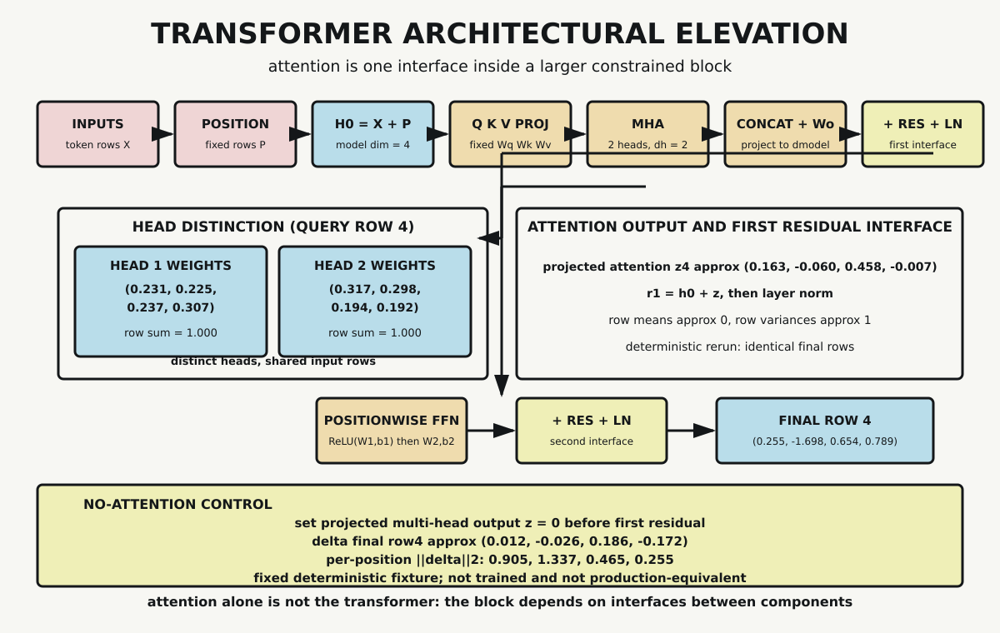

# Chapter 11 — The Transformer

Chapter 10 isolated one operation: scaled dot-product attention. That operation changed dependency paths and exposed direct value contribution edges. It did not, by itself, produce a Transformer.

The distinction matters. A Transformer block is not a single equation. It is a composition of interfaces with declared dimensions and handoff rules. Incoming representations are combined with positional information. Those rows are projected into queries, keys, and values. Attention is computed per head, head outputs are concatenated and projected, and the result is composed with the input path by residual-plus-normalization structure. A positionwise feed-forward stage follows, then a second residual-plus-normalization interface.

This chapter assembles those components in one fixed, fully inspectable fixture. Every matrix is declared. Every row is deterministic. No parameter is trained. The goal is architectural clarity, not benchmark performance and not semantic evaluation.

## Attention Is a Component, Not the Whole

Vaswani and colleagues introduced the Transformer as an architecture whose central sequence mechanism is attention. Their model used scaled dot-product attention, multiple heads, output projection, residual pathways, layer normalization, and positionwise feed-forward transformations in repeated stacks.

That sentence already implies a boundary: attention alone is not the Transformer.

If we keep only the attention operator and remove the surrounding interfaces, we lose:

- explicit positional entry into each block input row
- multi-head parallel representation subspaces
- residual identity pathways that preserve and route information
- normalization interfaces stabilizing row scale under a declared rule
- pointwise nonlinear transformation after attention mixing

So Chapter 11 asks a narrower question than “does attention work?” The question is: what exactly must be assembled around attention before the block matches Transformer structure?

## Fixed Fixture and Declared Shapes

The probe declares four positions, model dimension $d_{model}=4$, two heads, per-head dimension $d_h=2$, and feed-forward hidden width 6. Input token rows and positional rows are fixed small vectors:

$$
H_0 = X + P.
$$

For each row in $H_0$, fixed matrices produce

$$
Q=H_0W_Q,\quad K=H_0W_K,\quad V=H_0W_V.
$$

Each projected row is split into two head slices of length two. For head $h$ at query row $i$:

$$
s^{(h)}_{ij}=\frac{q^{(h)}_i\cdot k^{(h)}_j}{\sqrt{d_h}},
\qquad
\alpha^{(h)}_{ij}=\operatorname{softmax}(s^{(h)}_{i\cdot})_j.
$$

Head output row:

$$
z^{(h)}_i=\sum_j\alpha^{(h)}_{ij}v^{(h)}_j.
$$

Then:

$$
Z=\operatorname{Concat}(z^{(1)},z^{(2)})W_O.
$$

No randomness appears anywhere in the fixture. Rerunning the probe reproduces identical outputs.

## Two Heads, Distinct Rows

The architecture calls for multiple heads because one head is only one projected compatibility-and-mixture channel. The probe verifies that head rows are normalized and distinct.

For query row 4:

- head 1 weights: $(0.231425,0.224919,0.236720,0.306937)$
- head 2 weights: $(0.316628,0.297562,0.194005,0.191805)$

Both rows sum to one within tolerance, and they are not identical. That matters because “multi-head” is not satisfied by duplicating one row twice. Distinct heads expose different mixtures under shared input rows and shared fixture dimensions.

Distinctness here remains arithmetic, not semantic. We do not infer linguistic role labels, attention “meanings,” or causal explanations from these coefficients.

## Output Projection and First Residual Interface

After concatenation, the output projection returns to model dimension. For query row 4, projected attention is approximately

$$
Z_4=(0.162918,-0.060338,0.457843,-0.006945).
$$

The first residual interface composes this branch output with the entry path:

$$
R_1=H_0+Z.
$$

The probe verifies this equation row-by-row exactly for recorded values.

Then layer normalization is applied using the declared formula

$$
\operatorname{LN}(x)=\frac{x-\operatorname{mean}(x)}{\sqrt{\operatorname{var}(x)+\varepsilon}},\quad \varepsilon=10^{-9}.
$$

Under that formula, recorded row means are near zero and row variances near one at the first normalization output. The check is local and explicit: it validates the declared normalization arithmetic for this fixture. It does not assert training behavior or optimization dynamics.

## Positionwise Feed-Forward and Second Residual Interface

Attention mixes information across positions through query-key weighting. The positionwise feed-forward stage plays a different role: it transforms each row through a learned nonlinear map applied independently per position.

In the fixture:

$$
F_1=\operatorname{ReLU}(N_1W_1+b_1),
\qquad
F_2=F_1W_2+b_2.
$$

Then:

$$
R_2=N_1+F_2,
\qquad
N_2=\operatorname{LN}(R_2).
$$

For query row 4, final normalized output is approximately

$$
N_{2,4}=(0.255460,-1.698430,0.654426,0.788544).
$$

As with the first interface, the second residual equation is validated row-by-row, and final normalization rows satisfy near-zero mean and near-unit variance under the same declared formula.

This separation of interfaces is one of the chapter’s main exits:

- attention branch output is not final block output
- residual composition is not normalization
- normalization is not feed-forward transformation

Each stage has a distinct contract.

*The block assembles representation plus position, multi-head attention, concatenation/output projection, two residual-plus-normalization interfaces, and a positionwise feed-forward stage. A no-attention control changes final outputs, showing that attention contributes inside the assembly. This is a fixed deterministic fixture, not a trained production model.*

## Control: Remove Projected Attention

A component interface should have a falsifiable control. The probe runs one: set projected multi-head output $Z$ to zero before the first residual, while keeping all input rows, positional rows, and fixed matrices otherwise unchanged.

This is not “remove everything attention-adjacent.” It removes one declared contribution at one interface point, then re-runs the same downstream computations.

Observed change norms in final output rows are:

$$
(0.905029,1.337468,0.464690,0.254784).
$$

For row 4 specifically, full-minus-control difference is approximately

$$
(0.011855,-0.025612,0.185797,-0.172041).
$$

So in this fixture, removing projected multi-head attention measurably changes the final block output at every position.

What this does not show:

- it does not prove global causal semantics in trained models
- it does not prove which head is “most important” in general
- it does not show downstream task-quality effect
- it does not benchmark execution behavior

The control is an architectural contribution test inside one deterministic block.

## Encoder-Block Boundary in This Chapter

The fixture here is intentionally an encoder-style block slice, not a full encoder-decoder stack. There is no cross-attention sublayer, no causal decoder mask, no vocabulary projection head, and no decoding strategy. Keeping that boundary visible prevents two common category errors.

First, it avoids claiming that one block output is already a generated language result. Second, it avoids importing runtime claims from full-system implementations that include batching, cache management, kernel fusion, and decoding control flow.

Within this narrower boundary, the chapter can test what it owns: tensor interfaces, residual equations, normalization properties, and component contribution controls. That is enough to establish architectural assembly without pretending to establish full-system behavior.

## What This Chapter Does Not Claim

The fixed fixture is deliberately narrow. It does not train anything and does not pretend to be production-equivalent.

The chapter does not:

- run optimizer updates
- evaluate loss on a corpus
- perform tokenization, generation, or decoding pipelines
- trace complete end-to-end token-through-machine execution
- establish architecture limits or safety boundaries

Those boundaries are structural, not evasive. Chapter 11 owns block assembly. Later chapters own implementation path and limits claims at their designated interfaces.

## Historical and Technical Anchors

Three source anchors bound wording in this chapter.

1. Vaswani et al. define the Transformer block components and their arrangement, including multi-head attention, residual composition, normalization, and feed-forward stages.
2. Ba, Kiros, and Hinton define layer normalization as per-example hidden-unit normalization with explicit mean and variance terms.
3. He et al. establish residual pathway principles for deep architectures: transformed branches can be composed with identity paths to support depth-wise information flow.

The chapter inherits these as architecture references and verifies fixture arithmetic directly in the probe. It does not transfer benchmark conclusions from those papers into this small deterministic setup.

## Interface Clarity Before Scale

At larger model sizes, confusion often begins at interfaces:

- shape mismatches across projections and heads
- ambiguous ordering of residual and normalization steps
- conflating attention-row inspection with full block behavior
- treating a partial trace as end-to-end explanation

This chapter’s small fixture is useful because every intermediate row stays inspectable. The same reasoning scales conceptually: a Transformer is a constrained composition, and each boundary can be tested.

Chapter 10 taught that attention changes dependency paths. Chapter 11 adds the architectural rule: changed path is one sublayer inside a larger machine.

## What the Probe Establishes

The dependency-free Python probe verifies:

- declared dimensions across all intermediate tensors
- row normalization in both heads
- head distinction
- first and second residual equations
- normalization mean/variance properties under the explicit formula
- deterministic rerun equality
- nonzero final-output change under no-attention control

All gates pass. The evidence supports the chapter’s bounded claim: attention becomes Transformer architecture only when assembled with the surrounding interfaces.

## Transition to Chapter 12

Chapter 11 finishes the core architectural assembly of one Transformer block. The next chapter turns that assembly toward implementation-facing practice: how architecture becomes a concrete build target in tools and workflows without erasing the boundaries established here.

## Sources and Evidence

Bounded historical and technical claims are documented in the [Chapter 11 source ledger](../evidence/chapter_11_sources.md). Exact vectors, matrices, head rows, residual checks, normalization checks, controls, and final outputs are recorded in the [transformer-block probe](../evidence/chapter_11_transformer_block_probe.md), with the [Python implementation](../evidence/chapter_11_transformer_block_probe.py). Visual provenance and accessibility details are recorded with [Transformer Architectural Elevation](../visuals/chapter_11_transformer_architectural_elevation.md).