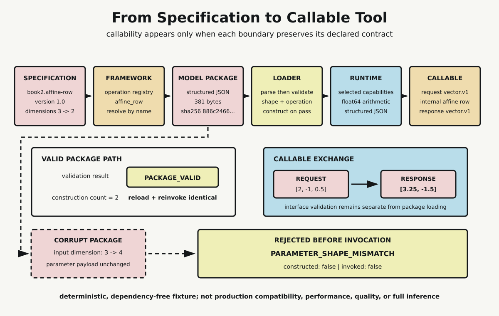

# Chapter 12 — From Paper to Tool

Chapter 11 ended with an assembled Transformer block. Its dimensions, projections, attention heads, residual paths, normalization rules, and feed-forward stage formed an explicit architecture contract. Yet even a perfectly specified block cannot receive an application request by itself.

A paper does not register executable operations. A matrix diagram does not say how parameters are serialized. A package on disk is not an in-memory object. An object cannot execute unless its runtime supplies the required capabilities. And an internal tensor row is not automatically a public request or response.

Those distinctions define the last step in the programming lineage: not how to make the architecture larger, but how to preserve its contracts until a caller can use it.

## The Architecture Is an Implementation Target

An architecture specification describes relationships that an implementation must preserve. In the Chapter 11 block, model dimension constrained projection shapes; head count constrained how rows were split and recombined; residual additions required equal dimensions; normalization and feed-forward stages had declared ordering.

These statements are necessary, but they remain specifications. They do not choose a programming language, allocate values, expose operator functions, select a runtime, or define a wire-level request. Treating the paper and the tool as the same object hides every failure that can occur between them.

The Chapter 12 fixture makes that separation literal. Its architecture is deliberately smaller than a Transformer so the handoffs remain visible. The specification names `book2.affine-row` version `1.0`, declares an `affine_row` operation, and fixes input dimension 3 and output dimension 2. This is enough structure to test packaging and callability without pretending to run a language model.

The operation computes

$$
y_j=\sum_i x_iW_{ji}+b_j.
$$

That equation is still not executable until some framework-level component implements it.

## A Framework Supplies Operations, Not This Model

The fixture's framework boundary is an operation registry. It maps the name `affine_row` to a standard-library Python function. The registry does not contain this model's dimensions, weights, bias, request, or response. It supplies reusable operation behavior.

This distinction prevents a common collapse. “The framework supports an operation” does not mean “the model package is valid.” Conversely, a package may name an operation that its selected framework does not provide. The loader therefore asks the registry whether the declared operation exists before constructing anything.

A production framework would contain many more operations and execution paths. This one-entry registry establishes only the local contract: an implementation can be resolved by the exact name declared in the architecture.

## A Package Binds Metadata to Parameters

The serialized model package is structured JSON with four top-level sections.

The manifest names the fixture format and its required runtime capability. The architecture records identity, version, operation, and dimensions. The parameter section carries two weight rows and a two-value bias. The interface section names the request and response schemas.

Canonical JSON serialization sorts object keys and uses compact separators. For this fixed package, the result is 381 bytes. Its SHA-256 is

`886c2466502250a0cbb654622dd47237cc433e28cb3ed333be3cf07fa6f74107`.

The digest identifies these exact serialized bytes reproducibly. It does not prove that the package is trustworthy or correct. Correctness still depends on semantic validation: dimensions must agree with payload shapes, operations must exist, runtime capabilities must be available, and interface schemas must be recognized.

Official ONNX documentation provides a useful bounded comparison. A real model format can distinguish metadata, graph and operator structure, tensor type and shape information, and serialized tensor data. The fixture is not ONNX and claims no compatibility with it. The comparison supports only the general lesson that a model package binds several kinds of contract-bearing information rather than storing an undifferentiated block of “the model.”

## Parsing Is Not Validation

The loader first calls `json.loads`. Structured parsing matters because it recovers objects, arrays, strings, and numbers according to JSON syntax. No search for textual fragments decides whether a field exists or a dimension matches.

But syntactic success is only the first gate. A document can be valid JSON and still be an invalid model package. The fixture loader checks, in order:

- required top-level fields
- architecture fields and declared dimensions
- weight-row and bias lengths
- framework operation availability
- required runtime capability
- request and response schema declarations

Only a complete pass returns `PACKAGE_VALID`. Only then does the loader create an immutable architecture specification, convert parameter arrays into internal tuples, resolve the operation, and construct a callable tool.

That order is a security and reliability habit even though this chapter does not make a security claim: validate assumptions before allowing later stages to rely on them.

## Runtime Selection Is a Separate Contract

The architecture says what operation and dimensions are required. It does not say that every runtime can provide them. The fixture selects a named CPython standard-library runtime with two declared capabilities: `float64_arithmetic` and `structured_json`.

The package requires the arithmetic capability. The loader checks that requirement explicitly. This keeps runtime selection outside the architecture definition. A missing capability is neither a new architecture nor a malformed weight payload; it is its own validation result at its own boundary.

The fixture does not measure latency, throughput, memory use, or hardware utilization. Runtime capability here means only that a named service required by the package is declared available.

*The valid path preserves contracts from specification through framework, structured package, validating loader, selected runtime, and callable interface. The corrupt control changes one declared dimension while retaining the parameter payload, then stops before construction or invocation. Callability is produced by the chain, not by renaming the architecture.*

## The Callable Boundary Translates Requests

After package validation and construction, a separate interface validator handles the request. The fixed request document declares schema `vector.v1` and values

$$
(2.0,-1.0,0.5).
$$

The interface checks the schema, verifies the input length against the constructed specification, rejects Boolean and nonnumeric values, and translates the JSON array into an internal immutable row. Package validation has already finished; request validation now protects a different boundary.

With fixed weights

$$
W=\begin{pmatrix}
1 & -0.5 & 0.5\\
-0.25 & 1 & 2
\end{pmatrix}
$$

and bias

$$
b=(0.5,-1),
$$

the registered operation produces the exact internal output

$$
(3.25,-1.5).
$$

The callable then translates that row into response schema `vector.v1`. The declared response is not an internal tensor accidentally printed to a terminal; it is an object formed at the interface boundary.

## Reload Must Preserve Behavior

Serialization is useful partly because an artifact can leave memory and later be reconstructed. The probe loads the same canonical package a second time, validates it again, constructs a second callable object, and sends the same request.

The second validation result equals the first. The request object, internal input row, internal output row, and response object are identical. The result is deterministic because the package, operation, runtime capabilities, and request are fixed and the operation contains no randomness.

This proves reproducibility only for the fixture. It says nothing about nondeterministic kernels, parallel scheduling, cross-platform numerical variation, or production package migration.

## Corrupt One Contract, Stop Early

A successful path is incomplete evidence unless a nearby failure can falsify the claimed gate. The control parses the valid package, changes only its declared input dimension from 3 to 4, and serializes it again. The weight and bias parameter payload remains unchanged under canonical serialization.

The mismatch is now precise: architecture metadata requires weight rows of length 4, while the preserved payload still contains rows of length 3. The loader returns

`PARAMETER_SHAPE_MISMATCH`.

More important than the label is where the failure occurs. The construction count does not increase. No callable object is returned. Invocation count for the corrupt path remains zero. The package is rejected before arithmetic can hide the contract error inside a later exception or misleading result.

The control does not establish that all corruption is detectable or that ecosystem loaders are reliable. It verifies one dimension invariant in one local package format.

## What Became Callable

The probe leaves six interfaces separately inspectable:

- architecture specification: identity, version, operation, dimensions
- framework registry: available executable operation names
- serialized package: manifest, architecture, parameters, interface schema
- loader validation: explicit checks and result codes before construction
- runtime capabilities: selected services required for execution
- callable exchange: request validation, internal rows, and response construction

All embedded assertions pass. There are two successful constructions and two valid invocations. The valid response is exactly $(3.25,-1.5)$ both times. The corrupted package preserves its parameter payload and produces zero constructions and zero invocations.

## The Boundary of the Tool

Nothing here claims production compatibility. The fixture is not a framework adapter, standard model format, benchmark, trained model, or quality evaluation. It does not download weights or compare ecosystems. It does not tokenize input, execute a Transformer stack, select a next token, or decode output.

Those exclusions preserve the book's architecture. Chapter 15 owns the complete token-through-machine execution path. Chapter 16 owns the limits analysis. This chapter owns the narrower transition from a declared computational object to a validated callable software object.

The programming lineage is now complete enough to meet the other lineages. Chapter 13 can compare AI, mathematics, and programming at their actual interfaces: representations and operations, specifications and constraints, packages and runtimes. It need not pretend that a paper, an implementation, and a running tool are synonyms.

## Sources and Evidence

Bounded claims and official documentation are recorded in the [Chapter 12 source ledger](../evidence/chapter_12_sources.md). Exact package bytes, digest, validation records, request and response values, reload equality, and corruption counters are documented in the [callable-tool probe](../evidence/chapter_12_callable_tool_probe.md), with the [Python implementation](../evidence/chapter_12_callable_tool_probe.py). Visual provenance, checksum, accessibility text, and production checks are recorded with [From Specification to Callable Tool](../visuals/chapter_12_specification_to_callable_tool.md).