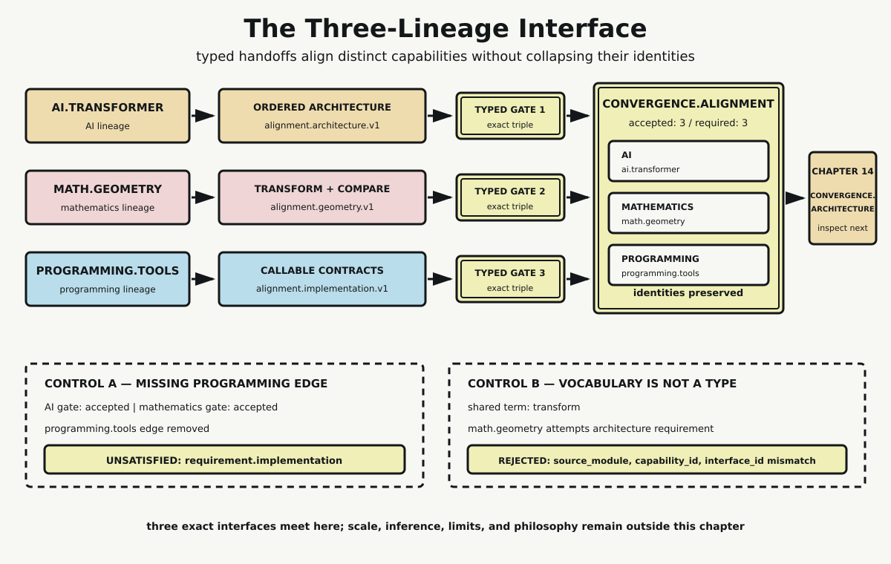

# Chapter 13 — Where the Journeys Meet

The first twelve chapters followed three lineages that developed at different rates and solved different problems. The AI lineage arrived with a Transformer architecture: an ordered relation among representation, attention, projection, residual, normalization, and feed-forward interfaces. The mathematical lineage arrived with numerical representations whose transformations and comparisons have to be declared. The programming lineage arrived with implementation, package, runtime, validation, and callable contracts.

Now they meet. But meeting is not merging.

That distinction controls this chapter. A mathematical transformation is not an attention head because both can be described with the word *transform*. A published architecture is not an executable tool because both describe operations. A dependency edge is not evidence that two disciplines have become the same object. The three lineages become operational together only where their exports satisfy named destination requirements.

## Convergence Begins with Edges

The repository dependency graph names exactly three incoming edges:

```text
ai.transformer -> convergence.alignment
math.geometry -> convergence.alignment
programming.tools -> convergence.alignment
```

These are not decorative arrows. Each edge authorizes a particular source module to offer a capability at the convergence boundary. The destination, `convergence.alignment`, owns three corresponding requirements. It needs ordered architectural relations from AI, declared representation and transformation rules from mathematics, and validated callable implementation contracts from programming.

An edge alone is still insufficient. If `math.geometry` is connected to convergence but presents itself as the Transformer architecture merely because its vocabulary contains *transform*, the graph has not made that claim true. The capability and interface identifiers must agree too.

The Chapter 13 probe therefore represents every handoff as structured data. It does not search prose. It does not test whether one label contains another. Acceptance compares an exact typed triple:

```text
(source_module, capability_id, interface_id)
```

This small rule keeps the chapter honest. Conceptual resemblance may help a reader reason across fields, but operational compatibility requires a declared contract.

## What AI Exports

Chapter 11 established that attention alone is not the Transformer. The architecture orders several component relations: input representations receive position; projections create query, key, and value channels; multiple heads are composed; output projection returns to model dimension; residual and normalization interfaces constrain handoffs; and positionwise feed-forward work follows.

Chapter 13 does not reopen that block or inspect a whole model at several scales. It receives the earlier result as the capability `component_architecture.ordered_relations` through interface `alignment.architecture.v1`.

That wording matters. AI exports an architectural role and an ordering among components. It does not export every matrix theorem used by the components, and it does not export the software services required to load and invoke them. The architecture is one lineage's contribution to alignment, not a container that erases the other two.

## What Mathematics Exports

The mathematical journey supplied coordinates, matrices, probability distributions, derivatives, tensors, and geometric comparison. By Chapter 8, learned representations could be discussed as points and neighborhoods only under declared choices: which representation is used, which transformation acts on it, and which comparison rule gives distance or similarity operational meaning.

The convergence fixture summarizes that contribution as `representation.declared_transform_compare` through `alignment.geometry.v1`. The compact identifier does not claim that all the mathematics in earlier chapters reduces to geometry. It names the specific export needed here: numerical objects and the rules under which they may be transformed and compared.

This interface also prevents a frequent category error. A matrix transformation may implement part of a Transformer component, but mathematical operation and architectural role remain different descriptions. The same multiplication can appear in a projection, a feed-forward stage, or another system entirely. Its algebra does not choose its role in an architecture.

## What Programming Exports

Chapter 12 followed a specification until it became callable. Framework operations, package fields, loader checks, runtime capabilities, and request and response schemas remained separately inspectable. That chain showed why a correctly drawn architecture cannot execute itself.

The programming export is `implementation.validated_callable_contracts` through `alignment.implementation.v1`. It carries the requirement that implementation behavior, serialized fields, selected runtime services, and invocation schemas agree before a caller can use the object.

Programming does not replace the architecture by making it executable. Nor does it define the mathematics by storing arrays. It binds declared behavior to machine representations and exposes validated interfaces. The resulting tool can realize architectural and mathematical requirements while preserving where those requirements came from.

## Exact Matching Preserves Identity

For the valid fixture, each destination requirement names one accepted source module, one capability identifier, and one interface identifier. Each of the three exports matches exactly once. No requirement is missing, and no requirement receives duplicate implementations.

The accepted alignment record retains the lineage identifier and source module from every export:

- `ai` remains `ai.transformer`
- `mathematics` remains `math.geometry`
- `programming` remains `programming.tools`

This is interface compatibility without object identity. The records can participate in one assembly because their contracts agree with the destination. They do not become interchangeable records. If the source identity were discarded after matching, the assembly could no longer explain which lineage supplied a requirement or detect an invalid substitution later.

Cardinality matters as much as type. “All requirements have at least one match” would permit two competing exports to satisfy one slot while hiding ambiguity. The probe instead requires every destination requirement to be satisfied exactly once. Complete alignment means three accepted records, zero unsatisfied requirements, and zero duplicate requirements.



*Three distinct exports cross exact typed gates into one alignment record while retaining their source identities. The outgoing edge leads only to Chapter 14. The lower controls show that neither a missing lineage nor shared vocabulary can satisfy a typed requirement.*

## Control One: Remove an Edge

The first control removes `programming.tools -> convergence.alignment` while leaving the programming export record present. This isolates graph authorization from data availability. A record sitting nearby is not an incoming handoff unless the dependency graph admits its source.

The architecture requirement remains satisfied by `ai.transformer`. The geometry requirement remains satisfied by `math.geometry`. The implementation requirement becomes explicitly unsatisfied:

```text
requirement.implementation
```

Exactly one failure appears. That precision is useful. The control does not report that “convergence failed” as an undifferentiated condition; it identifies the missing implementation contract and leaves the other accepted identities intact.

The result also prevents implementation from being treated as an optional final polish. Without the programming edge, mathematical and architectural descriptions still exist, but the alignment required for one executable technical object is incomplete.

## Control Two: Reject a Familiar Word

The second control introduces a mathematical candidate whose vocabulary includes *transform* and *architecture*. It comes from `math.geometry`, declares capability `representation.transform_label`, and exposes the geometry interface. It then attempts to satisfy the architecture requirement.

A substring matcher could be impressed by the shared word. The typed matcher is not. It reports a source-module mismatch, a capability-identifier mismatch, and an interface-identifier mismatch. The candidate is rejected with `TYPED_CONTRACT_MISMATCH`.

This does not forbid analogy. Mathematical transformation is indispensable to the implemented Transformer, and common language can reveal useful correspondences. The narrower conclusion is that correspondence does not authorize substitution. Vocabulary can motivate a question; it cannot complete a software or dependency contract.

## One Aligned Technical Handoff

Once all three requirements are satisfied exactly once, `convergence.alignment` can expose one outgoing edge:

```text
convergence.alignment -> convergence.architecture
```

The handoff says that three validated interfaces are now available for inspection as one technical object. It does not perform that inspection here. Chapter 14 owns the change of scale from system to stack to block to operation. Stopping at the outgoing edge keeps alignment distinct from architecture analysis.

The same boundary protects later chapters. Chapter 13 does not trace tokenization, model execution, next-token selection, or decoding; that is Chapter 15. It does not benchmark constraints or measure limits; that is Chapter 16. And it does not use technical convergence to settle questions about meaning, understanding, personhood, or humanity. Those philosophical questions belong beyond Book Two.

## What the Probe Establishes

The standard-library Python probe records structured lineage, edge, export, requirement, and accepted-match objects. Embedded assertions verify the exact canonical graph, three one-to-one matches, preserved source identities, the single unsatisfied requirement under edge removal, and the specific typed rejection despite shared vocabulary. A second computation produces equal valid and control records.

This is deliberately modest evidence. It establishes the repository's alignment contract, not a universal theory of interdisciplinary work. It shows how distinctions can survive assembly: AI contributes architectural relations, mathematics contributes declared numerical rules, and programming contributes executable contracts. Their joint operation depends on all three, while none acquires the identity of the others.

That is where the journeys meet: not in a shared slogan, but at interfaces precise enough to accept the right handoff and reject the wrong one.

## Sources and Evidence

The canonical graph, inherited chapter evidence, bounded external references, and prohibited inferences are documented in the [Chapter 13 source ledger](../evidence/chapter_13_sources.md). Exact records, controls, and validation results are documented in the [lineage-alignment probe](../evidence/chapter_13_lineage_alignment_probe.md), with the [Python implementation](../evidence/chapter_13_lineage_alignment_probe.py). Visual provenance, accessibility text, checksum, and production tests are recorded with [The Three-Lineage Interface](../visuals/chapter_13_three_lineage_interface.md).