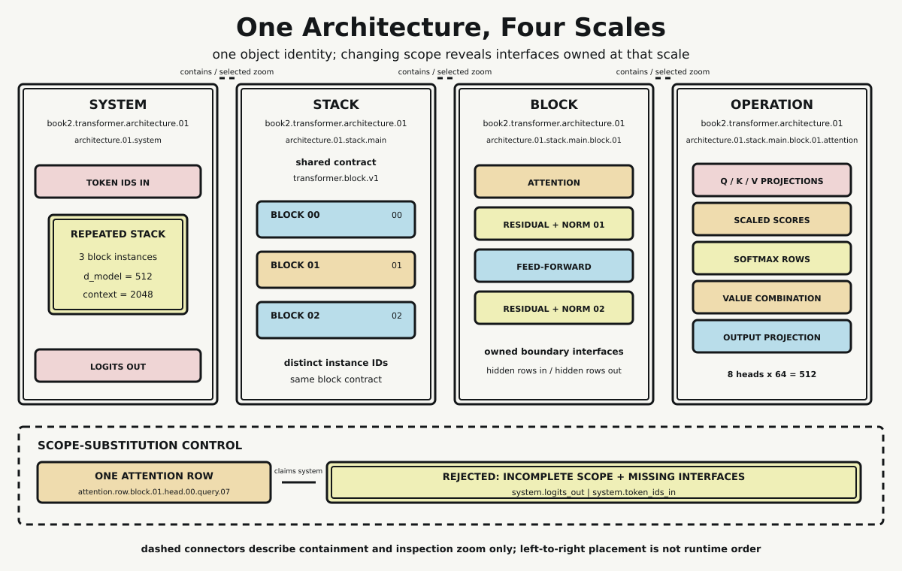

# Chapter 14 — Architecture in Full

Chapter 13 brought three lineages to one interface. Architectural relations, mathematical rules, and programmed contracts could finally be named together without being declared identical. Yet even that alignment leaves a basic problem of scale. What exactly is the object under discussion when someone says “the Transformer”?

The answer may point to a complete system, a repeated stack, one block, or one operation inside that block. All four views can be legitimate. The error begins when a change in inspection scale is mistaken for a change in object identity, or when selected detail is promoted into an explanation of everything that contains it.

This chapter fixes one architecture identity and inspects it at four scales. The object does not change. The selected scope and its visible interfaces do.

## One Identity, Four Selections

The deterministic fixture names one architecture:

```text
book2.transformer.architecture.01
```

That identifier appears unchanged on the system, stack, block, and operation records. Each record also names a selected object. At system scale the selected object is `architecture.01.system`. At stack scale it is `architecture.01.stack.main`. At block scale it is the middle instance, `architecture.01.stack.main.block.01`. At operation scale it is that block's attention operation.

This is not four architectures linked by resemblance. It is one architecture viewed through four scopes. Preserving the identifier makes the claim testable: a record that silently substitutes another architecture cannot pass as a closer view of this one.

The fixture also fixes its dimensions. Vocabulary size is 32,000, context length is 2,048, model dimension is 512, there are eight heads of dimension 64, feed-forward width is 2,048, and the stack contains three blocks. The checks require head dimensions to compose to model dimension and feed-forward width to equal four model dimensions. These values keep the structural contracts explicit. They are not measurements of speed, memory, quality, or usable capacity.

## System Scale: The External Boundary

At the widest scale, the architecture exposes only two owned interfaces: `system.token_ids_in` and `system.logits_out`. Between them sits one repeated stack.

That sparse view is deliberate. A system boundary should say what enters, what leaves, and which major object it contains. It should not pretend that every internal projection or normalization stage is a direct system interface. If all detail were flattened into one list, there would be no way to tell what an external caller must provide from what an internal component owns.

The system view is also not a trace of a request. No token sequence is supplied, no logits are computed, and no output is decoded. The labels establish architectural ports only. Chapter 15 will own the movement of one representation through executable stages.

## Stack Scale: Repetition Without Collapse

Zooming to the stack exposes three block instances:

```text
architecture.01.stack.main.block.00
architecture.01.stack.main.block.01
architecture.01.stack.main.block.02
```

Their identifiers are distinct. Their structural positions are distinct. All three satisfy the shared contract `transformer.block.v1`.

This distinction between instance identity and contract identity is essential. Repetition does not mean the architecture contains one block that is somehow in three places at once. It means three contained instances conform to one declared block interface. A defect or observation attached to block 01 therefore does not automatically become a record about block 00 or block 02, even though all three share a design.

The stack owns hidden-row input and output boundaries plus the shared block contract. It does not own the system's token-ID input, and it does not expose one head's normalized row as a stack interface. Scale limits what is visible because ownership limits what belongs at that boundary.

## Block Scale: The Local Assembly

The selected block is block 01. Its direct children are attention, first residual plus normalization, feed-forward, and second residual plus normalization. Its boundary exposes hidden rows entering and leaving the block.

Chapter 11 established why these interfaces must remain distinct. Chapter 14 does not repeat its projection matrices, attention coefficients, residual equations, normalization statistics, or component-removal arithmetic. The inherited result is architectural: attention is one sublayer in a larger block assembly, and the surrounding interfaces cannot be discarded when naming the block.

At this scale, the important fact is containment. The block contains an attention child and a feed-forward child. It also contains the two residual/normalization boundaries that organize their relation to the block path. The selected attention child is therefore neither a sibling of the complete system nor a replacement for the block. It has a parent with additional owned interfaces.

## Operation Scale: Attention as Selected Detail

The final view selects the attention operation inside block 01. It exposes Q, K, and V projections; scaled-score formation; softmax-normalized rows; value combination; and output projection. Its hidden-row entry and exit remain operation-owned boundaries.

This is the narrowest view, not the deepest explanation. More local detail can reveal how an operation is structured while hiding everything outside its scope. The operation view cannot show the feed-forward sublayer beside it, the other blocks in the stack, or the complete system boundary. Precision and completeness are different properties.

That point matters especially for attention records. A normalized attention row can be exact about one head and one query position. It can still be radically incomplete as an account of the block or system. The row records selected numerical relation within one operation; it does not carry every interface through which the architecture receives input and produces output.



*The same architecture ID appears at system, stack, block, and operation scales. Dashed connectors indicate containment and selected zoom, not runtime order. The subordinate control shows why one attention row cannot stand in for the whole system.*

## Exact Containment, Not a Suggestive Nesting

The probe does more than draw boxes inside boxes. It declares the exact parent-child edge set and compares it with an independently specified expected tuple.

The system has exactly one stack child. The stack has exactly three block children. Selected block 01 has exactly four named children. Its attention child has exactly five named operation components. A graph traversal then verifies that no containment cycle exists.

The selected path is exact:

```text
system contains stack
stack contains block 01
block 01 contains attention
```

No child can contain one of its ancestors. No unlisted edge can quietly make an attention component a direct child of the system. Exactness prevents a diagram's visual proximity from becoming an accidental architectural claim.

## Containment Is Not Execution Order

The four views are arranged from broad to narrow because that is a useful reading sequence. That arrangement must not be read as a runtime schedule.

Containment answers “which object owns this component?” Execution order answers “which operation acts next for a particular request?” Those are different relations. The probe's containment edges contain only parent and child identifiers. They include no execution field. The visual reinforces the distinction with dashed, unarrowed zoom connectors and a footer stating that left-to-right placement is not runtime order.

This chapter can say that a stack contains positionally identified blocks without following a representation through them. It can say that a block contains several sublayers without recording activation values at their boundaries. The architectural declaration prepares an execution trace; it does not perform one.

## Control: One Attention Row Claims the System

The control creates one record named `attention.row.block.01.head.00.query.07`. It preserves the architecture ID and exposes `attention.normalized_rows`. It then presents that operation record as a candidate for the whole-system view.

Validation rejects it with:

```text
INCOMPLETE_SCOPE_MISSING_INTERFACES
```

Two failures are explicit. First, the candidate declares `operation_record` scope rather than `system` scope. Second, it lacks both required system interfaces: token IDs in and logits out.

The rejection is stronger than saying “attention is not everything.” It states exactly what the candidate is and exactly which system requirements it cannot satisfy. Carrying the same architecture ID does not enlarge its scope. Being numerically complete as one row would not provide the missing interfaces.

The control also places a boundary around interpretation. Nothing in the row establishes semantic meaning, causal explanation, model reasoning, or complete system behavior. The probe rejects scope substitution; it does not attempt to settle broader interpretability questions.

## What the Four Views Establish

The verified fixture supports a bounded set of conclusions. One architecture identity survives all four selections. Parent-child containment is exact and acyclic. Three repeated blocks have distinct instance IDs while sharing one contract. Fixed dimensions agree across head, model, and feed-forward declarations. Every visible interface belongs to one scale in the fixture. The attention-row control fails for explicit scope and interface reasons. A second construction serializes identically, and two command-line runs produce the same deterministic JSON.

The evidence does not show how a request runs. It records no tokenization, intermediate activation, next-token selection, or decoding. It does not benchmark latency or throughput, and it does not measure context, compute, or data constraints. Those exclusions are ownership boundaries between chapters, just as the interface sets are ownership boundaries between scales.

## Two Exact Handoffs

The architecture exposes exactly two outgoing dependency edges:

```text
convergence.architecture -> convergence.execution
convergence.architecture -> convergence.limits
```

The first gives Chapter 15 a declared object through which to trace one representation in execution order. The second gives Chapter 16 the same declared object whose constraint envelope can be measured. Neither later task is smuggled into this chapter.

Architecture in full does not mean every possible fact about the system at once. It means the boundaries are complete enough that changing scale does not change identity, selected detail does not impersonate its container, and later investigations know exactly which object they inherit.

## Sources and Evidence

The bounded architecture claims and prohibited inferences are documented in the [Chapter 14 source ledger](../evidence/chapter_14_sources.md). Exact records, containment checks, controls, deterministic checksum, and dependency edges are documented in the [four-scales probe](../evidence/chapter_14_four_scales_probe.md), with the [Python implementation](../evidence/chapter_14_four_scales_probe.py). Visual provenance, accessibility text, checksum, and production tests are recorded with [One Architecture, Four Scales](../visuals/chapter_14_one_architecture_four_scales.md).