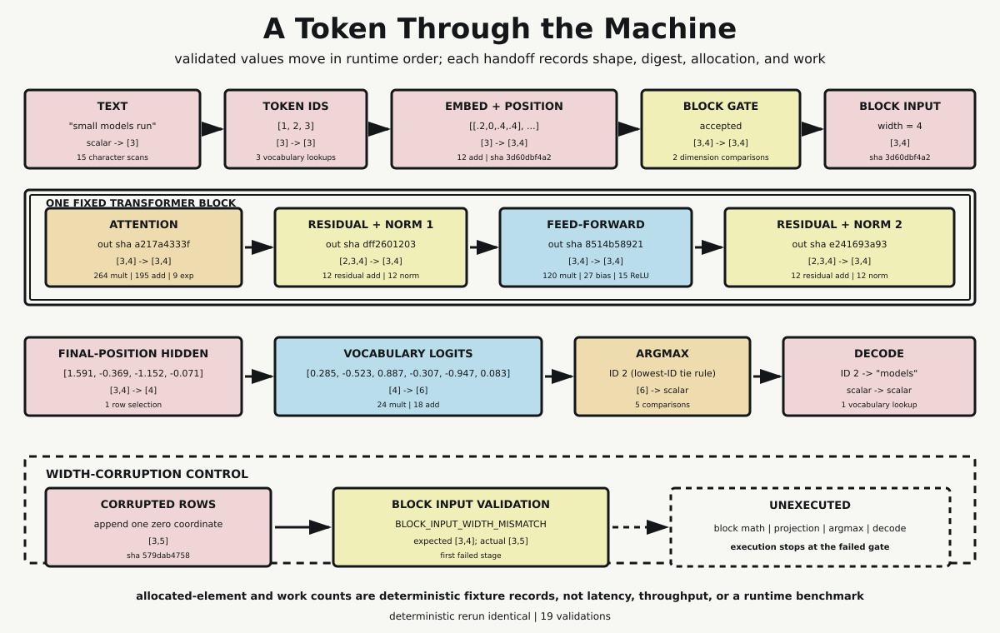

# Chapter 15 — A Token Through the Machine

Chapter 14 held one architecture still and inspected its boundaries at four scales. System contained stack, stack contained blocks, and one block contained attention, residual pathways, normalization, and feed-forward computation. Those containment relations answered what owns what. They did not answer what happens next when a request arrives.

Execution asks a different question. A representation must be accepted at one boundary, transformed, checked, and handed to the next operation. The order matters because later values do not exist before earlier operations produce them. This chapter follows one tiny request through that sequence. The aim is not to imitate the scale or behavior of a production language model. It is to make every handoff inspectable.

## A Fixture Small Enough to See

The request is fixed:

```text
small models run
```

The vocabulary is also fixed, in ID order:

```text
0 <unk>
1 small
2 models
3 run
4 clear
5 steps
```

Whitespace splitting after lowercase conversion produces three tokens. A token absent from this vocabulary would map to ID 0, `<unk>`. No unknown appears here, so lookup produces `[1, 2, 3]`.

This first change already demonstrates why representation handoffs need contracts. Text is a scalar string for the trace record. Tokenization produces a length-three sequence of strings. Vocabulary lookup preserves sequence length but changes the contents to integer identifiers. The identifiers are not miniature words. They are addresses into fixed numerical rows.

The fixture has three positions, model width four, feed-forward width five, and vocabulary size six. Each token ID selects one width-four embedding. Each sequence position selects one width-four positional row. Coordinatewise addition gives the block input:

```text
[[ 0.2, 0.0,  0.4, 0.4],
 [-0.2, 0.5,  0.2,-0.2],
 [ 0.4, 0.1, -0.1, 0.1]]
```

The shape has changed from `[3]` IDs to `[3,4]` numerical rows. Three embedding lookups and twelve additions are recorded. The resulting matrix also receives a stable SHA-256 digest, allowing the complete value to be compared without requiring every later summary to print every coordinate.

## The Gate Before the Block

Before attention performs a multiplication, the block-input gate compares the received shape with `[3,4]`. The normal path matches and is accepted.

That gate is not decorative validation after the fact. The projection matrices expect rows of width four. If a row of another width entered the matrix arithmetic, either the operation would be undefined for the fixture or some unrelated language behavior could obscure where the contract was first broken. Validation names the boundary at which responsibility changes.

This is the point where Chapter 14's architecture becomes Chapter 15's execution. Architecture declared a block with hidden rows in and hidden rows out. Execution supplies a concrete `[3,4]` value to that input and records acceptance before use.

## One Block in Runtime Order

The accepted rows enter one fixed Transformer block. Its order is attention, first residual plus normalization, feed-forward computation, and second residual plus normalization. This is a post-normalization fixture with fixed matrices and no learned activity during execution.

Attention first projects all three input rows into queries, keys, and values. It computes scaled query-key scores, applies softmax to each score row, combines value rows, and applies an output projection. The recorded attention output has shape `[3,4]` and digest prefix `a217a4333f`.

The work record inventories 264 multiplications, 195 additions, and nine exponentials. These counts follow from the actual loop dimensions in this fixture. They are not durations. An exponential is not assigned a fictional number of nanoseconds, and a Python operation count is not translated into processor instructions or device kernels.

The first residual stage pairs two `[3,4]` inputs: the block input and projected attention. Twelve coordinate additions form the residual rows. Layer normalization then operates across each width-four row using the declared epsilon-stabilized mean and variance formula. The output remains `[3,4]`, with digest prefix `dff2601203`.

Next, the positionwise feed-forward operation maps each width-four row to width five, adds a bias, applies ReLU, maps back to width four, and adds a second bias. Across three positions, its record contains 120 multiplications, 27 bias additions, and 15 ReLU comparisons. The public handoff remains `[3,4]`; its digest prefix is `8514b58921`.

The second residual combines those rows with the first normalized rows and normalizes again. It records twelve residual additions and twelve normalized elements. The block output has shape `[3,4]` and digest prefix `e241693a93`.

The digests do not replace arithmetic. The probe computes and retains the concrete rows at every executed stage. Digests provide a stable compact identity for visual and narrative use while the JSON evidence preserves rounded values.



*The fixed request moves through validated representations in runtime order. Values, shapes, and bounded work records remain distinct. The lower control changes only embedding width and stops at the first invalid block handoff.*

## From Hidden Row to Token

After the block, next-token projection uses only the final position. Selecting row three changes shape from `[3,4]` to `[4]` and produces:

```text
[1.591346871, -0.368589077, -1.151836533, -0.070921261]
```

Multiplication by the fixed $4\times6$ vocabulary matrix produces one logit per vocabulary ID:

```text
ID 0:  0.285293940
ID 1: -0.522753373
ID 2:  0.887095515
ID 3: -0.307293775
ID 4: -0.946629078
ID 5:  0.082931676
```

The projection records 24 multiplications and 18 additions. Again, this is an arithmetic inventory, not a performance result.

Selection uses deterministic argmax. The declared tie rule chooses the lowest token ID among entries sharing the maximum value. This logit vector has a unique maximum, `0.887095515`, at ID 2, so the tie rule is not invoked to break an actual tie. Declaring it still closes a source of ambiguity: if equal maxima occurred, reruns would not depend on an unstated convention.

Vocabulary lookup decodes ID 2 as:

```text
models
```

The output follows exactly from the fixture's arithmetic and mapping. It is not judged for fluency or semantic appropriateness. The request and weights were selected to make a complete path inspectable, not to establish language quality.

## Records Are Not Timings

Every one of the twelve stages records order, status, input shape, expected input shape, output shape, expected output shape, shape-validation result, operation category, allocated output elements, a work-count dictionary, and concrete output values or a stable digest.

Allocated output elements describe how many scalar slots appear in a stage's returned fixture value. Work counts describe declared arithmetic or lookup actions in the implementation. Neither is elapsed time. They do not report latency, throughput, memory-byte traffic, cache effects, interpreter overhead, vectorization, scheduling, power, or hardware utilization.

This separation matters because structural work and measured performance answer different questions. The trace can truthfully say that vocabulary projection performs 24 scalar multiplications under its declared loop model. It cannot infer how long a production kernel would take, whether operations execute in parallel, or which hardware bottleneck would dominate.

## The First-Failure Control

The control reruns the same text and token-ID stages. It selects the same embeddings and positional rows, then appends one zero coordinate to every resulting row. Nothing else changes. The corrupted matrix has shape `[3,5]`.

At `block_input_validation`, the fixture expects `[3,4]` and receives `[3,5]`. Validation rejects it with the specific code:

```text
BLOCK_INPUT_WIDTH_MISMATCH
```

This is the first failed stage. The stage-status record marks tokenization and ID lookup executed, embedding plus position executed with corrupted width, and block-input validation failed. Attention, first residual and normalization, feed-forward, second residual and normalization, final-row selection, vocabulary projection, argmax, and decode are all `unexecuted`.

That last distinction is crucial. The control does not fill later fields with zeros, empty arrays, or guessed error outputs. Such values would look like computational results. Instead, the record states that those stages never ran. Failure therefore changes both the value path and the existence of downstream records.

The control supports a local claim: this interface rejects this width error before block math. It does not establish universal failure handling for model frameworks, distributed runtimes, or production serving systems.

## What the Trace Establishes

Nineteen assertions cover the fixed request, known-token mapping, exact stage order, every executed shape, metadata completeness, component output dimensions, final-row identity, vocabulary-sized logits, argmax rule, decoding, dependency edges, control failure code, and downstream non-execution.

The probe constructs the complete result twice in one process and compares canonical serialization. Two separate command-line runs also produce byte-identical JSON. Their SHA-256 checksum is:

```text
484c4438d6a61629d718f4bb769c4f42b6a94e4213bbf98b707ba24be0c82b83
```

Determinism here means the same fixed program and inputs produce the same serialized evidence. It does not mean all language-model execution is deterministic, nor does it cover sampling, batching, caches, external tokenizers, trained weights, or device-specific numerical behavior.

Those exclusions remain explicit throughout.

## Exact Handoffs

This module has exactly two incoming dependency edges:

```text
convergence.architecture -> convergence.execution
programming.runtimes -> convergence.execution
```

The first supplies the declared block and interface boundary. The second supplies the discipline of ordered execution, allocation records, and bounded work counts. The one outgoing edge is:

```text
convergence.execution -> convergence.limits
```

It carries an observed fixed trace forward. This chapter does not vary context length, model width, vocabulary size, or other constraints. It establishes the baseline path whose declared constraints can later be measured without confusing a structural count with a benchmark or a technical boundary with a broader claim about meaning.

## Sources and Evidence

The bounded claims and prohibited inferences are documented in the [Chapter 15 source ledger](../evidence/chapter_15_sources.md). Exact arithmetic, stage records, assertions, control statuses, and checksum are documented in the [token-execution probe](../evidence/chapter_15_token_execution_probe.md), with the [Python implementation](../evidence/chapter_15_token_execution_probe.py). Visual provenance, accessibility text, exports, and deterministic SVG checksum are recorded with [A Token Through the Machine](../visuals/chapter_15_token_through_machine.md).