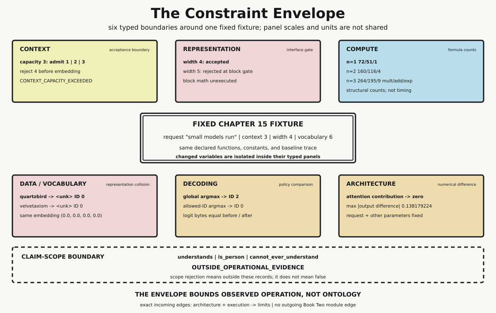

# Chapter 16 — Measured Limits

Chapter 15 followed one request through a fixed Transformer fixture. The request became token IDs, width-four numerical rows, attention output, residual and normalized rows, feed-forward output, logits, and finally one selected token. Every handoff was concrete. Yet a successful path can hide the boundaries that made it possible. It shows what happened inside the fixture, not where the fixture stops accepting inputs or how conclusions should stop when evidence runs out.

This final chapter of Book Two changes the mode of inspection. The architecture remains fixed while six different constraints are varied separately: context, representation, compute structure, vocabulary coverage, decoding policy, and one architectural contribution. Each experiment names what changed, what remained fixed, what kind of result was produced, and what inference that result permits. This typing matters because a rejected shape, an arithmetic count, and a changed token ID are not interchangeable measurements.

## One Fixture, Six Result Types

The fixture comes directly from Chapter 15. Its request is `small models run`; its context capacity is three positions; its model width is four; and its vocabulary contains six entries beginning with `<unk>` at ID 0. The same embedding table, positional rows, block matrices, normalization rule, and baseline logits remain available.

The experiment does not assign all constraints one numerical unit. Context produces admission records. Representation produces interface-gate records. Compute produces structural operation counts. Vocabulary coverage produces an ID-and-embedding collision. Decoding produces selected IDs under named policies. Architecture produces a numerical output difference. Placing these records in one envelope means they bound one fixture, not that they belong on one scale.

That distinction also prevents a common category error. A larger arithmetic count is not the same kind of fact as a rejected request. Neither one establishes language quality, semantic understanding, or production performance. The probe therefore attaches one permitted inference to every result instead of inviting an unrestricted conclusion.

## Context: Stop Before Embedding

The context experiment changes only requested sequence length. Capacity remains fixed at three, and the gate remains positioned before embedding. Requests of lengths one, two, and three are admitted. Length four returns:

```text
CONTEXT_CAPACITY_EXCEEDED
```

Its record also marks `embedding_executed` as false. This is stronger than noticing that a later operation failed. The invalid request is stopped at the boundary responsible for context admission, before an embedding result can be mistaken for valid downstream evidence.

The permitted conclusion is local: this fixture admits lengths one through three and rejects four before embedding. It does not establish the usable context of a production model, the quality of behavior near a long-context boundary, or a universal relation between context length and understanding.

## Representation: Width Is an Interface Contract

The representation experiment holds sequence length at three and the expected block width at four. It changes the width presented to the block-input gate.

Width four is accepted and block arithmetic may execute. Width five returns:

```text
BLOCK_INPUT_WIDTH_MISMATCH
```

For width five, `block_math_executed` is false. Chapter 15 introduced this failure lane by appending one zero coordinate. Chapter 16 treats the behavior as a measured acceptance boundary: one more coordinate is not “more representation” to this block. It is a different shape from the interface the matrices require.

Context and width may both reject an input, but they do so at different boundaries and for different reasons. Context compares sequence length with position capacity before embedding. Representation compares row width with the block contract before block arithmetic. The shared word “limit” should not erase that ownership.

## Compute: Exact Counts Are Not Time

The compute experiment varies sequence length through one, two, and three while holding model width at four, head count at one, and the scalar counting convention fixed. It evaluates the same declared formulas used by Chapter 15:

$$
M(n,d)=4nd^2+2n^2d
$$

$$
A(n,d)=4nd(d-1)+n^2(d-1)+nd(n-1)
$$

$$
E(n)=n^2
$$

Here $M$, $A$, and $E$ count multiplications, additions, and exponentials under the fixture's loops. At width four, the records are:

| Sequence length | Multiplications | Additions | Exponentials |
|---:|---:|---:|---:|
| 1 | 72 | 51 | 1 |
| 2 | 160 | 116 | 4 |
| 3 | 264 | 195 | 9 |

The final row exactly reproduces Chapter 15's attention inventory. The increasing values expose sequence-dependent structural work in this implementation. They do not report nanoseconds, latency, throughput, processor instructions, kernel launches, cache behavior, parallel efficiency, power, or memory traffic. No clock is read. Calling the table a benchmark would fabricate a result the probe never measured.

## Vocabulary: Distinct Strings Can Share One Row

The vocabulary experiment holds the six-entry vocabulary, unknown ID, and embedding table fixed. It changes only the input string. Two deliberately absent strings are supplied:

```text
quartzbird
velvetaxiom
```

They are distinct before lookup. Neither appears in the fixed vocabulary, so both map to `<unk>` ID 0. ID 0 selects the same embedding in both cases:

```text
[0.0, 0.0, 0.0, 0.0]
```

The distinction between the original strings is therefore unavailable after this lookup. That is a precise form of fixture information loss: a many-to-one representation rule collapses these two inputs at this boundary.

The result says nothing general about all tokenizers, subword vocabularies, character models, or training corpora. It does not show that unknown words must be represented identically in every system. It shows exactly what this deliberately finite mapping does to these two absent strings.

## Decoding: Policy Is Part of the Result

Chapter 15 produced a fixed six-value logit vector whose global maximum is at ID 2. Chapter 16 retains those exact logits and compares two deterministic policies.

The first policy is global argmax with the lowest ID winning any tie. It selects ID 2. The second policy declares the allowed set `{0,1,3,4,5}`, selects the highest-logit member of that set, and again uses the lowest ID for an eligible tie. Because ID 2 is not eligible and ID 0 has the largest allowed logit, the constrained rule selects ID 0.

The canonical logit bytes before and after both selections are equal. Their SHA-256 digest remains:

```text
af6666aa2915977123572c90a8f2a41fda50e830c57bd0da128481f070bd48ce
```

Nothing in the numerical model output changed. The eligible set and selection rule changed. The different ID therefore supports a narrow but important conclusion: decoding policy participates in observable output. It does not imply that this allowed set is useful, safe, fluent, or appropriate for another application. The policy is defensible here because it is explicit, total over a nonempty valid set, deterministic under ties, and independently checkable.

## Architecture: A Numerical Contribution Control

The architecture experiment returns to the width-four block. The request, input rows, matrices, biases, normalization constant, feed-forward path, and all operations after the first residual addition remain fixed. The changed variable is the attention contribution presented at that residual boundary.

The baseline uses the attention output computed by Chapter 15's actual function. The control replaces that contribution with zero rows of the same shape. It does not invent alternate weights or reroute the remaining block. Both paths then execute the same residual, normalization, feed-forward, second residual, and second normalization functions.

The baseline block-output digest is:

```text
e241693a9373cd7586485ffd3bbe80467862c77678223d8feded9f88b0dc18af
```

The no-attention-contribution digest is:

```text
12646e35923002aa765247f5803e7b5ff81f68e42569310bf87c8902e23f6518
```

Across the twelve output coordinates, the maximum absolute difference is `0.138179224`. The nonzero result demonstrates numerical sensitivity to this declared contribution under controlled fixture conditions.

It does not establish that attention is universally the most important component, that the changed coordinates carry a semantic interpretation, or that component removal predicts behavior in a trained production model. “The output changed” is the measured result. “What that change means” requires evidence this control does not contain.



*Six typed panels surround the fixed Chapter 15 fixture. Context and representation are gates; compute records formula counts rather than time; vocabulary records a collision; decoding compares policies over identical logits; architecture records numerical sensitivity. The panels do not share units.*

## The Boundary Around the Envelope

Operational restraint is itself made inspectable. A claim-scope validator receives three candidate conclusions:

```text
understands
is_person
cannot_ever_understand
```

Each returns `OUTSIDE_OPERATIONAL_EVIDENCE`. The code does not label the claims false. It says that context admissions, shape checks, operation counts, vocabulary collisions, selected IDs, and numerical differences do not decide those predicates.

This symmetrical boundary matters. The experiments do not prove that the fixture understands or is a person. They also do not prove that understanding is impossible for every present or future system under every account of meaning. Unsupported affirmation and unsupported impossibility exceed the same evidence.

That is the Global Manifest's Tool Boundary in executable form. Claims begin with operations the design enables and evidence demonstrates. Metaphor may motivate a question, but it cannot silently enlarge a result type.

## Exact Terminal Handoff

The limits module has exactly two incoming dependency edges:

```text
convergence.architecture -> convergence.limits
convergence.execution -> convergence.limits
```

Architecture supplies the declared object and its structural contracts. Execution supplies the observed baseline trace and work records. There is no outgoing Book Two module edge. Chapter 16 closes the technical dependency graph rather than opening another mechanism inside this book.

The probe constructs all six experiments twice and compares canonical serialization. Two command-line runs are byte-identical at SHA-256 `f0eff86f8826caee1af09ba508ed170a568374b4bf898963e69f230281c460fa`. Determinism makes the local evidence repeatable; it does not generalize the evidence beyond its declared fixture.

Book Two therefore ends with an architecture that can be inspected, executed, varied, and bounded. It hands Book Three mechanisms, interface failures, structural counts, representation loss, policy dependence, numerical sensitivity, and a disciplined account of unsupported inference. Book Three may ask what these systems mean for human beings and how geometric computation enters an account of semantics. It must begin from the measured envelope without confusing computation with meaning, or the absence of operational evidence with disproof.

## Sources and Evidence

The bounded claims and prohibited inferences are documented in the [Chapter 16 source ledger](../evidence/chapter_16_sources.md). Exact experiment records, controls, formulas, dependency edges, and deterministic checksum are documented in the [constraint-envelope probe](../evidence/chapter_16_constraint_envelope_probe.md), with the [Python implementation](../evidence/chapter_16_constraint_envelope_probe.py). Visual provenance, accessibility text, exports, and deterministic SVG checksum are recorded with [The Constraint Envelope](../visuals/chapter_16_constraint_envelope.md).