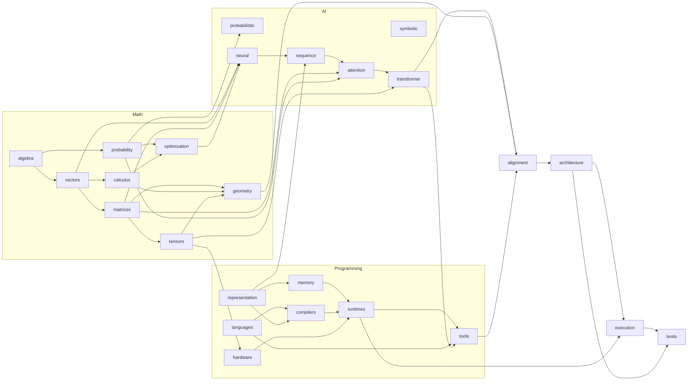

# Book Two — Dependency Map

This map records explanatory prerequisites, not a single-file reading order and not a claim of linear intellectual history. Several ideas developed in parallel and influence one another. An arrow means that the target module requires concepts established by the source module for this book's explanation.

The complete module registry is [modules.txt](modules.txt), and the directed edge list is [dependencies.tsv](dependencies.tsv).

## Structural Graph

## Build Layers

These layers show one valid topological build order. Modules within a layer may be developed in parallel.

| Layer | Modules | Reader movement |
|---|---|---|
| 0 | `math.algebra`, `ai.symbolic`, `programming.languages` | Formal operations, early AI structure, and executable expression |
| 1 | `math.vectors`, `math.probability`, `programming.representation` | Representation and uncertainty become explicit |
| 2 | `math.matrices`, `math.calculus`, `ai.probabilistic`, `programming.memory`, `programming.compilers` | Transformations, change, inference, and implementation constraints |
| 3 | `math.optimization`, `math.tensors` | Learning and scalable multidimensional computation |
| 4 | `ai.neural`, `math.geometry`, `programming.hardware` | Learned representation meets spatial interpretation and acceleration |
| 5 | `ai.sequence`, `programming.runtimes` | Ordered data becomes executable recurrent computation |
| 6 | `ai.attention` | Learned relevance loosens the recurrent bottleneck |
| 7 | `ai.transformer` | Attention becomes the organizing architecture |
| 8 | `programming.tools` | The architecture becomes broadly buildable and usable |
| 9 | `convergence.alignment` | The three completed lineages are compared at their interfaces |
| 10 | `convergence.architecture` | The transformer is inspected as one technical object |
| 11 | `convergence.execution` | Representations are followed through inference |
| 12 | `convergence.limits` | Concrete constraints are measured without philosophical closure |

The layers are not yet chapters. For example, vectors and matrices may form one reader movement, while attention may require more than one chapter if its conceptual and mechanical explanations separate naturally.

## Cross-Crate Dependency Matrix

| Source | Target | What crosses the boundary |
|---|---|---|
| Mathematics | AI | vectors, matrices, probability, gradients, and tensors |
| Programming | AI | token representation and executable sequence processing |
| Mathematics | Programming | tensor structure and parallel numerical workloads |
| AI | Programming | the transformer architecture as the object implemented by frameworks |
| AI | Convergence | the completed architectural lineage |
| Mathematics | Convergence | a disciplined account of transformations and learned spaces |
| Programming | Convergence | the implemented stack from language through runtime and tools |

## Natural Pivots

1. **Rules to learning:** symbolic and probabilistic traditions establish problems that neural methods approach differently.
2. **Representation to sequence:** vectors become ordered computational objects with memory and recurrence.
3. **Sequence to attention:** recurrence exposes constraints that attention changes rather than simply erases.
4. **Attention to transformer:** attention moves from component to organizing principle.
5. **Specification to execution:** mathematical operations become kernels, schedules, memory movement, and hardware work.
6. **Three lineages to one artifact:** convergence begins only after each lineage can account for its own contribution.
7. **Architecture to measured limits:** Book Two ends where technical constraints can be demonstrated; Book Three begins where their philosophical meaning is asked.

## Chapter-Derivation Test

A proposed chapter must satisfy at least one condition:

- establish a prerequisite used by multiple later modules
- carry a distinct historical or conceptual pivot
- support an inspectable build or experiment
- join previously separate dependencies at a visible interface
- test a concrete architectural constraint

If a proposed chapter merely mirrors a directory name, it is not yet justified.