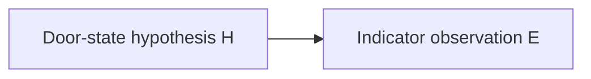

# Chapter 3 Probe Specification — Reasoning Under Uncertainty

**Status:** Verified August 12, 2026  
**Implementation:** [chapter_03_bayesian_update_probe.py](chapter_03_bayesian_update_probe.py)  
**Dependencies:** Python standard library only  
**Chapter brief:** [../chapter_briefs/chapter_03.md](../chapter_briefs/chapter_03.md)

## Claims Under Test

1. Bayesian conditioning redistributes probability over declared hypotheses without necessarily selecting a certain state.
2. A posterior depends on the declared prior and likelihood model as well as the admitted evidence.
3. A posterior distribution does not, by itself, specify a decision or action.

## Hypothesis Model

The probe uses the complete toy hypothesis space:

$$
H=\{locked, unlocked\}.
$$

The observed evidence is the categorical value:

$$
E=red.
$$

The dependency graph is:

The edge declares conditional dependence in the model. It does not establish physical causation or measured sensor behavior.

## Base Inputs

Prior distribution:

| Hypothesis | $P(H)$ |
|---|---:|
| `locked` | 0.6 |
| `unlocked` | 0.4 |

Likelihood model for the admitted observation:

| Hypothesis | $P(red\mid H)$ |
|---|---:|
| `locked` | 0.8 |
| `unlocked` | 0.3 |

These are fixed illustrative values. They are not measurements, learned parameters, confidence intervals, or claims about a physical indicator.

## Update Function

For each hypothesis $h$, compute its unnormalized joint weight:

$$
w(h)=P(E=red\mid h)P(h).
$$

Compute the evidence probability:

$$
P(E=red)=\sum_{h\in H}w(h).
$$

Normalize each weight:

$$
P(h\mid E=red)=\frac{w(h)}{P(E=red)}.
$$

The implementation must reject:

- an empty hypothesis space
- mismatched prior and likelihood keys
- negative or non-finite values
- a prior that does not sum to one within the declared tolerance
- a zero evidence probability, for which normalization is undefined

## Required Base Output

The base case must record:

| Measurement | `locked` | `unlocked` |
|---|---:|---:|
| prior | 0.6 | 0.4 |
| likelihood of `red` | 0.8 | 0.3 |
| joint weight | 0.48 | 0.12 |
| posterior | 0.8 | 0.2 |

The evidence probability must be recorded as:

$$
P(red)=0.48+0.12=0.60.
$$

The output must preserve the labels `prior`, `likelihood`, `joint_weight`, `evidence_probability`, and `posterior` rather than presenting the update as one unexplained score.

## Sensitivity Cases

Sensitivity changes one declared assumption at a time while retaining the same observation `red`.

### Prior Sensitivity

Change the prior to:

$$
P(locked)=0.4, \qquad P(unlocked)=0.6.
$$

Keep the base likelihoods. The expected posterior is:

$$
P(locked\mid red)=0.64, \qquad P(unlocked\mid red)=0.36.
$$

### Likelihood Sensitivity

Restore the base prior and change only:

$$
P(red\mid locked)=0.5.
$$

Keep $P(red\mid unlocked)=0.3$. The expected posterior is:

$$
P(locked\mid red)=\frac{5}{7}, \qquad
P(unlocked\mid red)=\frac{2}{7}.
$$

These cases establish dependence on model inputs. They do not identify which assumptions correspond to the world.

## Required Probe Output

Emit one structured JSON document containing:

- the hypothesis labels
- the evidence label and observed value
- the base prior and likelihoods
- the base joint weights and evidence probability
- the base posterior
- the prior-sensitivity inputs and posterior
- the likelihood-sensitivity inputs and posterior
- Boolean results for normalization, non-collapse, directional update, and sensitivity

The output must not contain a predicted action, threshold, utility, loss, confidence interval, or ground-truth state.

## Validation Gates

The implementation passes only when:

- every scenario uses the same two hypothesis labels
- every prior sums to one within an absolute tolerance of $10^{-12}$
- every posterior sums to one within an absolute tolerance of $10^{-12}$
- every base posterior value is strictly between zero and one
- the base observation increases `locked` from 0.6 to 0.8 without making it certain
- changing only the prior changes the posterior to $(0.64,0.36)$
- changing only one likelihood changes the posterior to $(5/7,2/7)$
- input validation rejects each declared malformed case
- rerunning the probe produces the same structured output

## Observed Result

The probe passed every update and input-validation assertion:

| Scenario | Posterior `locked` | Posterior `unlocked` | Result |
|---|---:|---:|---|
| base | 0.8 | 0.2 | normalized and non-collapsed |
| changed prior | 0.64 | 0.36 | posterior changed |
| changed `locked` likelihood | $5/7$ | $2/7$ | posterior changed |

The base evidence probability was $0.60$, derived from joint weights $0.48$ and $0.12$. The implementation also rejected an empty hypothesis space, mismatched keys, negative and non-finite probabilities, a non-normalized prior, and zero-probability evidence.

The result supports all three claims under test within the declared toy model. It does not establish that any input corresponds to a physical door, sensor, decision, or action.

## Evidence Boundary

The probe can establish that the declared arithmetic is coherent, normalized, non-collapsing in the base case, and sensitive to prior and likelihood assumptions.

It cannot establish:

- that `locked` or `unlocked` is the actual state of a door
- that the hypotheses exhaust a physical state space
- that the observation was produced by a real indicator
- that the illustrative likelihoods measure a real sensor
- that a posterior probability is a confidence interval
- that the model edge establishes causation
- that the favored hypothesis should trigger a decision or action
- that Bayesian inference is the only valid representation of uncertainty

## Visual Anchor Constraints

**The Shape of Updated Belief** must be derived from the recorded base inputs and outputs rather than independently redrawn values.

The visual must:

- place prior and posterior on the same probability scale
- show both hypothesis labels at both stages
- expose both likelihood weights
- retain visible posterior mass at `locked` and `unlocked`
- distinguish the base update from sensitivity results without adding a second anchor
- remain intelligible in grayscale and at thumbnail size
- avoid depicting the posterior as a selected state, verdict, or action

The sensitivity cases may appear as thin comparison marks or annotations within the same plot. They may not become separate panels that function as additional chapter anchors.

## Implementation Gate

The executable artifact may be created only from this specification. If implementation reveals a defect in the expected values, input contract, or validation gates, revise this specification and the chapter brief before changing the chapter claim.
