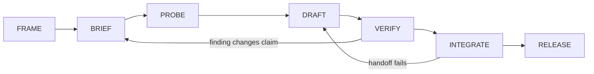

# Book Two — Manuscript Workflow

**Status:** Canonical workflow established August 12, 2026

Book Two is developed top-down: public promise, crate boundaries, dependencies, chapter spine, visual contract, chapter briefs, verified drafts, integrated manuscript, and publication builds. Framing controls the concrete; drafting does not silently redefine the architecture.

## Source of Truth

| Concern | Canonical artifact |
|---|---|
| public promise and trilogy boundary | [GLOBAL_MANIFEST.md](GLOBAL_MANIFEST.md) |
| crate and module responsibilities | [book_structure.md](book_structure.md) |
| prerequisites and cross-crate interfaces | [dependency_map.md](dependency_map.md) |
| chapter order and ownership | [CHAPTER_MANIFEST.md](CHAPTER_MANIFEST.md) |
| visual grammar | [VISUAL_LANGUAGE.md](VISUAL_LANGUAGE.md) |
| chapter visual assignments | [VISUAL_MANIFEST.md](VISUAL_MANIFEST.md) |
| manuscript analytics | [analytics/README.md](analytics/README.md) |

When prose exposes a structural defect, update the controlling artifact explicitly before changing downstream work.

## Build Sequence

The sequence governs readiness, not daily work order. Chapters whose prerequisites are stable may be developed in parallel.

## Chapter States

### 1. Framed

The chapter has a canonical number, title, module assignment, derivation rationale, prerequisites, and visual anchor. All 16 chapters currently satisfy this state.

### 2. Briefed

Before prose begins, record:

- the reader's entry state and intended exit state
- inherited terms and claims from prerequisite chapters
- the chapter's central question
- the structural reveal performed by its visual anchor
- the inspectable probe or evidence, when applicable
- the handoff required by the next dependent chapter
- explicit exclusions, especially material reserved for Book Three

### 3. Probed

Build or run the smallest inspectable experiment needed to test the chapter's central technical claim. Record inputs, environment, procedure, outputs, limitations, and the claim that the result does or does not support.

Not every historical or foundational claim requires executable code. When execution is inappropriate, use a derivation, worked example, primary source, or reproducible data analysis instead. Evidence must match the kind of claim being made.

### 4. Drafted

Write around the verified structure:

1. establish the reader's problem
2. introduce only the prerequisites needed here
3. expose the mechanism or relationship
4. present the visual anchor at the moment of structural reveal
5. inspect the evidence or probe
6. state constraints and failure modes
7. hand the resulting concept to the next chapter

Drafts may discover better language. They may not silently move module ownership, duplicate another chapter's anchor, or cross the Book Two boundary.

### 5. Verified

A chapter reaches verified status only when:

- factual and historical claims have traceable sources
- equations, examples, code, and reported outputs have been checked
- the central probe is reproducible or its non-executable evidence is inspectable
- the visual anchor passes every production test in the visual language
- terminology agrees with prerequisite chapters
- limitations are stated at the same level of confidence as conclusions
- the chapter remains technical rather than making Book Three's philosophical claims
- the analytics engine completes with no broken local links, and metric outliers have been inspected rather than mechanically optimized

The governing loop is:

**Conversation → Build → Test → Reverse Engineer → Conversation Update**

If verification changes the claim, revise the brief before revising the prose. This keeps discoveries visible instead of burying them as local edits.

### 6. Integrated

Read the chapter at its incoming and outgoing interfaces. Remove accidental repetition, repair undefined references, verify narrative pivots, and confirm that later chapters rely only on concepts actually established earlier.

Integration occurs first within each part, then across the four part boundaries, and finally across the complete manuscript.

### 7. Release Candidate

The manuscript can enter publication production only after:

- all chapters are integrated
- all 16 original anchors are complete and accessible
- citations, permissions, and attributions are resolved
- front matter, back matter, metadata, and acknowledgments are present
- ebook and print outputs build from the same canonical manuscript sources
- generated outputs pass link, image, typography, navigation, and device checks
- the complete book receives a final Book Two/Book Three boundary review

Publication commands, formats, and toolchain configuration will be added when canonical manuscript sources exist. This workflow defines the gates; it does not claim that build tooling already exists.

## Change Control

Changes propagate from structure to concrete:

1. update the highest controlling artifact affected
2. update machine-readable mappings when ownership or order changes
3. update chapter briefs and visual assignments
4. revise manuscript prose and probes
5. rerun dependency, anchor, analytics, and build validation

A local prose edit that does not alter architecture needs no manifest change. A change to chapter ownership, prerequisite order, visual assignment, public promise, or trilogy boundary does.

## Current Gate

The frame is complete through chapter and visual assignment. Chapters 1 through 16 are verified manuscript chapters with reproducible evidence, bounded source ledgers, and original visual anchors. Chapters 1 through 5 pass the [Part I integration audit](evidence/part_01_integration.md), Chapters 6 through 9 pass the [Part II integration audit](evidence/part_02_integration.md), Chapters 10 through 12 pass the [Part III integration audit](evidence/part_03_integration.md), and Chapters 13 through 16 pass the [Part IV integration audit](evidence/part_04_integration.md).

The 16-chapter manuscript is integrated at 24,802 words with zero broken local links and passes the [complete manuscript integration audit](evidence/full_book_integration.md). All chapter probes and visual checksums reproduce, the final cross-part and trilogy-boundary review passes, and workspace diagnostics are clean.

The [publication release-readiness audit](evidence/release_readiness.md) remains open. Front and back matter, acknowledgments, consolidated citation and permissions resolution, confirmed metadata, and canonical ebook/print production tooling are required before release-candidate status.
