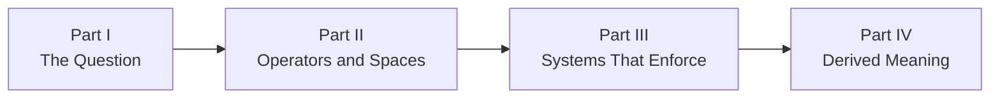

# Book Three — Chapter Manifest

**Status:** Structural baseline; re-derivation required August 14, 2026
**Title:** *The Architecture of Geometric Semantics*
**Subtitle:** *Berkeley, Transformers, and the Geometry of Inquiry*

This manifest records the 14 chapters derived from the 21-module philosophical DAG in [dependency_map.md](dependency_map.md). It predates the canonical evidence-bounded closure thesis in [CLOSURE_PROBE.md](CLOSURE_PROBE.md) and remains a baseline for re-derivation, not current drafting authority. The machine-readable assignment is [chapter_modules.tsv](chapter_modules.tsv), and every future chapter remains subject to [OWNERSHIP_CONTRACT.md](OWNERSHIP_CONTRACT.md).

## Part I — The Question

### Chapter 1 — Berkeley's Question

**Modules:** `lineage.berkeley`

Establish Berkeley as the historical protagonist by reconstructing his questions about perception, signs, abstraction, ideas, and what warrants talk of an object. Separate Berkeley's documented arguments from Book Three's modern reconstruction before the transformer enters the inquiry.

**Evidence classes:** primary historical text, scholarly interpretation, philosophical reconstruction
**Ownership invariants:** C3, P1, P2, P3, R3
**Forbidden inference:** Berkeley anticipated transformers or endorsed derived meaning.
**Handoff:** The reader can distinguish Berkeley's question from the answers Book Three may later propose.

### Chapter 2 — Leibniz and the Dream of Form

**Modules:** `lineage.leibniz`

Examine symbolic form, relation, calculus, possible worlds, and rational structure as a second historical pressure on the problem of meaning. Leibniz complicates Berkeley without being recruited as the system's formal guarantor.

**Evidence classes:** primary historical text, scholarly interpretation, philosophical reconstruction
**Ownership invariants:** C3, P1, P3, R3
**Forbidden inference:** symbolic form eliminates interpretation or makes meaning mechanically complete.
**Handoff:** Formal relation becomes available as a question that Kant and the later account of derivation must constrain.

### Chapter 3 — Conditions of Possibility

**Modules:** `lineage.kant`

Bring Berkeley's perceptual challenge and Leibniz's formal ambition into contact with Kantian categories, synthesis, and limits on knowledge. The chapter establishes that inquiry has conditions without treating those conditions as a direct theory of transformer cognition.

**Evidence classes:** primary historical text, scholarly interpretation, comparative philosophical argument
**Ownership invariants:** C3, P1, P3, R3
**Forbidden inference:** Kantian synthesis and transformer computation are the same process.
**Handoff:** Interpretation now requires both relational structure and conditions under which structure becomes intelligible.

## Part II — Operators and Spaces

### Chapter 4 — What Operations Permit

**Modules:** `closure.operations`, `closure.constraints`

Move from historical questions to the first philosophical operators: permitted operations, preserved forms, generated states, exclusions, and boundaries. Distinguish algebraic, programmed, learned, institutional, and philosophical uses of closure.

**Evidence classes:** inherited technical evidence, formal example, philosophical distinction
**Ownership invariants:** P3, P4, R2, R3
**Forbidden inference:** every constrained system is closed in the same mathematical or philosophical sense.
**Handoff:** Constraints become explicit enough to inspect interfaces, limits, order, and concrete systems.

### Chapter 5 — From Geometry to Possibility

**Modules:** `lineage.modern_geometry`, `geometry.manifolds`

Trace the movement from modern geometric structures to philosophical spaces of possibility. Establish what manifolds, local structure, global organization, and invariants can model while refusing to convert the model into an ontology of meaning.

**Evidence classes:** mathematical history, inherited technical evidence, geometric model, philosophical interpretation
**Ownership invariants:** P3, P4, R2, R3, R4
**Forbidden inference:** because learned representations admit geometric description, meaning is literally a manifold.
**Handoff:** A space of possibility is available for paths, transformations, and learned relations.

### Chapter 6 — Interfaces and Trajectories

**Modules:** `closure.interfaces`, `geometry.trajectories`

Join boundaries with movement. Ask how representations cross interfaces, how paths depend on prior states, and how inquiry changes when no participant owns the complete route from request to interpretation.

**Evidence classes:** inherited technical evidence, geometric model, interface analysis, philosophical inference
**Ownership invariants:** P3, P4, R2, R3
**Forbidden inference:** crossing an interface preserves meaning without translation, loss, or reinterpretation.
**Handoff:** The reader can inspect order-sensitive paths and distinguish an interface from a transparent conduit.

### Chapter 7 — Order Changes the Reachable

**Modules:** `geometry.non_commutativity`, `comparative_systems.rubiks_cube`

Use non-commutativity and the Rubik's Cube to make order, move closure, and reachable states visible. The case tests the operator without becoming a miniature ontology of intelligence.

**Evidence classes:** formal derivation, inspectable comparative case, bounded analogy
**Ownership invariants:** C4, P3, P4, R2, R3
**Forbidden inference:** human thought or transformer inference operates literally like a Rubik's Cube.
**Handoff:** Order dependence becomes an inspectable constraint for later accounts of derivation and limits.

### Chapter 8 — Where Closure Stops

**Modules:** `closure.limits`

Distinguish the limits of an operation set, interface, representation, architecture, knowledge claim, and philosophical argument. Closure becomes a disciplined account of boundaries rather than a shortcut to ontology.

**Evidence classes:** inherited technical limits, formal distinction, philosophical argument, counterexample
**Ownership invariants:** P3, P4, R2, R3
**Forbidden inference:** a demonstrated architectural limit establishes an ultimate limit on intelligence or meaning.
**Handoff:** Later chapters may compare system limits without collapsing them into one universal boundary.

## Part III — Systems That Enforce

### Chapter 9 — Meaning Under Enforcement

**Modules:** `comparative_systems.programming_languages`, `comparative_systems.engineered_systems`

Compare syntax, semantics, types, compilation, mechanisms, procedures, organizations, and human judgment as different forms of enforced constraint. Use the assembly instruction and its human-readable comment as a bounded case: the instruction executes under an ABI, the comment records rationale, and either can expose a mismatch in the other. Show how systems realize meaning and safety through interfaces while preserving their disanalogies.

**Evidence classes:** inherited technical evidence, programming case, engineered case, institutional case, disanalogy
**Ownership invariants:** C4, P3, P4, R2, R3
**Forbidden inference:** formal enforcement removes interpretation, human judgment, or interface failure.
**Handoff:** Concrete enforced systems become evidence for derivation and its limits.

### Chapter 10 — The Transformer as Philosophical Object

**Modules:** `lineage.transformers`, `geometry.attention_geometry`, `comparative_systems.transformers`

Place the transformer in lineage, inspect the geometric usefulness and limits of attention, and treat the implemented architecture as a comparative case. This chapter imports Book Two's machine without rewriting it.

**Evidence classes:** Book Two technical evidence, contemporary lineage, geometric model, execution trace, comparative case
**Ownership invariants:** C1, C4, P2, P3, P4, R2, R3, R4
**Forbidden inference:** attention weights reveal intention, explanation, consciousness, or complete provenance.
**Handoff:** The transformer becomes a bounded modern site where the thesis of derived meaning can be tested.

## Part IV — Derived Meaning

### Chapter 11 — Meaning Is Derived

**Modules:** `meaning.derivation`

Join relational form, permitted operations, trajectories, programming enforcement, and transformer execution into the book's central thesis. Use a declared alias and its expansion as a bounded case of symbolic compression. Test it by naming its referent, recovering its valid context, exposing consequential omissions, and demonstrating the operative machinery required by the reader's question. The glyph saves space, but it does not preserve every detail or contain meaning intact. Meaning emerges through structured contact and transformation rather than arriving as an object retrieved from one participant or stored whole inside a symbol.

**Evidence classes:** philosophical synthesis, inherited technical evidence, alias-expansion demonstration, comparative cases, collaboration trace
**Ownership invariants:** C1, C2, C3, C4, P2, P3, R1, R3, R4
**Forbidden inference:** derivation proves that meaning resides in the transformer, belongs equally to every causal contributor, remains intact inside a glyph independently of its defining practice, or can be losslessly reconstructed from every compression.
**Handoff:** The thesis is available for contextual interpretation rather than treated as self-validating.

### Chapter 12 — Interpretation and the Human Return

**Modules:** `meaning.interpretation`

Make the trilogy's excursion-and-return structure explicit, then return derived output to human purpose, context, judgment, and responsibility. Examine care in transformer use through differences in user knowledge, goals, context, susceptibility, access, and interpretive practice rather than through invented rankings of cognitive machinery. Berkeley's question and Kant's conditions meet the practical loop in which a result becomes meaningful through selection, testing, revision, and use. Mean-and-sigma language remains a declared narrative coordinate rather than a statistical, biological, or moral claim.

**Evidence classes:** philosophical interpretation, collaboration trace, provenance audit, human-factors evidence, interaction case, counterexample
**Ownership invariants:** C1, C2, C3, C4, P2, P3, R1, R3, R4
**Forbidden inference:** human interpretation can repair unsupported provenance, transfer accountability to the collaboration, turn a transformer into a person or biological brain, or rank people through an unspecified Jacobian.
**Handoff:** Meaning can now be evaluated against architectural, epistemic, and interpretive limits.

### Chapter 13 — The Limits of Derived Meaning

**Modules:** `meaning.limits`

Separate what cannot be reached, computed, known, sourced, interpreted, or responsibly claimed. Compare closure limits, attention geometry, engineered failure, order-sensitive cases, and human interpretation without compressing them into one boundary.

**Evidence classes:** inherited technical limits, comparative cases, epistemic analysis, philosophical argument
**Ownership invariants:** C4, P2, P3, P4, R1, R2, R3, R4
**Forbidden inference:** identifying limits proves either machine impossibility or unlimited human interpretive privilege.
**Handoff:** The manuscript can test explanatory stories against the complete architecture of evidence and limits.

### Chapter 14 — Against the Story That Explains Too Much

**Modules:** `meaning.anti_narrative`

Distinguish narrative as a legitimate human form from narrative used to replace mechanisms, provenance, constraints, and responsibility. Audit the trilogy's own claims about inevitable success, the trilogy as its own proof, exact homomorphism, collision-free concurrency, lineage, mean-and-sigma return, universal stickman representation, and human Jacobian rankings. End by asking whether an explanation reveals load-bearing structure or merely makes uncertainty feel complete.

**Evidence classes:** philosophical critique, provenance audit, transformer case, counterexample, self-audit of the trilogy
**Ownership invariants:** C1, C2, C3, C4, P2, P3, P4, R1, R2, R3, R4
**Forbidden inference:** narrative is inherently false, structural analysis can eliminate interpretation, or an inspectable artifact validates itself.
**Handoff:** The trilogy returns its claims to the reader as inspectable structures rather than compulsory conclusions.

## Narrative Spine

The reader movement is:

1. Berkeley opens the question; Leibniz and Kant complicate its formal and epistemic conditions
2. closure and geometry supply operators without becoming ontology
3. comparative systems test those operators in visible and executable cases
4. derivation becomes interpretation, encounters limits, and submits its own explanatory language to critique

## Drafting Boundary

The spine remains structurally valid under its August 12 thesis but is not drafting-ready under the August 14 closure thesis. Re-derivation must preserve useful historical, technical, and comparative dependencies while making warranted action, accountable authority, consequences, and revision part of the final movement. Every replacement chapter must satisfy the candidate chapter contract in [chapter_derivation.md](chapter_derivation.md).

Interior visual anchors remain unassigned until Book Three establishes a visual grammar distinct from, but compatible with, Book Two.
