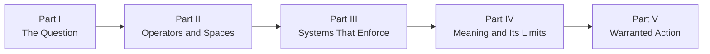

# Book Three — Chapter Manifest

**Status:** Canonical closure spine established August 14, 2026
**Title:** *The Architecture of Geometric Semantics*
**Subtitle:** *Berkeley, Transformers, and the Geometry of Inquiry*

This manifest derives 16 chapters from the 27-module philosophical DAG in [dependency_map.md](dependency_map.md). It makes derived meaning an input to evidence-bounded closure rather than the manuscript's endpoint. The machine-readable assignment is [chapter_modules.tsv](chapter_modules.tsv), and every chapter remains subject to [OWNERSHIP_CONTRACT.md](OWNERSHIP_CONTRACT.md) and [CLOSURE_PROBE.md](CLOSURE_PROBE.md).

## Part I — The Question

### Chapter 1 — Berkeley's Question

**Modules:** `lineage.berkeley`

Establish Berkeley as the historical protagonist by reconstructing his questions about perception, signs, abstraction, ideas, and what warrants talk of an object. Separate Berkeley's documented arguments from Book Three's modern reconstruction before the transformer enters the inquiry.

**Evidence classes:** primary historical text, scholarly interpretation, philosophical reconstruction
**Ownership invariants:** C3, P1, P2, P3, R3
**Forbidden inference:** Berkeley anticipated transformers or endorsed derived meaning.
**Handoff:** The reader can distinguish Berkeley's question from the answers Book Three may later propose.

### Chapter 2 — Leibniz and the Dream of Form

**Modules:** `lineage.leibniz`

Examine symbolic form, relation, calculus, possible worlds, and rational structure as a second historical pressure on the problem of meaning. Leibniz complicates Berkeley without being recruited as the system's formal guarantor.

**Evidence classes:** primary historical text, scholarly interpretation, philosophical reconstruction
**Ownership invariants:** C3, P1, P3, R3
**Forbidden inference:** symbolic form eliminates interpretation or makes meaning mechanically complete.
**Handoff:** Formal relation becomes available as a question that Kant and the later account of derivation must constrain.

### Chapter 3 — Conditions of Possibility

**Modules:** `lineage.kant`

Bring Berkeley's perceptual challenge and Leibniz's formal ambition into contact with Kantian categories, synthesis, and limits on knowledge. The chapter establishes that inquiry has conditions without treating those conditions as a direct theory of transformer cognition.

**Evidence classes:** primary historical text, scholarly interpretation, comparative philosophical argument
**Ownership invariants:** C3, P1, P3, R3
**Forbidden inference:** Kantian synthesis and transformer computation are the same process.
**Handoff:** Interpretation now requires both relational structure and conditions under which structure becomes intelligible.

## Part II — Operators and Spaces

### Chapter 4 — What Operations Permit

**Modules:** `closure.operations`, `closure.constraints`

Move from historical questions to the first philosophical operators: permitted operations, preserved forms, generated states, exclusions, and boundaries. Distinguish algebraic, programmed, learned, institutional, and philosophical uses of closure.

**Evidence classes:** inherited technical evidence, formal example, philosophical distinction
**Ownership invariants:** P3, P4, R2, R3
**Forbidden inference:** every constrained system is closed in the same mathematical or philosophical sense.
**Handoff:** Constraints become explicit enough to inspect interfaces, limits, order, and concrete systems.

### Chapter 5 — From Geometry to Possibility

**Modules:** `lineage.modern_geometry`, `geometry.manifolds`

Trace the movement from modern geometric structures to philosophical spaces of possibility. Establish what manifolds, local structure, global organization, and invariants can model while refusing to convert the model into an ontology of meaning.

**Evidence classes:** mathematical history, inherited technical evidence, geometric model, philosophical interpretation
**Ownership invariants:** P3, P4, R2, R3, R4
**Forbidden inference:** because learned representations admit geometric description, meaning is literally a manifold.
**Handoff:** A space of possibility is available for paths, transformations, and learned relations.

### Chapter 6 — Interfaces and Trajectories

**Modules:** `closure.interfaces`, `geometry.trajectories`

Join boundaries with movement. Ask how representations cross interfaces, how paths depend on prior states, and how inquiry changes when no participant owns the complete route from request to interpretation.

**Evidence classes:** inherited technical evidence, geometric model, interface analysis, philosophical inference
**Ownership invariants:** P3, P4, R2, R3
**Forbidden inference:** crossing an interface preserves meaning without translation, loss, or reinterpretation.
**Handoff:** The reader can inspect order-sensitive paths and distinguish an interface from a transparent conduit.

### Chapter 7 — Order Changes the Reachable

**Modules:** `geometry.non_commutativity`, `comparative_systems.rubiks_cube`

Use non-commutativity and the Rubik's Cube to make order, move closure, and reachable states visible. The case tests the operator without becoming a miniature ontology of intelligence.

**Evidence classes:** formal derivation, inspectable comparative case, bounded analogy
**Ownership invariants:** C4, P3, P4, R2, R3
**Forbidden inference:** human thought or transformer inference operates literally like a Rubik's Cube.
**Handoff:** Order dependence becomes an inspectable constraint for later accounts of derivation and limits.

### Chapter 8 — Where Closure Stops

**Modules:** `closure.limits`

Distinguish the limits of an operation set, interface, representation, architecture, knowledge claim, and philosophical argument. Closure becomes a disciplined account of boundaries rather than a shortcut to ontology.

**Evidence classes:** inherited technical limits, formal distinction, philosophical argument, counterexample
**Ownership invariants:** P3, P4, R2, R3
**Forbidden inference:** a demonstrated architectural limit establishes an ultimate limit on intelligence or meaning.
**Handoff:** Later chapters may compare system limits without collapsing them into one universal boundary.

## Part III — Systems That Enforce

### Chapter 9 — Meaning Under Enforcement

**Modules:** `comparative_systems.programming_languages`, `comparative_systems.engineered_systems`

Compare syntax, semantics, types, compilation, mechanisms, procedures, organizations, and human judgment as different forms of enforced constraint. Use the assembly instruction and its human-readable comment as a bounded case: the instruction executes under an ABI, the comment records rationale, and either can expose a mismatch in the other. Show how systems realize meaning and safety through interfaces while preserving their disanalogies.

**Evidence classes:** inherited technical evidence, programming case, engineered case, institutional case, disanalogy
**Ownership invariants:** C4, P3, P4, R2, R3
**Forbidden inference:** formal enforcement removes interpretation, human judgment, or interface failure.
**Handoff:** Concrete enforced systems become evidence for derivation and its limits.

### Chapter 10 — The Transformer as Philosophical Object

**Modules:** `lineage.transformers`, `geometry.attention_geometry`, `comparative_systems.transformers`

Place the transformer in lineage, inspect the geometric usefulness and limits of attention, and treat the implemented architecture as a comparative case. This chapter imports Book Two's machine without rewriting it.

**Evidence classes:** Book Two technical evidence, contemporary lineage, geometric model, execution trace, comparative case
**Ownership invariants:** C1, C4, P2, P3, P4, R2, R3, R4
**Forbidden inference:** attention weights reveal intention, explanation, consciousness, or complete provenance.
**Handoff:** The transformer becomes a bounded modern site where the thesis of derived meaning can be tested.

## Part IV — Meaning and Its Limits

### Chapter 11 — Meaning Is Derived

**Modules:** `meaning.derivation`

Join relational form, permitted operations, trajectories, programming enforcement, and transformer execution into the book's necessary semantic thesis. Use a declared alias and its expansion as a bounded case of symbolic compression. Test it by naming its referent, recovering its valid context, exposing consequential omissions, and demonstrating the operative machinery required by the reader's question. The glyph saves space, but it does not preserve every detail or contain meaning intact. Meaning emerges through structured contact and transformation rather than arriving as an object retrieved from one participant or stored whole inside a symbol.

**Evidence classes:** philosophical synthesis, inherited technical evidence, alias-expansion demonstration, comparative cases, collaboration trace
**Ownership invariants:** C1, C2, C3, C4, P2, P3, R1, R3, R4
**Forbidden inference:** derivation proves that meaning resides in the transformer, belongs equally to every causal contributor, remains intact inside a glyph independently of its defining practice, or can be losslessly reconstructed from every compression.
**Handoff:** Derived meaning becomes an inspectable input to interpretation, not a warrant for action.

### Chapter 12 — Interpretation, Values, and the Human Return

**Modules:** `meaning.interpretation`, `closure.values`

Make the trilogy's excursion-and-return structure explicit, then return derived output to human purpose and context. Examine care in transformer use through differences in user knowledge, goals, stakes, access, and interpretive practice rather than through invented rankings of cognitive machinery. Identify the priorities, duties, tolerances, and rights introduced when an interpreted result becomes a candidate for action. Berkeley's question and Kant's conditions meet the practical loop without allowing values to hide inside technical language.

**Evidence classes:** philosophical interpretation, declared value judgment, collaboration trace, provenance audit, human-factors evidence, interaction case, counterexample
**Ownership invariants:** C1, C2, C3, C4, P2, P3, R1, R3, R4
**Forbidden inference:** values can be derived from model output, hidden inside a metric, or made objective by institutional repetition; human interpretation cannot repair unsupported provenance or transfer accountability to the collaboration.
**Handoff:** Meaning and values can now be tested against the exact point where available evidence stops deciding.

### Chapter 13 — Where Evidence Ends

**Modules:** `meaning.limits`, `closure.evidence_boundary`

Separate what cannot be reached, computed, known, sourced, interpreted, or responsibly claimed. Import Book Two's constraint envelope without strengthening it, then identify the unresolved judgment that remains after technical, empirical, and interpretive evidence has done all it can. Compare closure limits, attention geometry, engineered failure, order-sensitive cases, and human interpretation without compressing them into one universal boundary.

**Evidence classes:** inherited technical limits, comparative cases, epistemic analysis, philosophical argument, counterexample
**Ownership invariants:** C4, P2, P3, P4, R1, R2, R3, R4
**Forbidden inference:** identifying an evidence boundary proves a claim false, licenses arbitrary belief, establishes machine impossibility, or grants unlimited human interpretive privilege.
**Handoff:** The manuscript has a bounded evidence record and can test whether explanatory language is concealing what remains undecided.

### Chapter 14 — Against the Story That Explains Too Much

**Modules:** `meaning.anti_narrative`

Distinguish narrative as a legitimate human form from narrative used to replace mechanisms, provenance, constraints, and responsibility. Audit the trilogy's own claims about inevitable success, the trilogy as its own proof, exact homomorphism, collision-free concurrency, lineage, mean-and-sigma return, universal stickman representation, and human Jacobian rankings. End by asking whether an explanation reveals load-bearing structure or merely makes uncertainty feel complete.

**Evidence classes:** philosophical critique, provenance audit, transformer case, counterexample, self-audit of the trilogy
**Ownership invariants:** C1, C2, C3, C4, P2, P3, P4, R1, R2, R3, R4
**Forbidden inference:** narrative is inherently false, structural analysis can eliminate interpretation, or an inspectable artifact validates itself.
**Handoff:** Explanatory excess has been removed before judgment and authority enter the closure record.

## Part V — Warranted Action

### Chapter 15 — Who Closes?

**Modules:** `closure.judgment`, `closure.authority`

Ask who evaluates alternatives after evidence is bounded, which values constrain that evaluation, and who possesses legitimate authority to decide. Distinguish a generated justification from warranted judgment, delegated power from normative warrant, and causal participation from responsibility. Use paired institutional cases in which the same machine output enters different value and authority structures.

**Evidence classes:** complete bounded-evidence record, declared value judgment, institutional case, philosophical inference, counterexample
**Ownership invariants:** C1, C2, C4, P3, P4, R1, R2, R3, R4
**Forbidden inference:** a model, metric, policy, or institution can launder human judgment; possession of authority proves that a decision is warranted; distributed contribution dissolves responsibility.
**Handoff:** A named accountable actor has made a contestable judgment and may now authorize a concrete action.

### Chapter 16 — Action Under Revision

**Modules:** `closure.action`, `closure.revision`

Complete the closure probe by naming the authorized reliance, refusal, escalation, delay, or intervention; observing its consequences; and specifying what triggers correction, withdrawal, or renewed inquiry. Compare a revisable closure with a decision that hides its values, actor, or stopping rule. End the trilogy with responsibility continuing after action rather than with uncertainty rhetorically erased.

**Evidence classes:** complete closure record, observed consequence, institutional or collaboration trace, revision test, counterexample
**Ownership invariants:** C1, C2, C4, P3, P4, R1, R2, R3, R4
**Forbidden inference:** action makes the underlying claim true, successful consequences retroactively erase weak warrant, revision signals failure rather than accountability, or closure transfers responsibility to the machine.
**Handoff:** The reader can inspect, contest, authorize, observe, and revise the conversion of bounded evidence into accountable action.

## Narrative Spine

The reader movement is:

1. Berkeley opens the question; Leibniz and Kant complicate its formal and epistemic conditions
2. closure and geometry supply operators without becoming ontology
3. comparative systems test those operators in visible and executable cases
4. derivation becomes interpretation, declares its values, reaches an evidence boundary, and submits its explanatory language to critique
5. judgment and authority become visible before action; consequences keep closure open to revision

## Drafting Boundary

The spine is structurally valid under the August 14 closure thesis but is not a research shortcut. Historical chapters require source briefs, technical handoffs require concrete Book Two evidence, and every chapter that supports action must complete or explicitly withhold the record required by [CLOSURE_PROBE.md](CLOSURE_PROBE.md). Every draft must satisfy the candidate chapter contract in [chapter_derivation.md](chapter_derivation.md).

Interior visual anchors remain unassigned until Book Three establishes a visual grammar distinct from, but compatible with, Book Two.
