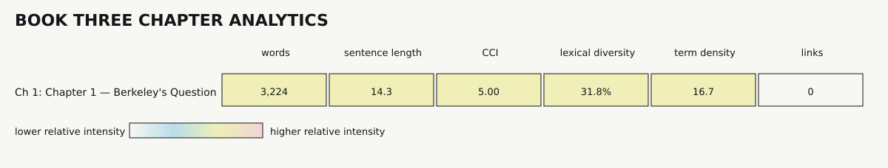

# Book Three Analytics

> Generated by `python3 analytics/analyze.py`. Do not edit manually.

## Runtime

- Mode: **framing**
- Measured units: 11
- Words: 8,404
- Canonical modules: 27
- Dependency edges: 54
- Dependency layers: 13
- Broken local links: 0

## Unit Metrics

| Unit | Words | Share | Avg words/sentence | Long sentences | CCI | Lexical diversity | Reading ease* | Term density | Links |
|---|---:|---:|---:|---:|---:|---:|---:|---:|---:|
| Global Manifest | 1,219 | 14.5% | 16.9 | 11.1% | 2.88 | 43.1% | 15.5 | 44.3 | 6 (0 broken) |
| Closure Probe Contract | 490 | 5.8% | 37.7 | 30.8% | 1.86 | 51.6% | -12.0 | 28.6 | 1 (0 broken) |
| Book Structure | 577 | 6.9% | 16.0 | 5.6% | 2.77 | 50.3% | 8.6 | 48.5 | 10 (0 broken) |
| Dependency Map | 968 | 11.5% | 11.4 | 2.4% | 9.44 | 44.4% | -1.6 | 57.9 | 6 (0 broken) |
| Chapter Manifest | 1,967 | 23.4% | 17.1 | 9.6% | 3.29 | 34.7% | 2.0 | 46.3 | 6 (0 broken) |
| Ownership Contract | 737 | 8.8% | 22.3 | 6.1% | 6.60 | 51.2% | -1.6 | 39.3 | 2 (0 broken) |
| Provenance and Versioning | 424 | 5.0% | 30.3 | 42.9% | 1.56 | 59.2% | 0.7 | 14.2 | 2 (0 broken) |
| Interface Preface | 401 | 4.8% | 10.0 | 2.5% | 4.00 | 57.4% | 20.5 | 57.4 | 4 (0 broken) |
| Concurrent Workflow | 320 | 3.8% | 20.0 | 6.2% | 2.67 | 55.6% | 25.3 | 21.9 | 2 (0 broken) |
| Chapter Derivation | 617 | 7.3% | 22.9 | 18.5% | 3.86 | 51.5% | 2.2 | 38.9 | 8 (0 broken) |
| Cover Specification | 684 | 8.1% | 24.4 | 25.0% | 2.15 | 47.5% | 16.1 | 43.9 | 1 (0 broken) |

*Reading ease is heuristic and comparative; technical vocabulary can lower it without indicating weak prose.*

## Structural Vocabulary

| Term | Exact count |
|---|---:|
| berkeley | 32 |
| closure | 88 |
| constraint | 5 |
| derivation | 24 |
| geometry | 38 |
| interface | 15 |
| interpretation | 38 |
| provenance | 31 |
| responsibility | 43 |
| transformer | 48 |

## Architecture density

Each column is normalized independently. Color shows relative intensity, not quality.
