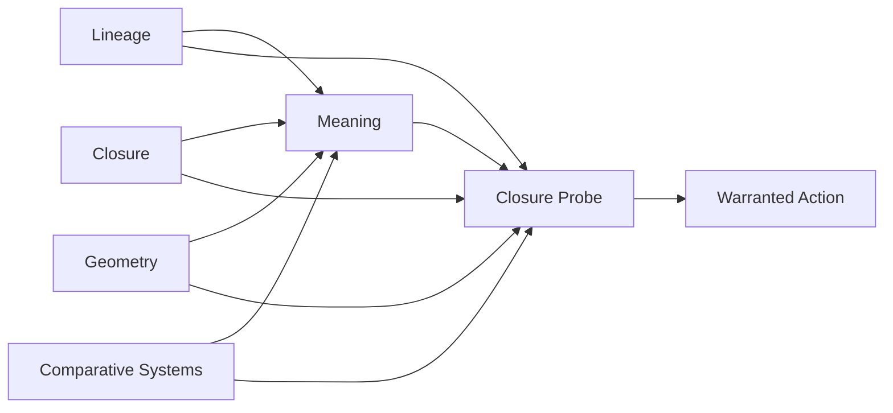

# Book Three — Structural Frame

Book Three is organized as five provisional philosophical crates governed by a cross-cutting closure probe. They assign ownership without treating crate order as a chapter spine.

## Canonical Crates

- [lineage/](lineage/) — historical interlocutors and the ancestry of derived meaning
- [closure/](closure/) — operations, evidence boundaries, values, judgment, authority, action, and revision
- [geometry/](geometry/) — spaces, trajectories, order, and attention geometry
- [meaning/](meaning/) — derivation, interpretation, limits, and anti-narrative critique
- [comparative_systems/](comparative_systems/) — cases that test claims without collapsing differences

The complete module registry is [modules.txt](modules.txt). Explanatory prerequisites are recorded in [dependency_map.md](dependency_map.md), and the validated chapter spine derived from them is [CHAPTER_MANIFEST.md](CHAPTER_MANIFEST.md). Every crate imports collaboration, provenance, and responsibility invariants from [OWNERSHIP_CONTRACT.md](OWNERSHIP_CONTRACT.md).

Every crate also imports [CLOSURE_PROBE.md](CLOSURE_PROBE.md). Derived meaning is an input to closure, not the manuscript's final warrant. Each concrete case must expose bounded evidence, unresolved judgment, declared values, an accountable actor, authorized action, and consequences with a revision path.

## Governing Question Fields

### Lineage

**Question:** What becomes reachable when a transformer exposes learned relationships across language, mathematics, code, history, and craft?

This field must distinguish statistical inheritance from historical provenance. A model can support lineage inquiry without serving as a trustworthy citation system.

### Derivation

**Question:** How does a structured request become a meaningful continuation, comparison, explanation, or artifact?

This field examines meaning as an outcome of relations and transformations rather than as a complete object retrieved unchanged from one location.

### Collaboration

**Question:** What kind of system forms when human intention, transformer capacity, tools, and testing operate in a recurrent loop?

This field rejects two simplifications: the transformer as passive instrument and the transformer as human-equivalent co-author. The unit of analysis is the collaboration while responsibility remains attributable.

### Closure

**Question:** How do permitted operations, representations, and interfaces define reachable outcomes, and how does accountable action proceed when their evidence reaches a boundary?

Closure must be treated separately in algebraic, programmed, learned, institutional, and philosophical contexts before analogies among them are trusted. Its owned sequence moves from operational limits through evidence boundaries, declared values, unresolved judgment, authority, action, and revision.

### Geometry

**Question:** What does geometric language explain about learned spaces, trajectories, neighborhoods, and constraints, and where does that language stop?

Book Two supplies the technical model. Book Three tests its philosophical usefulness without converting a model of computation into an unsupported ontology of meaning.

### Provenance and Trust

**Question:** How do citation, reproduction, testing, and human judgment govern claims derived through transformer collaboration?

Fluency does not establish lineage, and synthesis does not transfer responsibility. This field keeps epistemology connected to practice.

### Responsibility

**Question:** Who selects, verifies, publishes, and answers for a derived result?

Collaboration may distribute causal contribution without dissolving human accountability or granting authorship by metaphor.

### Warranted Action

**Question:** How do humans move from bounded operational evidence to action without disguising values, judgment, authority, or responsibility as machine conclusions?

This field is enforced through the closure probe in every case. The `closure` crate owns its explicit modules; the ownership contract keeps responsibility cross-cutting and human rather than turning it into a fictitious machine faculty.

## Module-Derivation Rule

A module remains canonical in the chapter spine only while it has:

- a distinct philosophical problem
- an explicit technical inheritance from Book One or Book Two
- a boundary separating it from neighboring fields
- an inspectable conversation, artifact, case, or failure
- an inspectable closure record when the module supports or contests action
- a reason it must precede or follow another field

No chapter count, crate symmetry, reading order, or publication structure is implied by this frame.
