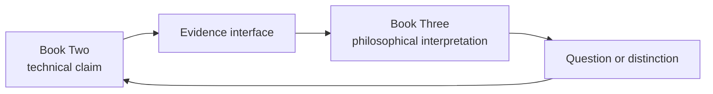

# Books Two and Three — Concurrent Workflow

Books Two and Three may be developed concurrently because they inspect the same systems at different explanatory levels. Concurrency is governed by interfaces: Book Two establishes technical claims; Book Three interprets their philosophical consequences.

All handoffs are subject to [the Book Three ownership contract](OWNERSHIP_CONTRACT.md). The workflow controls direction; the contract controls attribution, admissible evidence, and responsibility.

## Direction of Evidence

Book Three may return a sharper question to Book Two. It may not dictate a technical result because that result would make the philosophy more convenient.

## Handoff Record

Every cross-book claim should record:

- the Book Two module, chapter, experiment, or source that supplies the technical ground
- the exact technical claim being inherited
- the philosophical question Book Three asks of that claim
- assumptions introduced during interpretation
- the point where evidence ends and argument begins
- the values and unresolved judgment introduced if the claim supports action
- the accountable actor, authorized action, consequences, and revision path
- unresolved questions returned to Book Two
- applicable ownership invariant IDs

## Boundary Tests

A Book Two passage belongs in Book Three when it asks what an established constraint means rather than how the constraint works.

A Book Three passage belongs in Book Two when its argument depends on an architectural or mathematical mechanism that has not yet been demonstrated.

A passage belongs in neither manuscript yet when it relies on analogy without stating the level of similarity and the relevant disanalogy.

## Shared Method

Both books use:

**Conversation → Build → Test → Reverse Engineer → Conversation Update**

The objects tested differ. Book Two tests mechanisms and measurable limits. Book Three tests distinctions, interpretations, provenance, counterexamples, and closure records under [the closure probe](CLOSURE_PROBE.md).

## Change Control

1. Technical discoveries update Book Two first, then any dependent Book Three argument.
2. Philosophical distinctions update Book Three first, then return explicit questions to Book Two.
3. Shared terminology changes require a boundary review in both books.
4. Neither manuscript silently rewrites the other's governing claims.
