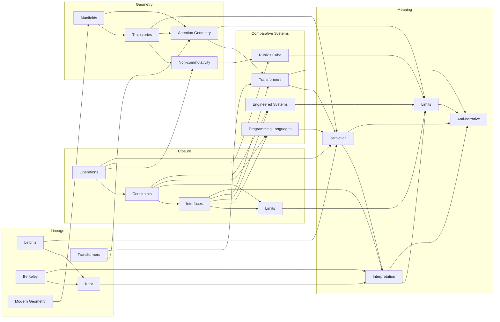

# Book Three — Dependency Map

This graph records explanatory prerequisites for the philosophical argument. It is neither a single reading order nor a claim that philosophical history developed as a directed acyclic graph. An arrow means the target requires a distinction, operator, case, or question established by the source.

The complete module registry is [modules.txt](modules.txt), and the machine-readable edge list is [dependencies.tsv](dependencies.tsv).

## Structural Graph

## Build Layers

These layers give one valid topological development order. Modules in the same layer may be researched or drafted concurrently.

| Layer | Modules | Philosophical movement |
|---|---|---|
| 0 | `lineage.leibniz`, `lineage.berkeley`, `lineage.modern_geometry`, `lineage.transformers`, `closure.operations` | Historical questions, contemporary object, and the first operator enter independently |
| 1 | `lineage.kant`, `closure.constraints`, `geometry.manifolds` | Conditions, exclusions, and spaces of possibility become explicit |
| 2 | `closure.interfaces`, `geometry.trajectories` | Boundaries become crossings; spaces become paths |
| 3 | `closure.limits`, `geometry.non_commutativity`, `geometry.attention_geometry`, `comparative_systems.programming_languages`, `comparative_systems.engineered_systems` | Operators expose limits and become inspectable in formal, learned, and engineered systems |
| 4 | `comparative_systems.rubiks_cube`, `comparative_systems.transformers` | Visible and learned cases test closure, order, interfaces, and geometry |
| 5 | `meaning.derivation` | Historical questions, operators, and cases converge into the central thesis |
| 6 | `meaning.interpretation` | Derived outputs meet human context, synthesis, and judgment |
| 7 | `meaning.limits` | Architectural, epistemic, and interpretive limits are distinguished |
| 8 | `meaning.anti_narrative` | Explanations are tested against structure, evidence, and the temptation of persuasive story |

The layers are not chapters. Lineage modules may recur as interlocutors throughout the manuscript, and comparative cases may be embedded beside the operators they test.

## Cross-Crate Dependency Matrix

| Source | Target | What crosses the boundary |
|---|---|---|
| Lineage | Closure | questions about symbolic form, relation, conditions, and possibility |
| Lineage | Geometry | historical and contemporary accounts of space, transformation, and learned representation |
| Closure | Geometry | operations and constraints needed to discuss reachable paths and order |
| Closure | Comparative Systems | the operators used to inspect concrete mechanisms and institutions |
| Geometry | Comparative Systems | spaces, trajectories, and non-commutative movement made visible in cases |
| Lineage | Meaning | unresolved historical questions, not inherited authority |
| Closure | Meaning | operations, boundaries, interfaces, and differentiated limits |
| Geometry | Meaning | models of relation and reach whose ontological status remains open |
| Comparative Systems | Meaning | counterexamples and inspectable cases, not conclusions |

## Book Two Evidence Interfaces

Book Three dependencies begin at a philosophical level, but several modules require technical handoffs governed by [concurrent_workflow.md](concurrent_workflow.md).

| Book Two evidence | Book Three consumer | Inherited claim |
|---|---|---|
| `math.algebra`, `convergence.limits` | `closure.operations`, `closure.limits` | operations and architectural constraints delimit reachable outcomes |
| `math.geometry` | `lineage.modern_geometry`, `geometry.manifolds`, `geometry.trajectories` | geometric language can describe learned spaces and transformations under explicit assumptions |
| `ai.attention`, `ai.transformer` | `lineage.transformers`, `geometry.attention_geometry` | attention and transformer organization create specific relational pathways |
| `programming.languages`, `programming.compilers` | `comparative_systems.programming_languages` | languages and compilers enforce distinctions through syntax, semantics, types, and translation |
| `convergence.architecture`, `convergence.execution` | `comparative_systems.transformers`, `meaning.derivation` | transformer outputs arise through a constrained executable process rather than disembodied narration |
| `convergence.limits` | `meaning.limits`, `meaning.anti_narrative` | context, representation, compute, data, and decoding constrain warranted interpretation |

These interfaces do not allow Book Three to alter Book Two's technical findings. They identify where philosophical argument begins from technical evidence.

## Natural Pivots

1. **Interlocutors to operators:** historical positions supply questions that closure and geometry must reformulate precisely.
2. **Operations to constraints:** what a system permits becomes inseparable from what it excludes.
3. **Spaces to paths:** geometry becomes operational when order and trajectory affect reachable outcomes.
4. **Operators to cases:** abstractions are tested against cubes, languages, engineered systems, and transformers.
5. **Cases to derivation:** repeated structural patterns support, qualify, or falsify the thesis of derived meaning.
6. **Derivation to interpretation:** a generated relation becomes meaningful only within purposes, contexts, and judgments.
7. **Interpretation to limits:** architectural limits, epistemic limits, and philosophical limits must be separated.
8. **Limits to explanatory discipline:** anti-narrative critique asks whether a story reveals structure or merely replaces it.

## Ownership Decisions

The three cross-cutting fields are resolved by [OWNERSHIP_CONTRACT.md](OWNERSHIP_CONTRACT.md):

| Field | Ownership decision | Effect |
|---|---|---|
| collaboration | book-level method governed by C1–C4; local synthesis obligations in `meaning` | collaboration remains the unit of analysis without becoming co-authorship or synthetic voice |
| provenance and trust | book-level evidence protocol governed by P1–P4; historical enforcement owned locally by `lineage` | learned relation, historical source, technical evidence, case, analogy, and speculation cannot silently substitute for one another |
| responsibility | book-level human obligation governed by R1–R4 | interpretation and publication remain attributable without adding a fictitious machine responsibility module |

These fields regulate every module and do not require new DAG nodes. This preserves module ownership while giving cross-cutting concerns enforceable scope.

## Chapter-Derivation Gate

The structural gate produced the validated spine in [CHAPTER_MANIFEST.md](CHAPTER_MANIFEST.md) through the process defined in [chapter_derivation.md](chapter_derivation.md).

Research readiness remains a later gate. Concrete Book Two evidence references, primary-source briefs for historical claims, and explicit distinctions among learned relation, retrieval, provenance, and verification are required before affected chapters enter prose or verified status.
